# Hệ thống kiến thức vấn đáp — Smart Privacy Locker

> Nhóm 12: **Thái Quang Huy — 24127177**, **Nguyễn Văn Minh — 24127205**,
> **Mai Phương Thùy — 24127249**.
>
> Tài liệu này chỉ giữ **kiến thức, luồng xử lý, code và cách giải thích bản
> chất**. Thứ tự trình bày: kiến thức chung → Huy → Minh → Thùy.

## Cách đọc tài liệu

Mỗi chức năng được hệ thống theo bốn lớp:

1. **Bản chất:** chức năng giải quyết việc gì.
2. **Luồng:** dữ liệu đi qua đâu, ai ra quyết định.
3. **Code:** file, lớp, hàm và nhánh quan trọng.
4. **Điểm chốt:** điều đúng, giới hạn và câu dễ bị hỏi xoáy.

Quy tắc trả lời ngắn gọn khi thầy chỉ vào một đoạn code:

> **Input là gì → hàm kiểm điều kiện gì → state nào thay đổi → output đi đâu →
> lỗi thì fail như thế nào.**

---

# PHẦN I — KIẾN THỨC CHUNG CẢ NHÓM

## 1. Bài toán, phân công và từ khóa cốt lõi

Smart Privacy Locker là tủ dùng ESP32 để:

- đọc trạng thái cửa bằng MC-38;
- điều khiển chốt quay bằng SG90, đèn WS2812B và còi active-low;
- đọc DHT22 và hiển thị cục bộ trên OLED;
- nhận lệnh qua MQTT từ Node-RED;
- cho đúng chủ sở hữu điều khiển qua Dashboard;
- lưu sự kiện, hiển thị lịch sử/biểu đồ, gửi Telegram/email và trả lời chatbot
  bằng dữ liệu đã kiểm soát.

| Thành viên | Phạm vi chính | Phải hiểu sâu |
|---|---|---|
| **Thái Quang Huy** | **CB2, YC1, YC3, YC12** | SG90; DHT22/OLED; WS2812B; WiFiManager; toàn bộ firmware và Node-RED liên quan |
| **Nguyễn Văn Minh** | **CB1, YC6, YC8, YC9** | MC-38; mở trái phép/Telegram; Gemini grounding; Auth/ownership/RLS |
| **Mai Phương Thùy** | **CB3, YC4, YC5, YC7** | buzzer; lưu lịch sử; biểu đồ 7/30 ngày; báo cáo email |

Năm câu phải nói đúng ngay từ đầu:

1. Người dùng **tự đóng/mở cánh cửa**; SG90 chỉ quay **chốt**.
2. MC-38 chỉ đo **cửa OPEN/CLOSED**, không đo góc chốt.
3. SG90 không có encoder/current feedback; `LOCKED/UNLOCKED` chỉ là trạng thái
   logic sau khi chu kỳ điều khiển hoàn tất.
4. Browser không giữ MQTT credential hay Supabase service-role key và không
   publish MQTT trực tiếp.
5. DHT22 → OLED là luồng cục bộ; nhiệt độ/độ ẩm hiện không được publish MQTT.

## 2. Kiến trúc toàn hệ thống

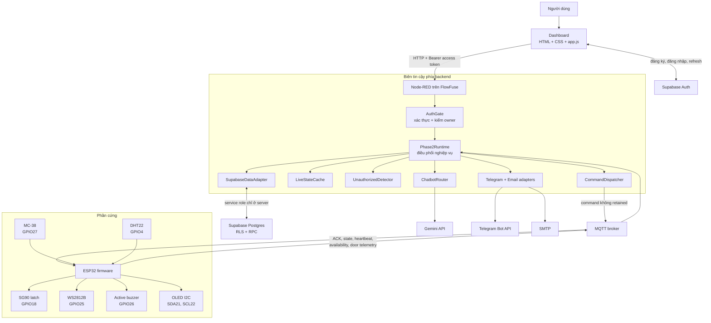

### Trách nhiệm từng lớp

| Lớp | Trách nhiệm | Không được nhầm |
|---|---|---|
| Dashboard | hiển thị, nhận thao tác, gửi HTTP có access token | không quyết định owner, không publish MQTT |
| Supabase Auth | cấp/xác minh phiên người dùng | anon key không phải service-role key |
| Node-RED | policy, owner gate, command correlation, cache, tích hợp cloud | HTTP `202` chưa phải thiết bị thành công |
| MQTT broker | định tuyến message theo topic | broker không tự hiểu nghiệp vụ khóa/cửa |
| ESP32 | interlock cục bộ, actuator, sensor, ACK/state | không xác thực người dùng cuối |
| Supabase DB | lịch sử bền vững, RLS, settings, delivery | khác với live cache trong RAM |

## 3. Bốn loại trạng thái không được đánh đồng

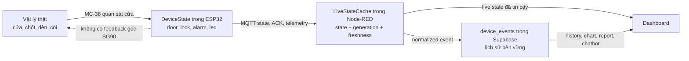

| Khái niệm | Ý nghĩa chính xác |
|---|---|
| `door=OPEN/CLOSED` | trạng thái ổn định suy ra từ MC-38 sau debounce |
| `lock=LOCKED/UNLOCKED` | endpoint logic mà firmware vừa ra lệnh và chờ đủ `SERVO_SETTLE_MS` |
| `availability=ONLINE/OFFLINE` | trạng thái phiên thiết bị do MQTT availability/LWT biểu diễn |
| `fresh=true` | Node-RED có ONLINE và full state mới, đúng connection generation |
| retained state | dữ liệu cuối cùng broker lưu; không tự chứng minh thiết bị đang sống |
| event history | bản ghi theo thời gian; không dùng thay cho live state hiện tại |

## 4. Hai hướng dữ liệu chính

### 4.1. Từ input vật lý lên giao diện

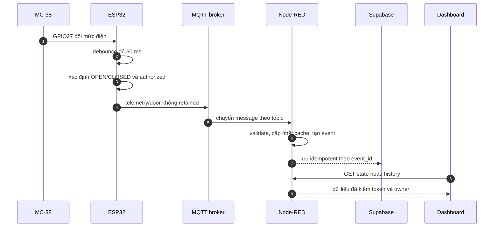

### 4.2. Từ giao diện xuống output vật lý

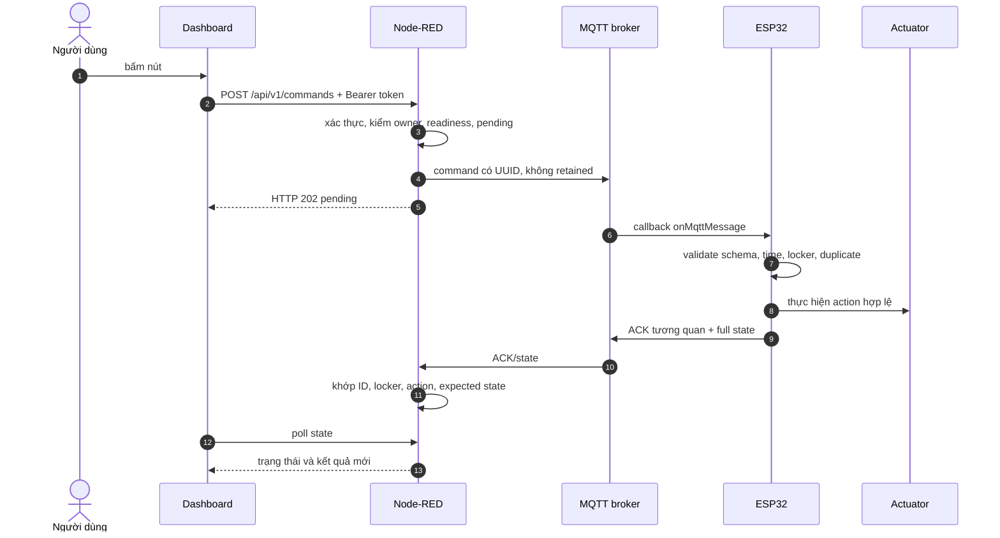

Điểm chốt: publish thành công chỉ nói message đã được đưa cho client/broker ở
mức transport. Thành công nghiệp vụ chỉ có khi ACK hợp lệ quay về; với SG90,
ACK vẫn không phải feedback cơ khí.

## 5. Pin, mức điện và kiến thức vật lý

### 5.1. Pin map đang dùng

| Thiết bị | Nguồn | Chân ESP32 | Kiểu tín hiệu |
|---|---|---:|---|
| SG90 | rail tải 5 V | GPIO18 | pulse servo 50 Hz; GPIO chỉ là signal |
| DHT22 | 3.3 V | GPIO4 | one-wire riêng của DHT; cần pull-up 3.3 V nếu module thiếu |
| WS2812B | rail tải 5 V | GPIO25 | chuỗi dữ liệu số GRB 800 kHz |
| OLED SSD1306 | 3.3 V | SDA21, SCL22 | I2C, địa chỉ mặc định `0x3C` |
| MC-38 | dry contact về GND | GPIO27 | `INPUT_PULLUP`; baseline LOW = CLOSED |
| Buzzer LOW-trigger | 3.3 V | GPIO26 | active-low; signal qua 4.7 kΩ |

GPIO 0, 2, 12, 15 được tránh vì có thể ảnh hưởng boot strapping. GPIO34–39
chỉ input nên không phù hợp để điều khiển output. ESP32 dùng logic 3.3 V; không
đưa mức 5 V trực tiếp vào GPIO.

### 5.2. Công thức và ý nghĩa

| Kiến thức | Công thức | Liên hệ dự án |
|---|---|---|
| Định luật Ohm | `V = I × R` | sụt áp dây, dòng qua điện trở |
| Công suất | `P = V × I` | chọn nguồn, dây, connector và đánh giá nhiệt |
| Sụt áp | `V_drop = I × R_wire` | servo/LED kéo dòng làm điện áp tại tải giảm |
| Năng lượng tụ | `E = 1/2 × C × V²` | tụ hỗ trợ xung ngắn, không thay nguồn thiếu công suất |
| Hằng số RC | `τ = R × C` | liên hệ lọc nhiễu; code đang debounce theo thời gian ổn định |

Các câu giải thích phải thuộc:

- Adapter 5 V/3 A không ép mọi tải nhận 3 A; tải lấy dòng theo đặc tính của nó,
  còn nguồn phải đủ khả năng cấp mà không sụt áp quá mức.
- Common GND tạo cùng mốc tham chiếu 0 V cho signal giữa ESP32 và thiết bị.
- Tụ gần WS2812B hỗ trợ transient; điện trở nối tiếp data giảm ringing và bảo
  vệ đường tín hiệu, không phải điện trở hạn dòng nguồn LED.
- Servo có thể có dòng khởi động/stall lớn; không cấp servo từ GPIO.
- I2C dùng SDA/SCL kiểu open-drain: thiết bị kéo LOW, điện trở pull-up tạo HIGH;
  nhiều thiết bị dùng chung bus nhờ địa chỉ.
- PWM servo biểu diễn vị trí bằng độ rộng xung lặp; `80°/170°` là giá trị hiệu
  chỉnh của cơ cấu hiện tại, không phải chân lý cho mọi servo.

## 6. Kiến trúc firmware Arduino/PlatformIO

### 6.1. Vì sao file `.ino` gần như chỉ có `#include`?

`arduino/SmartPrivacyLocker/SmartPrivacyLocker.ino` giúp Arduino IDE nhận diện
thư viện. Logic thật nằm trong các `.cpp/.h` cùng sketch, được compiler biên
dịch và linker ghép với `setup()`/`loop()` trong `main.cpp`.

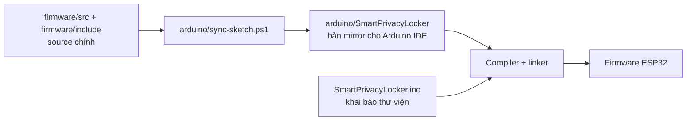

Khi thầy hỏi “code `.ino` ở đâu?”, trả lời: `.ino` là entry cho Arduino IDE;
`firmware/src/main.cpp` mới chứa `setup()`, `loop()` và orchestration.

### 6.2. Trách nhiệm module

| Module | Trách nhiệm |
|---|---|
| `main.cpp` | khởi tạo, loop, MQTT callback, interlock, auto-lock, ordering ACK/state |
| `state_manager` | nguồn `DeviceState` trong RAM |
| `command_handler` | parse/validate command JSON |
| `ack_publisher` | serialize ACK, cache command đã hoàn tất |
| `mqtt_client` | TLS, broker lifecycle, LWT, heartbeat, reconnect, publish/subscribe |
| `lock_controller` | state machine SG90 |
| `door_sensor` | raw GPIO → stable door qua debounce |
| `door_security` | one-time opening grant, auto-lock, door-event FIFO |
| `led_controller` | WS2812B ON/OFF |
| `environment_monitor` | đọc DHT22 định kỳ |
| `display_controller` | hiển thị OLED theo thay đổi |
| `wifi_provisioning` | WiFiManager portal, NVS, reset cục bộ |
| `alarm_controller` | polarity và trạng thái còi |

### 6.3. Safe boot

```json
{"door":"UNKNOWN","lock":"UNKNOWN","alarm":"INACTIVE","led":"OFF"}
```

- Servo không attach và không di chuyển trong `setup()`.
- Buzzer được đặt mức inactive trước khi bật pin output.
- LED được `clear()` rồi `show()`.
- Door bắt đầu `UNKNOWN` cho tới khi có mẫu ổn định.
- Không replay command cũ và không suy đoán vị trí chốt từ NVS.

### 6.4. Vì sao dùng loop không chặn?

Wi-Fi, MQTT, debounce, servo, DHT và OLED phải cùng tiến triển. `delay(2000)`
trong callback servo sẽ làm MQTT và sensor bị đói. Thiết kế lưu timestamp/state,
mỗi vòng chỉ thực hiện một bước nhỏ bằng `millis()`.

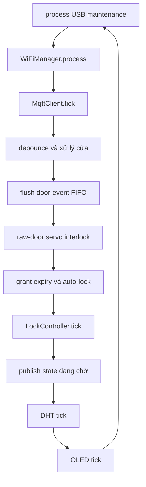

Phép trừ unsigned `now - startedAt` được dùng để vẫn đúng khi bộ đếm
`millis()` tràn vòng, miễn interval nhỏ hơn rất nhiều một chu kỳ tràn.

## 7. MQTT v1, ACK và freshness

### 7.1. Topic và retain

Base topic: `locker/{locker_id}`. `locker_id` trong topic và payload phải khớp.

| Topic suffix | Hướng | Retained | Lý do |
|---|---|---:|---|
| `command` | Node-RED → ESP32 | không | tránh lệnh cũ chạy lại sau reconnect |
| `ack` | ESP32 → Node-RED | không | kết quả của một pending command, không phải snapshot |
| `state` | ESP32 → Node-RED | có | giữ full state cuối cùng cho consumer mới |
| `heartbeat` | ESP32 → Node-RED | không | chứng minh liveness ứng dụng hiện tại |
| `telemetry/door` | ESP32 → Node-RED | không | transition event, không phải state mới nhất |
| `availability` | ESP32/LWT → Node-RED | có | giữ ONLINE/OFFLINE hiện tại |

PubSubClient trong firmware publish QoS 0. Vì vậy hệ thống dùng:

- UUID `command_id` để correlation;
- ACK có `command_id`, `locker_id`, `action`, `result`, `device_state`;
- timeout 5 giây ở Node-RED;
- một lệnh `GET_STATE` để đối soát nếu outcome mơ hồ;
- cache command gần nhất để duplicate không chạy actuator lần hai.

Không tự retry `LOCK/UNLOCK/LED/ALARM` sau timeout vì lần đầu có thể đã tác
động vật lý nhưng ACK bị mất.

### 7.2. Command contract

```json
{
  "schema_version": 1,
  "command_id": "550e8400-e29b-41d4-a716-446655440000",
  "locker_id": "LOCKER-001",
  "action": "UNLOCK",
  "issued_at": "2026-08-18T08:00:00.000Z",
  "requested_by": "550e8400-e29b-41d4-a716-446655440001"
}
```

Action allowlist: `LOCK`, `UNLOCK`, `ALARM_ON`, `ALARM_OFF`, `LED_ON`,
`LED_OFF`, `GET_STATE`.

Firmware kiểm:

1. JSON object và `schema_version=1`;
2. UUID, field bắt buộc và độ dài;
3. locker trong topic = payload = cấu hình thiết bị;
4. action thuộc allowlist;
5. `requested_by` là user UUID hoặc service principal được phép;
6. `issued_at` là UTC; khi NTP đã tin cậy thì chặn quá cũ 120 giây hoặc xa hơn
   30 giây trong tương lai.

Malformed payload không tạo được UUID đáng tin thì không phát ACK giả
`command_id:null`. Payload có UUID hợp lệ nhưng lỗi field khác sẽ nhận error
ACK tương quan.

### 7.3. ACK lifecycle

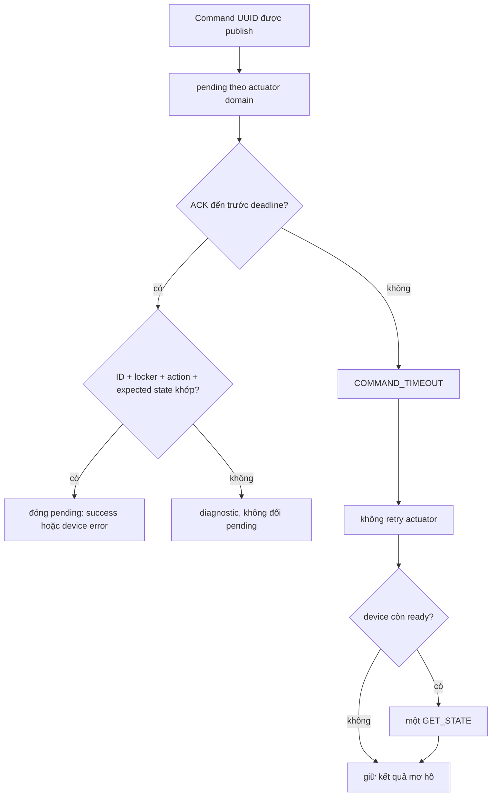

HTTP `202` nghĩa là backend đã chấp nhận intent và tạo pending; không nghĩa là
thiết bị đã thực hiện xong.

### 7.4. Availability, LWT, heartbeat và generation

- Khi connect, ESP32 đăng ký retained LWT `OFFLINE`.
- Sau subscribe cục bộ thành công, ESP32 publish retained `ONLINE`.
- Mỗi 10 giây, heartbeat không retained đi trước một retained full-state refresh.
- Reconnect dùng exponential backoff từ 1 giây đến tối đa 30 giây.
- `LiveStateCache` tăng `connectionGeneration` mỗi lần reconnect.
- Chỉ tin state khi MQTT connected, availability ONLINE và state cùng generation,
  còn mới, đồng thời state được quan sát sau ONLINE.
- Dữ liệu cũ/stale biến thành `UNKNOWN` trên UI; retained state một mình không
  được bật control.

## 8. HTTP, xác thực và bí mật

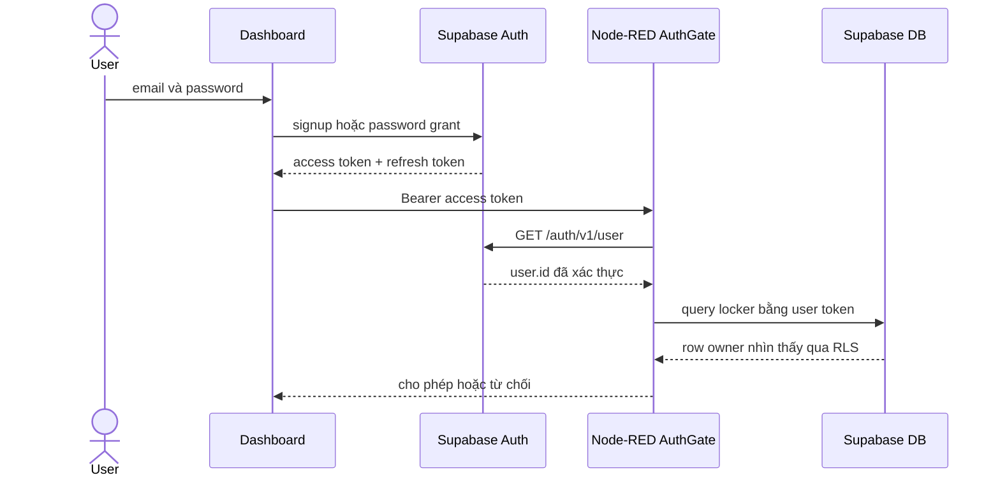

Phân biệt status:

- `401`: không có hoặc phiên không hợp lệ;
- `403`: user hợp lệ nhưng không sở hữu locker;
- `409`: state/door/pending conflict hoặc claim conflict;
- `503`: provider, MQTT hoặc device không sẵn sàng.

Phân loại cấu hình:

| Có thể tới browser | Chỉ ở backend/device secret store |
|---|---|
| `SUPABASE_URL`, `SUPABASE_ANON_KEY` | service-role key, MQTT password, CA/private config, Gemini key, Telegram token/secret, SMTP password |

Anon key xác định project và vai trò public; nó không vượt RLS. Service-role
key có quyền rất mạnh và bypass RLS nên tuyệt đối không gửi xuống browser.

## 9. Thư viện và các cặp so sánh thường bị hỏi

### 9.1. Firmware: phiên bản và vai trò thật

| Thư viện | Phiên bản trong `platformio.ini` | Vai trò trong source |
|---|---:|---|
| ArduinoJson | 7.4.2 | parse command, tạo ACK/state/telemetry JSON |
| PubSubClient | 2.8.0 | MQTT client trên ESP32; publish trong dự án là QoS 0 |
| WiFiManager | 2.0.17 | captive portal và lưu Wi-Fi vào NVS |
| ESP32Servo | 3.0.7 | tạo pulse servo bằng tài nguyên PWM ESP32 |
| DHT sensor library | 1.4.6 | đọc DHT22 qua `DHT` class |
| Adafruit Unified Sensor | 1.1.15 | dependency/chung hóa sensor; code hiện gọi `DHT` trực tiếp |
| Adafruit SSD1306 | 2.5.15 | buffer và lệnh điều khiển OLED SSD1306 |
| Adafruit GFX | 1.12.1 | API vẽ/text mà SSD1306 kế thừa |
| Adafruit NeoPixel | 1.12.5 | encode chuỗi GRB 800 kHz cho WS2812B |

### 9.2. Backend: phiên bản và vai trò thật

| Package/API | Loại | Vai trò |
|---|---|---|
| Node.js `>=20` | runtime | chạy module CommonJS và Web APIs server |
| Node-RED `>=4.1.13 <5` | peer host | HTTP/MQTT flow runtime |
| `@flowfuse/node-red-dashboard` 1.30.2 | production dependency | host `ui-template` chứa custom Dashboard |
| `nodemailer` 9.0.5 | production dependency | SMTP transport cho báo cáo email |
| `aedes` 1.1.1 | development dependency | broker MQTT nhúng phục vụ kiểm tra cục bộ |
| `mqtt` 5.15.2 | development dependency | MQTT.js client cho simulator/broker harness |
| `node:crypto` | built-in | UUID, random bytes, SHA-256, timing-safe comparison |
| Browser/Node `fetch` | built-in Web API | gọi Supabase, Node-RED và provider REST; không dùng Axios |

`dependencies` cần cho đường chạy ứng dụng; `devDependencies` chỉ phục vụ phát
triển/kiểm tra; `peerDependencies` yêu cầu một host tương thích cung cấp runtime.

### 9.3. So sánh đúng bản chất

| Cặp | Khác nhau | Dự án dùng thế nào |
|---|---|---|
| `WiFi.h` và WiFiManager | `WiFi.h` điều khiển Wi-Fi STA/AP; WiFiManager xây provisioning portal trên đó | WiFiManager nhận/lưu credential; `WiFi.status()` cho biết kết nối hiện tại |
| `WiFiClient` và `WiFiClientSecure` | một bên TCP thường, một bên TCP + TLS/certificate verification | MQTT chọn client theo `MQTT_USE_TLS`; không gọi `setInsecure()` |
| PubSubClient và MQTT broker | PubSubClient là client library; broker là server định tuyến topic | ESP32 dùng PubSubClient kết nối broker, không tự làm broker |
| PubSubClient và MQTT.js | MCU C++ nhỏ gọn so với client JavaScript nhiều tính năng | firmware dùng PubSubClient; harness Node dùng MQTT.js |
| ArduinoJson và `JSON.parse/stringify` | ArduinoJson tối ưu embedded C++/buffer; API JS là built-in động | ESP32 dùng ArduinoJson; Node/Dashboard dùng JSON built-in |
| ESP32Servo và `analogWrite`/PWM thường | servo cần pulse timing theo vị trí; PWM thường mô tả duty cycle tổng quát | ESP32Servo ánh xạ góc sang pulse và quản lý attach/detach |
| DHT library và Unified Sensor | DHT là driver cụ thể; Unified Sensor là interface/metadata thống nhất | code dùng `DHT.readHumidity/readTemperature`; Unified Sensor là dependency hỗ trợ |
| `Wire`, GFX và SSD1306 | `Wire` là bus I2C; GFX là primitive vẽ; SSD1306 là driver màn hình | cả ba tạo thành chuỗi transport → drawing API → thiết bị |
| NeoPixel và PWM | WS2812B cần frame số tuần tự cho từng pixel; PWM không mang chuỗi màu | NeoPixel gửi GRB 800 kHz và gọi `show()` để chốt frame |
| Node-RED và Node.js | Node.js là runtime JS; Node-RED là nền tảng flow chạy trên Node.js | flow lo wiring, `lib/*.js` giữ logic nghiệp vụ có cấu trúc |
| Node-RED và Express | Node-RED mạnh ở wiring MQTT/HTTP trực quan; Express là server code-first | dự án dùng Node-RED nhưng tách logic khỏi Function node lớn |
| FlowFuse Dashboard và custom web | package cung cấp host/widget; custom HTML/CSS/JS quyết định UI cụ thể | app được nhúng qua `ui-template`, không phải React/Vue |
| `fetch` và Axios | `fetch` built-in, Axios thêm wrapper/interceptor | request hiện có timeout/abort/error mapping riêng nên dùng `fetch` |
| REST trực tiếp và `supabase-js` | REST cho kiểm soát request thấp; SDK tiện session/query/realtime | dự án gọi Auth/PostgREST/RPC trực tiếp, không được nói đang dùng SDK |
| Nodemailer/SMTP và Gmail API | SMTP chung nhà cung cấp; Gmail API dùng HTTP/OAuth và metadata riêng | dự án dùng Nodemailer SMTP; idempotency do app/DB xử lý |
| hash và encryption | hash một chiều để so sánh; encryption giải mã được bằng key | token liên kết Telegram lưu SHA-256 vì không cần lấy plaintext lại |
| UUID và random secret | UUID phù hợp identity/correlation; secret cần entropy và không đoán được | command/event dùng UUID, link token dùng random bytes |

## 10. Bản đồ source chung

| Câu hỏi | File nguồn | Hàm/lớp cần mở |
|---|---|---|
| Boot và loop | `firmware/src/main.cpp` | `setup()`, `loop()` |
| Parse command | `firmware/src/command_handler.cpp` | `parseAndValidateCommand()` |
| MQTT/LWT | `firmware/src/mqtt_client.cpp` | `tick()`, `connect()`, `publishState()` |
| SG90 | `firmware/src/lock_controller.cpp` | `start()`, `tick()`, `cancel()` |
| MC-38/quyền mở | `door_sensor.cpp`, `door_security.cpp` | `sample()`, `evaluateTransition()` |
| MQTT validator | `node-red/lib/contracts.js` | `validateState/Door/Ack()` |
| Command backend | `node-red/lib/dispatcher.js` | `dispatch()`, `processAck()`, `expire()` |
| Freshness | `node-red/lib/live-state.js` | `snapshot()`, `ingressGeneration()` |
| Orchestration | `node-red/lib/runtime.js` | `ingest()`, `protectedCommand()`, `uiState()` |
| HTTP/MQTT wiring | `node-red/flows.json` | `http in`, Function, `mqtt in/out` nodes |
| Dashboard | `dashboard/app.js` | render, polling và event listeners |
| Auth/owner | `node-red/lib/auth.js` | `AuthGate`, `SupabaseAuthAdapter` |
| DB/schema | `supabase/migrations/` | table, RLS, grant, RPC |

---

# PHẦN II — THÁI QUANG HUY: CB2, YC1, YC3, YC12

## 11. Bản đồ phần Huy

| Yêu cầu | Input | Xử lý chính | Output | File trọng tâm |
|---|---|---|---|---|
| CB2 | `LOCK/UNLOCK` từ Dashboard hoặc auto-lock cục bộ | Node-RED gate + firmware interlock + SG90 state machine | chốt quay, ACK/state | `dispatcher.js`, `runtime.js`, `main.cpp`, `lock_controller.cpp`, `door_security.cpp` |
| YC1 | DHT22 GPIO4 | đọc định kỳ, kiểm `NaN`, chỉ redraw khi cần | OLED SDA21/SCL22 | `environment_monitor.cpp`, `display_controller.cpp` |
| YC3 | `LED_ON/OFF` từ Dashboard | command correlation + `LedController` | WS2812B GPIO25, ACK/state | `dispatcher.js`, `main.cpp`, `led_controller.cpp` |
| YC12 | Wi-Fi credential từ portal cục bộ | WiFiManager STA/AP, NVS, boolean state | Wi-Fi cho ESP32; status an toàn trên UI | `wifi_provisioning.cpp`, `mqtt_client.cpp`, `live-state.js`, `dashboard-state.js` |

Thứ tự đọc code Huy:

1. `pin_map.h` + `app_config.h`/`app_config.example.h`.
2. Bốn controller: lock, environment, display, LED, Wi-Fi.
3. `main.cpp`: `setup()`, `loop()`, `onMqttMessage()` và auto-lock.
4. `contracts.js` → `live-state.js` → `dispatcher.js` → `runtime.js`.
5. `flows.json` để thấy các module được nối vào HTTP/MQTT.
6. Frontend chỉ cần hiểu các sơ đồ ở từng yêu cầu bên dưới.

## 12. Nền tảng dùng chung cho các yêu cầu của Huy

### 12.1. Hằng số phải thuộc

| Hằng số | Giá trị hiện tại | Ý nghĩa |
|---|---:|---|
| `LOCK_ANGLE` | `80` | góc lệnh đưa tay servo về vị trí khóa chốt |
| `UNLOCK_ANGLE` | `170` | góc lệnh đưa tay servo về vị trí mở chốt |
| `SERVO_SETTLE_MS` | `2000` ms | thời gian chờ logic trước khi detach và xác nhận state |
| `DHT_READ_INTERVAL_MS` | `2500` ms | chu kỳ đọc DHT22 |
| `DISPLAY_REFRESH_INTERVAL_MS` | `1000` ms | giới hạn tần suất render OLED |
| `OLED_I2C_ADDRESS` | `0x3C` | địa chỉ OLED trên I2C |
| `WS2812_PIXEL_COUNT` | local `10`; example `1` | số pixel thực được tạo trong `Adafruit_NeoPixel` |
| `WS2812_BRIGHTNESS` | `32/255` | brightness scaling của thư viện |
| `WIFI_PORTAL_TIMEOUT_SECONDS` | `180` giây | thời gian portal cấu hình tồn tại |
| `WIFI_PORTAL_AP_NAME` | `Locker-Setup` | SSID AP provisioning |
| `COMMAND_MAX_AGE_SECONDS` | `120` giây | tuổi tối đa sau khi NTP đáng tin |
| `COMMAND_MAX_FUTURE_SKEW_SECONDS` | `30` giây | sai lệch tương lai cho phép |
| `RECENT_COMMAND_CACHE_SIZE` | `16` | số kết quả command gần nhất trong RAM |

`runtime_config.h` chọn toàn bộ `app_config.h` nếu file local tồn tại; nếu không
thì dùng `app_config.example.h`. Nó không trộn từng field giữa hai file. Vì vậy
một bản local phải chứa đủ cấu hình cần thiết.

### 12.2. Frontend phần Huy chỉ cần hiểu flow này

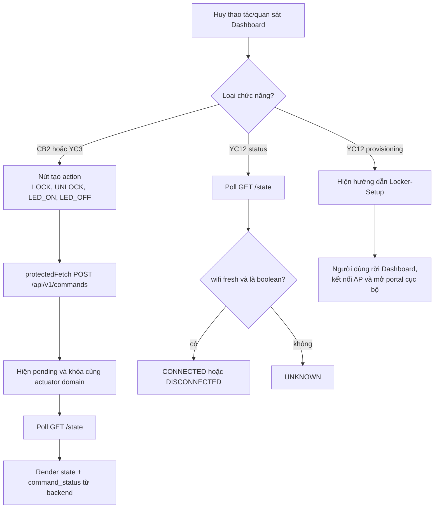

Frontend không tự kết luận actuator thành công và không nhận Wi-Fi password.
Nó chỉ gửi action, thể hiện pending, rồi render kết quả backend trả về.

### 12.3. Flow Node-RED dùng chung cho CB2 và YC3


`flows.json` chủ yếu nối node; business logic nằm trong `lib/*.js`. Điều này
giúp không nhồi toàn bộ auth, state và correlation vào một Function node lớn.

### 12.4. `runtime.protectedCommand()` — xác thực trước, dispatch sau

Đoạn dưới giữ đúng logic source và thêm chú thích tiếng Việt:

```js
async protectedCommand({ headers, body, isAborted = () => false }) {
  // Client đã ngắt trước khi xử lý: không tạo side effect MQTT.
  if (isAborted()) {
    return { ok: false, status: 499, code: 'REQUEST_ABORTED' };
  }

  // forceFresh=true: command là side effect nên phải hỏi provider lại,
  // không chỉ tin cache auth/ownership 15 giây.
  const authorization = await this.authGate.authorize(
    headers,
    body?.locker_id,
    { forceFresh: true },
  );
  if (!authorization.ok) return authorization;

  // Request có thể bị đóng trong lúc đang chờ Supabase.
  if (isAborted()) {
    return { ok: false, status: 499, code: 'REQUEST_ABORTED' };
  }

  // principal.id lấy từ token đã verify, không lấy requested_by từ browser.
  const result = this.dispatcher.dispatchUser({
    principal: authorization.principal,
    lockerId: body.locker_id,
    action: body.action,
  });

  // Detector cần biết một LOCK/UNLOCK mới đã bắt đầu để xóa legacy window cũ.
  if (result.ok) {
    this.detector.onCommandStarted({
      lockerId: body.locker_id,
      action: body.action,
    });
  }

  if (result.noop) {
    this.recordCommandStatus(body.locker_id, {
      command_id: null,
      action: body.action,
      status: result.code,
      completed_at: new Date(this.now()).toISOString(),
    });
  } else if (result.ok) {
    this.recordCommandStatus(body.locker_id, {
      command_id: result.command.command_id,
      action: body.action,
      status: 'PENDING',
      completed_at: null,
    });
  }
  return result;
}
```

Điểm chốt:

- Auth thất bại thì chưa có command, chưa có MQTT publish.
- `requested_by` do backend gán bằng identity đã xác thực.
- HTTP response của dispatch thành công là pending, không phải ACK thiết bị.
- Request bị abort được kiểm cả trước và sau bước authorize để tránh “browser
  đã bỏ nhưng backend vẫn tác động phần cứng”.

### 12.5. `CommandDispatcher.dispatch()` — toàn bộ gate trước MQTT

```js
dispatch({ lockerId, action, requestedBy, caller, requireReady = true }) {
  const snapshot = this.cache.snapshot(lockerId, this.now());

  // Gate transport và live device.
  if (!snapshot.mqtt_connected)
    return { ok: false, status: 503, code: 'MQTT_DISCONNECTED' };
  if (requireReady && snapshot.availability !== 'ONLINE')
    return { ok: false, status: 503, code: 'DEVICE_OFFLINE' };
  if (requireReady && !snapshot.fresh)
    return { ok: false, status: 409, code: 'STATE_UNTRUSTED' };

  // LOCK và UNLOCK chung domain "lock"; LED_ON/OFF chung domain "led".
  const actuatorDomain = domain(action);
  const conflict = [...this.pending.values()].some((item) =>
    item.lockerId === lockerId && item.domain === actuatorDomain
  );
  if (conflict)
    return { ok: false, status: 409, code: 'PENDING_CONFLICT' };

  // Backend chặn sớm; firmware vẫn kiểm lại bằng stable + raw door.
  if (action === 'LOCK' && snapshot.state.door !== 'CLOSED')
    return { ok: false, status: 409, code: 'DOOR_NOT_CLOSED' };
  if (action === 'UNLOCK' && snapshot.state.door !== 'CLOSED')
    return { ok: false, status: 409, code: 'DOOR_NOT_CLOSED_FOR_ACCESS' };

  // Action đã đúng state thường là no-op để khỏi gửi message thừa.
  // UNLOCK là ngoại lệ: cùng state vẫn phải tới firmware để cấp lượt mở mới.
  if (requireReady && action !== 'UNLOCK'
      && actionAlreadyApplied(action, snapshot.state)) {
    return {
      ok: true,
      status: 200,
      code: 'ALREADY_IN_STATE',
      noop: true,
      locker_id: lockerId,
      action,
      state: snapshot.state,
    };
  }

  // Backend tạo identity và timestamp của command.
  const commandId = this.uuid();
  const issuedAt = new Date(this.now()).toISOString();
  const command = {
    schema_version: 1,
    command_id: commandId,
    locker_id: lockerId,
    action,
    issued_at: issuedAt,
    requested_by: requestedBy,
  };

  // Ghi pending trước publish để ACK đến rất nhanh vẫn tìm được correlation.
  const pending = {
    commandId,
    lockerId,
    action,
    domain: actuatorDomain,
    requestedBy,
    caller,
    issuedAt,
    deadline: this.now() + this.timeoutMs,
  };
  this.pending.set(commandId, pending);

  try {
    this.publish(`locker/${lockerId}/command`, command, { retain: false });
  } catch {
    this.pending.delete(commandId);
    return { ok: false, status: 503, code: 'MQTT_PUBLISH_FAILED' };
  }
  return { ok: true, status: 202, command, pending };
}
```

Vì sao `UNLOCK` cùng state không bị no-op ở Node-RED? Vì một ACK `UNLOCK`
thành công khi cửa đóng cấp đúng **một lượt OPEN mới**. Nếu backend tự no-op,
firmware sẽ không biết phải re-arm grant.

### 12.6. `processAck()` và timeout

```js
processAck(ack) {
  const pending = this.pending.get(ack.command_id);
  if (!pending) {
    return {
      ok: false,
      code: this.completed.has(ack.command_id)
        ? 'DUPLICATE_OR_LATE_ACK'
        : 'UNKNOWN_ACK',
    };
  }

  // ACK success phải đúng locker, action và state kỳ vọng.
  if (ack.locker_id !== pending.lockerId
      || ack.action !== pending.action
      || (ack.result === 'success'
          && !expectedState(pending.action, ack.device_state))) {
    return { ok: false, code: 'ACK_CORRELATION_MISMATCH' };
  }

  this.pending.delete(ack.command_id);
  this.remember(ack.command_id, { ...pending, result: ack.result });
  const result = {
    ok: ack.result === 'success',
    code: ack.result === 'success'
      ? 'COMMAND_SUCCEEDED'
      : 'COMMAND_FAILED',
    pending,
    ack,
  };
  this.onResult(result);
  return result;
}
```

Khi `expire()` thấy quá deadline:

- xóa pending và ghi completed `timeout`;
- không lặp lại actuator action;
- nếu device vẫn ready và action cũ không phải `GET_STATE`, phát một
  `GET_STATE` nội bộ;
- không đối soát đệ quy một `GET_STATE` đã timeout.

### 12.7. ACK đi vào runtime và cập nhật cache thế nào?

```js
if (topic.endsWith('/ack')) {
  // ACK đã được validate schema trước đoạn này.
  const result = this.dispatcher.processAck(value);
  const correlated = Boolean(result.pending);

  if (correlated) {
    // Chỉ ACK thuộc một pending thật mới được cập nhật live state.
    this.cache.ingestState(
      lockerId,
      { ...value.device_state, timestamp: value.timestamp },
      observedAt,
      'mqtt:ack',
    );
  } else {
    // ACK lạ/trễ/sai chỉ vào diagnostic đã giới hạn; không đổi state.
    pushBounded(this.diagnostics, {
      code: result.code,
      topic,
      locker_id: lockerId,
      command_id: value.command_id,
      observed_at: new Date(observedAt).toISOString(),
    }, this.diagnosticLimit);
  }
  return {
    accepted: correlated,
    type: 'ack',
    code: correlated ? undefined : result.code,
    result,
  };
}
```

Error ACK đúng correlation vẫn đóng pending dưới dạng failure và có thể cập
nhật state do thiết bị báo. ACK lạ không được dùng để sửa live cache.

### 12.8. Firmware ingress dùng chung cho CB2 và YC3

Trước khi chạm controller, mọi command đi qua cùng một chuỗi kiểm tra. Đây là
phần Huy cần đọc để không chỉ biết “action cuối cùng”:

```cpp
void onMqttMessage(const char* topic,
                   const uint8_t* payload,
                   unsigned int payloadLength) {
  // Chỉ nhận đúng locker/{LOCKER_ID}/command.
  // Cần chừa một byte '\0', nên length >= 1024 bị từ chối.
  if (!expectedCommandTopic(topic)
      || payloadLength >= RuntimeConfig::MQTT_PACKET_SIZE) {
    Serial.println("Rejected MQTT message with an unexpected topic or size");
    return;
  }

  char json[RuntimeConfig::MQTT_PACKET_SIZE] = {};
  memcpy(json, payload, payloadLength);
  json[payloadLength] = '\0';

  const CommandValidationContext context = {
    AppConfig::LOCKER_ID,                    // locker lấy từ topic
    AppConfig::LOCKER_ID,                    // locker cấu hình thiết bị
    isTimeSynced(),                          // có được kiểm age hay chưa
    static_cast<int64_t>(time(nullptr)),
    AppConfig::COMMAND_MAX_AGE_SECONDS,
    AppConfig::COMMAND_MAX_FUTURE_SKEW_SECONDS,
  };
  const CommandParseResult parsed =
      parseAndValidateCommand(json, payloadLength, context);

  if (parsed.hasCorrelatableId) {
    // UUID đã hoàn tất: replay ACK gốc, không chạy actuator lại.
    const AckRecord* cached =
        recentCommands.find(parsed.command.commandId);
    if (cached != nullptr) {
      publishAckAndState(*cached, true); // duplicate=true
      return;
    }

    // Cùng UUID đang chạy servo: không bắt đầu chuyển động thứ hai.
    // Completion của operation gốc sẽ phát ACK bình thường.
    if (lockCommandInFlight
        && strcmp(inFlightLockAck.commandId,
                  parsed.command.commandId) == 0) {
      return;
    }
  }

  if (!parsed.ok()) {
    if (!parsed.hasCorrelatableId) {
      // Không có UUID tin cậy thì không thể tạo ACK tương quan.
      Serial.println("Rejected uncorrelatable MQTT command");
      return;
    }
    rememberAndPublish(makeAck(
      parsed.command,
      AckResult::ERROR,
      parsed.error,
      errorMessage(parsed.error)
    ));
    return;
  }

  if (parsed.command.action == CommandAction::LOCK
      || parsed.command.action == CommandAction::UNLOCK) {
    // Đi vào state-machine branch ở mục CB2.
    // Source thật xử lý branch rồi return tại đây.
  } else {
    // ALARM, LED và GET_STATE là immediate command.
    handleImmediateCommand(parsed.command);
  }
}
```

`parseAndValidateCommand()` dùng ArduinoJson để parse object, rồi kiểm field
theo thứ tự: `command_id` → schema → locker/time/requester → action → identity
locker → ISO UTC và tuổi lệnh. Việc lấy UUID sớm có chủ ý: nếu UUID hợp lệ thì
firmware còn có thể trả error ACK tương quan cho lỗi field phía sau.

### 12.9. ACK serialization và thứ tự ACK/state

ACK v1 được tạo từ `AckRecord`:

```cpp
document["schema_version"] = 1;
document["command_id"] = record.commandId;
document["locker_id"] = record.lockerId;
document["action"] = toString(record.action);
document["result"] =
    record.result == AckResult::SUCCESS ? "success" : "error";

JsonObject deviceState = document["device_state"].to<JsonObject>();
deviceState["door"] = toString(record.state.door);
deviceState["lock"] = toString(record.state.lock);
deviceState["alarm"] = toString(record.state.alarm);
deviceState["led"] = toString(record.state.led);

if (record.result == AckResult::SUCCESS) {
  document["error"] = nullptr;
} else {
  JsonObject error = document["error"].to<JsonObject>();
  error["code"] = toString(record.error);
  error["message"] = record.errorMessage;
}
document["duplicate"] = duplicate;
if (timestamp == nullptr) {
  document["timestamp"] = nullptr;
} else {
  document["timestamp"] = timestamp;
}
```

Thứ tự publish thật nằm ở `publishAckAndState()`:

```cpp
void publishAckAndState(const AckRecord& record, bool duplicate) {
  char timestamp[25] = {};
  const char* value = formatUtcTimestamp(timestamp, sizeof(timestamp))
      ? timestamp
      : nullptr;

  // ACK trước để giảm latency của pending command.
  if (!mqttClient.publishAck(record, duplicate, value)) {
    Serial.println("MQTT ACK publish failed; command will require timeout reconciliation");
  }

  if (!duplicate) {
    // Chưa publish state ngay: chỉ đánh dấu pending.
    requestStatePublish();
  }
}

void flushPendingStatePublish() {
  // Door transition cũ phải ra FIFO trước snapshot state mới.
  if (!statePublishPending
      || !doorTransitionOutbox.empty()
      || !mqttClient.isConnected()) {
    return;
  }
  if (mqttClient.publishState(stateManager.current(), true)) {
    statePublishPending = false;
  }
}
```

Nếu full state mới vượt một door edge cũ đang đợi gửi, backend có thể quan sát
snapshot và transition sai thứ tự. Vì vậy ACK được ưu tiên, còn retained state
đợi door FIFO rỗng. Duplicate ACK không yêu cầu publish state mới vì nó chỉ
replay kết quả cũ.

Node-RED chỉ chấp nhận success state đúng action:

```js
function expectedState(action, state) {
  if (!validDeviceState(state)) return false;
  return ({ LOCK: 'LOCKED', UNLOCK: 'UNLOCKED' }[action] || state.lock)
      === state.lock
    && ({ ALARM_ON: 'ACTIVE', ALARM_OFF: 'INACTIVE' }[action] || state.alarm)
      === state.alarm
    && ({ LED_ON: 'ON', LED_OFF: 'OFF' }[action] || state.led)
      === state.led;
}
```

## 13. CB2 — SG90 điều khiển chốt

### 13.1. Bản chất CB2

`LOCK` và `UNLOCK` điều khiển tay servo quay chốt giữa hai giá trị hiệu chỉnh.
Đây là **open-loop timed actuator**:

- input: action hợp lệ;
- điều kiện: cửa stable và raw đều `CLOSED`, servo không bận;
- output: pulse servo ở GPIO18;
- completion: đủ 2 giây thì detach và cập nhật logical lock state;
- giới hạn: không biết chốt có kẹt hay thật sự đạt góc hay không.

### 13.2. Luồng đầy đủ khi bấm “Mở chốt”

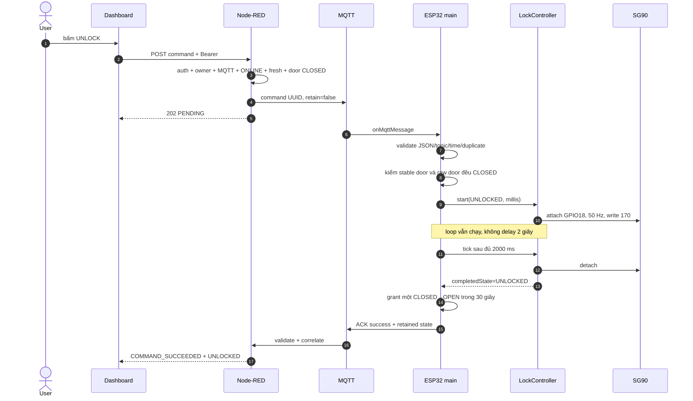

### 13.3. `LockController` — đọc được từng dòng

```cpp
void LockController::begin() {
  // Cố ý không attach/write khi boot.
  // Không có feedback nên không được tự suy đoán vị trí và làm servo chạy.
}

bool LockController::start(LockState desiredState, unsigned long now) {
  // Chỉ nhận LOCKED/UNLOCKED và không cho hai chuyển động chồng nhau.
  if (busy_ || (desiredState != LockState::LOCKED
                && desiredState != LockState::UNLOCKED)) {
    return false;
  }

  // Servo hobby thường nhận frame 50 Hz.
  servo_.setPeriodHertz(50);

  // GPIO18 là signal. 500–2400 µs là khoảng pulse cấu hình cho thư viện.
  servo_.attach(static_cast<int>(PinMap::SERVO_SIGNAL), 500, 2400);

  // attach() trả PWM channel; channel 0 vẫn hợp lệ.
  // Vì vậy phải hỏi attached(), không dùng return value như bool.
  if (!servo_.attached()) return false;

  const uint8_t angle = desiredState == LockState::LOCKED
      ? AppConfig::LOCK_ANGLE      // 80°
      : AppConfig::UNLOCK_ANGLE;   // 170°
  servo_.write(angle);

  // Ghi state machine, không chờ chặn tại đây.
  desiredState_ = desiredState;
  startedAt_ = now;
  busy_ = true;
  return true;
}

bool LockController::tick(unsigned long now,
                          LockState* completedState) {
  // Chưa bận hoặc chưa đủ 2 giây: chưa hoàn tất.
  if (!busy_ || now - startedAt_ < AppConfig::SERVO_SETTLE_MS) {
    return false;
  }

  // Ngừng phát pulse sau khi hết thời gian di chuyển đã cấu hình.
  servo_.detach();
  busy_ = false;

  if (completedState != nullptr) {
    *completedState = desiredState_;
  }
  desiredState_ = LockState::UNKNOWN;
  return true;
}

void LockController::cancel() {
  // Cửa mở khi servo đang chạy: dừng pulse càng sớm càng tốt.
  if (servo_.attached()) servo_.detach();
  busy_ = false;
  desiredState_ = LockState::UNKNOWN;
}
```

Tại sao detach? Giảm việc servo giữ lực/rung/nóng sau hành trình. Đổi lại, tải
cơ khí có thể làm tay servo dịch nếu cơ cấu không tự giữ; đây là trade-off của
prototype, không phải feedback.

### 13.4. Nhánh `LOCK/UNLOCK` trong `onMqttMessage()`

```cpp
if (parsed.command.action == CommandAction::LOCK
    || parsed.command.action == CommandAction::UNLOCK) {
  const LockState desiredState =
      parsed.command.action == CommandAction::LOCK
          ? LockState::LOCKED
          : LockState::UNLOCKED;

  if (desiredState == LockState::LOCKED) {
    // LOCK hủy ngay lượt mở chưa dùng, kể cả sau đó interlock từ chối.
    doorAccessController.revoke();
  }

  // Không cho command khác chen vào chuyển động hiện tại.
  if (lockCommandInFlight || lockController.isBusy()) {
    rememberAndPublish(makeAck(
      parsed.command, AckResult::ERROR,
      CommandError::ACTUATION_FAILED,
      errorMessage(CommandError::ACTUATION_FAILED)));
    return;
  }

  // LOCK cần cả door state đã debounce và raw GPIO đều CLOSED.
  if (desiredState == LockState::LOCKED
      && (stateManager.current().door != DoorState::CLOSED
          || !rawDoorIsClosed())) {
    rememberAndPublish(makeAck(
      parsed.command, AckResult::ERROR,
      CommandError::DOOR_NOT_CLOSED,
      errorMessage(CommandError::DOOR_NOT_CLOSED)));
    return;
  }

  // UNLOCK cũng chỉ cấp lượt mở mới khi cửa đang đóng thật.
  if (desiredState == LockState::UNLOCKED
      && (stateManager.current().door != DoorState::CLOSED
          || !rawDoorIsClosed())) {
    doorAccessController.revoke();
    rememberAndPublish(makeAck(
      parsed.command, AckResult::ERROR,
      CommandError::DOOR_NOT_CLOSED_FOR_ACCESS,
      errorMessage(CommandError::DOOR_NOT_CLOSED_FOR_ACCESS)));
    return;
  }

  // Manual command mới thay thế kế hoạch auto-lock cũ.
  autoLockPolicy.disarm();
  autoLockPending = false;

  if (stateManager.current().lock == desiredState) {
    // Same-state UNLOCK không quay servo nhưng cấp một lượt OPEN mới.
    if (desiredState == LockState::UNLOCKED) {
      doorAccessController.grantNextOpen(
        stateManager.current().door, millis());
    }
    rememberAndPublish(makeAck(
      parsed.command, AckResult::SUCCESS, CommandError::NONE, ""));
    return;
  }

  // Bắt đầu state machine; chưa ACK success ngay.
  if (!lockController.start(desiredState, millis())) {
    rememberAndPublish(makeAck(
      parsed.command, AckResult::ERROR,
      CommandError::ACTUATION_FAILED,
      errorMessage(CommandError::ACTUATION_FAILED)));
    return;
  }

  // Giữ ACK trong RAM cho tới khi tick xác nhận completion.
  inFlightLockAck = makeAck(
    parsed.command, AckResult::SUCCESS, CommandError::NONE, "");
  lockCommandInFlight = true;
  return;
}
```

Hai lớp interlock không dư thừa:

- stable door chống bounce và dùng cho state/nghiệp vụ;
- raw door là fail-safe tức thời để không chờ thêm 50 ms khi cửa bật mở lúc
  chốt đang chuyển động.

### 13.5. Completion và ACK chỉ xảy ra trong `loop()`

```cpp
const unsigned long actuatorNow = millis();

LockState completedLockState = LockState::UNKNOWN;
if (lockController.tick(actuatorNow, &completedLockState)
    && (lockCommandInFlight || autoLockInFlight)) {
  // Chỉ lúc này logical lock state mới được xác nhận.
  stateManager.setLock(completedLockState);

  if (completedLockState == LockState::UNLOCKED) {
    // Một UNLOCK hoàn tất khi cửa CLOSED cấp đúng một lượt mở.
    doorAccessController.grantNextOpen(
      stateManager.current().door, actuatorNow);
  } else {
    doorAccessController.revoke();
  }

  if (lockCommandInFlight) {
    // ACK mang state sau completion.
    inFlightLockAck.state = stateManager.current();
    rememberAndPublish(inFlightLockAck);
  } else if (autoLockInFlight) {
    // Auto-lock không có command_id nên chỉ yêu cầu publish state.
    requestStatePublish();
  }

  lockCommandInFlight = false;
  autoLockInFlight = false;
}
```

`mqttClient.tick()` có thể nhận command và gọi `start()` ngay trong callback,
nên code lấy lại `actuatorNow=millis()` sau đó. Nếu dùng timestamp cũ chụp trước
callback, elapsed có thể được tính từ thời điểm trước khi servo thật sự bắt đầu.

### 13.6. Cửa mở khi servo đang chạy

```cpp
void cancelInFlightLatch() {
  const bool commandOperation = lockCommandInFlight;
  lockController.cancel();

  // Đã di chuyển một phần rồi bị ngắt: vị trí logic cũ không còn đáng tin.
  stateManager.setLock(LockState::UNKNOWN);
  doorAccessController.revoke();

  if (commandOperation) {
    const CommandError doorError =
        inFlightLockAck.action == CommandAction::UNLOCK
            ? CommandError::DOOR_NOT_CLOSED_FOR_ACCESS
            : CommandError::DOOR_NOT_CLOSED;
    inFlightLockAck.result = AckResult::ERROR;
    inFlightLockAck.error = doorError;
    inFlightLockAck.state = stateManager.current();
    rememberAndPublish(inFlightLockAck);
  } else {
    // Auto-lock không được bịa một ACK không có command.
    requestStatePublish();
  }

  lockCommandInFlight = false;
  autoLockInFlight = false;
  autoLockPending = false;
}
```

Không giữ state cũ sau cancel vì tay servo có thể đã đi được một phần. Đặt
`UNKNOWN` buộc lệnh kế tiếp phải chạy thật thay vì bị same-state no-op.

### 13.7. One-time grant và auto-lock liên quan trực tiếp CB2

```cpp
bool DoorAccessController::grantNextOpen(DoorState door,
                                         unsigned long now) {
  // Chỉ cấp grant khi cửa đang CLOSED.
  grantAvailable_ = door == DoorState::CLOSED;
  grantedAt_ = static_cast<uint32_t>(now);
  return grantAvailable_;
}

DoorAccessResult DoorAccessController::evaluateTransition(
    DoorState previous, DoorState current,
    LockState lock, unsigned long now) {
  // Chỉ đánh giá quyền trên cạnh CLOSED -> OPEN.
  if (previous != DoorState::CLOSED || current != DoorState::OPEN) {
    return DoorAccessResult::NOT_APPLICABLE;
  }

  const uint32_t elapsed = static_cast<uint32_t>(now) - grantedAt_;
  const bool authorized = grantAvailable_
      && lock == LockState::UNLOCKED
      && elapsed < windowMs_;  // mặc định 30 giây

  // OPEN đầu tiên luôn tiêu thụ grant, dù hợp lệ hay đã hết hạn.
  revoke();
  return authorized
      ? DoorAccessResult::AUTHORIZED
      : DoorAccessResult::UNAUTHORIZED;
}

bool DoorAutoLockPolicy::observeTransition(
    DoorState previous, DoorState current) {
  if (previous == DoorState::CLOSED && current == DoorState::OPEN) {
    lockOnNextClose_ = true;   // đã mở thì nhớ khóa ở lần đóng kế tiếp
    return false;
  }
  if (previous == DoorState::OPEN && current == DoorState::CLOSED
      && lockOnNextClose_) {
    lockOnNextClose_ = false;
    return true;               // yêu cầu auto-lock
  }
  return false;
}
```

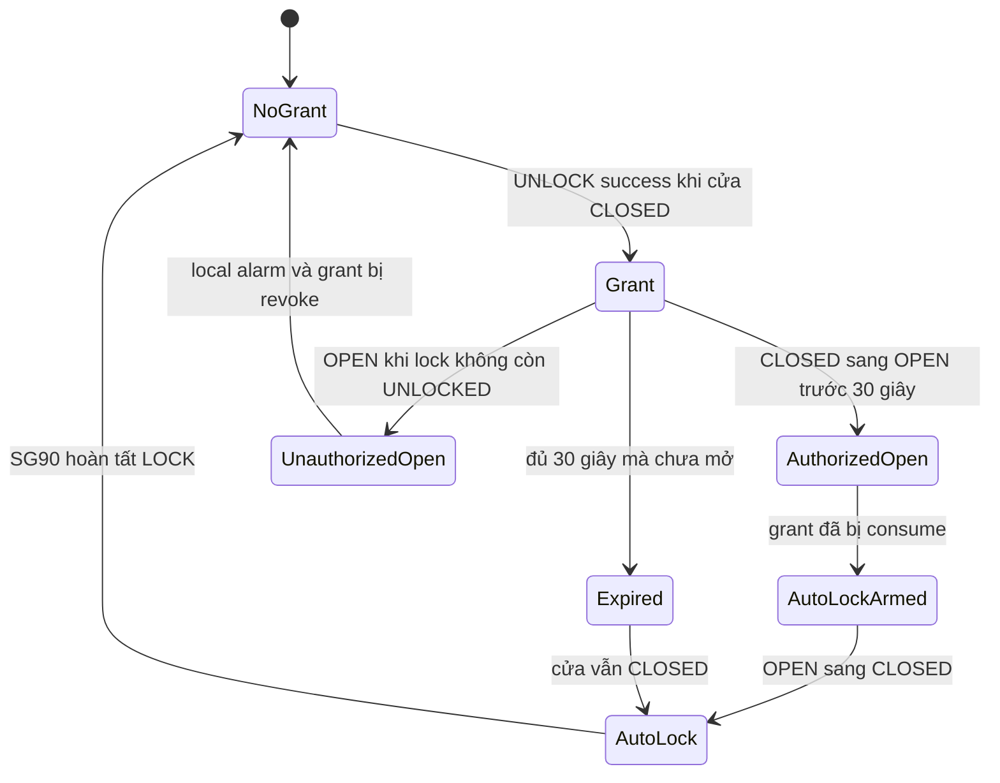

Auto-lock là local behavior, không phụ thuộc MQTT và không có command UUID.
Vì vậy nó publish state sau completion nhưng không phát ACK giả.

### 13.8. Ma trận tình huống CB2

| Tình huống | Kết quả đúng |
|---|---|
| Boot | servo detached, `lock=UNKNOWN` |
| `LOCK` khi cửa mở | từ chối `DOOR_NOT_CLOSED` |
| `UNLOCK` khi cửa mở | từ chối `DOOR_NOT_CLOSED_FOR_ACCESS`, revoke grant |
| Servo đang bận | `ACTUATION_FAILED` |
| `LOCK` khi đã `LOCKED` và cửa đóng | success no movement |
| `UNLOCK` khi đã `UNLOCKED` và cửa đóng | success, không quay, cấp grant mới |
| Cửa mở trong lúc servo chạy | detach, `lock=UNKNOWN`, error ACK nếu là command |
| Mở hợp lệ rồi đóng | auto-lock local |
| Không mở trong 30 giây sau UNLOCK | grant hết hạn và auto-lock khi cửa đóng |
| ACK mất | backend timeout rồi đối soát state; không tự retry servo |
| Servo kẹt nhưng đủ 2 giây | logical success vẫn có thể xảy ra vì không có feedback |

### 13.9. Câu hỏi chốt CB2

**Tại sao ACK không gửi ngay khi gọi `servo.write()`?**

Vì lúc đó mới bắt đầu actuator. Firmware giữ ACK đến khi state machine đủ 2
giây, sau đó detach, cập nhật logical state rồi mới phát ACK.

**Tại sao vẫn chưa được nói chốt chắc chắn đã khóa?**

SG90 không có encoder/current sensor. Deadline chỉ xác nhận firmware đã phát
lệnh đủ thời gian, không phát hiện kẹt, horn tuột hoặc thiếu lực.

**Tại sao cả LOCK lẫn UNLOCK đều yêu cầu cửa đóng?**

LOCK khi cửa mở có thể đẩy chốt sai vị trí. UNLOCK khi cửa mở không thể tạo một
lượt `CLOSED→OPEN` có nghĩa; nếu ACK success lúc đó, grant sẽ mơ hồ.

**Tại sao lặp UNLOCK khi đang UNLOCKED vẫn phải tới ESP32?**

Để cấp đúng một lượt mở mới mà không quay servo lại.

**Nếu muốn chứng minh vị trí chốt thật, cải tiến gì?**

Thêm limit switch/encoder/Hall sensor hoặc đo dòng, rồi chỉ xác nhận physical
state khi feedback đạt điều kiện; cần thiết kế lại contract và failure states.

## 14. YC1 — DHT22 hiển thị trên OLED

### 14.1. Bản chất và flow

YC1 là luồng **cục bộ hoàn toàn** trong ESP32:

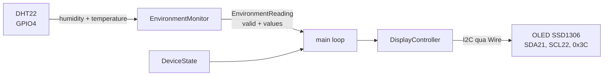

Không có nhánh DHT → MQTT → Node-RED → Dashboard trong code hiện tại. OLED còn
hiển thị door, latch, alarm, Wi-Fi và MQTT, nhưng temperature/humidity chỉ được
đọc từ object cục bộ `EnvironmentReading`.

### 14.2. `EnvironmentMonitor` — đọc định kỳ, không chặn

```cpp
EnvironmentMonitor::EnvironmentMonitor()
    : dht_(static_cast<uint8_t>(PinMap::DHT22_DATA), DHT22) {
  // Tạo driver DHT22 trên GPIO4.
}

void EnvironmentMonitor::begin() {
  dht_.begin();
}

bool EnvironmentMonitor::tick(unsigned long now) {
  // Nếu đã đọc ít nhất một lần và chưa đủ 2500 ms thì bỏ qua vòng này.
  if (lastReadAt_ != 0
      && now - lastReadAt_ < AppConfig::DHT_READ_INTERVAL_MS) {
    return false;
  }

  lastReadAt_ = now;
  const float humidity = dht_.readHumidity();
  const float temperature = dht_.readTemperature(); // mặc định °C

  // DHT library trả NaN khi checksum/timing/read thất bại.
  reading_.valid = !isnan(humidity) && !isnan(temperature);

  if (reading_.valid) {
    reading_.humidityPercent = humidity;
    reading_.temperatureC = temperature;
  }
  // Nếu lỗi, giữ numeric value cũ trong struct nhưng valid=false;
  // consumer bắt buộc nhìn cờ valid, không được hiển thị số cũ như số mới.
  return true;
}

const EnvironmentReading& EnvironmentMonitor::latest() const {
  return reading_;
}
```

Tại sao chu kỳ 2,5 giây? DHT22 là cảm biến chậm; đọc dồn dập không tạo thông tin
mới đáng tin và dễ nhận lỗi timing. Thiết kế dùng `tick()` nên không chặn MQTT.

### 14.3. `DisplayController.begin()` — ghép `Wire`, GFX và SSD1306

```cpp
bool DisplayController::begin() {
  // Khởi tạo bus I2C bằng pin explicit của ESP32.
  Wire.begin(
    static_cast<int>(PinMap::OLED_SDA),
    static_cast<int>(PinMap::OLED_SCL)
  );

  // SSD1306_SWITCHCAPVCC: dùng charge pump nội của module.
  // OLED_I2C_ADDRESS mặc định 0x3C.
  available_ = display_.begin(
    SSD1306_SWITCHCAPVCC,
    AppConfig::OLED_I2C_ADDRESS
  );

  if (available_) {
    display_.clearDisplay();
    display_.setTextColor(SSD1306_WHITE);
    display_.setTextSize(1);
    display_.setCursor(0, 0);
    display_.println("Smart Locker");
    display_.println("Starting...");
    display_.display(); // đẩy framebuffer ra panel thật
  }
  return available_;
}
```

Ba tầng thư viện:

1. `Wire` truyền byte qua I2C.
2. `Adafruit_GFX` cung cấp primitive như cursor, text, line, pixel.
3. `Adafruit_SSD1306` quản lý framebuffer và command riêng của controller.

`println()` chỉ sửa buffer RAM; `display()` mới gửi buffer ra OLED.

### 14.4. `DisplayController.tick()` — chỉ redraw khi cần

```cpp
void DisplayController::tick(
    unsigned long now,
    const EnvironmentReading& environment,
    const DeviceState& state) {
  // OLED lỗi hoặc chưa đủ 1 giây: bỏ qua, firmware phần khác vẫn chạy.
  if (!available_
      || (lastRenderAt_ != 0
          && now - lastRenderAt_
              < AppConfig::DISPLAY_REFRESH_INTERVAL_MS)) {
    return;
  }
  lastRenderAt_ = now;

  // Chỉ xem môi trường thay đổi đáng kể khi:
  // - cờ valid đổi; hoặc
  // - nhiệt độ lệch >= 0.1°C; hoặc
  // - độ ẩm lệch >= 0.5%.
  const bool environmentChanged =
      environment.valid != lastEnvironment_.valid
      || (environment.valid
          && (fabsf(environment.temperatureC
                    - lastEnvironment_.temperatureC) >= 0.1F
              || fabsf(environment.humidityPercent
                       - lastEnvironment_.humidityPercent) >= 0.5F));

  const bool stateChanged =
      state.door != lastState_.door
      || state.lock != lastState_.lock
      || state.alarm != lastState_.alarm
      || state.led != lastState_.led
      || state.wifiConnected != lastState_.wifiConnected
      || state.mqttConnected != lastState_.mqttConnected;

  // Đã render rồi mà không có gì đổi thì không gửi lại I2C.
  if (rendered_ && !environmentChanged && !stateChanged) return;

  rendered_ = true;
  lastEnvironment_ = environment;
  lastState_ = state;

  display_.clearDisplay();
  display_.setTextSize(1);
  display_.setCursor(0, 0);
  display_.println("Smart Locker");
  display_.print("Door: ");
  display_.println(toString(state.door));
  display_.print("Latch: ");
  display_.println(toString(state.lock));
  display_.print("Alarm: ");
  display_.println(toString(state.alarm));
  display_.print("WiFi:");
  display_.print(state.wifiConnected ? "OK" : "--");
  display_.print(" MQTT:");
  display_.println(state.mqttConnected ? "OK" : "--");

  if (environment.valid) {
    display_.print("T:");
    display_.print(environment.temperatureC, 1);
    display_.print("C H:");
    display_.print(environment.humidityPercent, 0);
    display_.println("%");
  } else {
    // Không giả vờ số cũ vẫn là reading hiện tại.
    display_.println("DHT: CHECK SENSOR");
  }
  display_.display();
}
```

Trong `setup()`, nếu OLED begin thất bại, code chỉ log rồi tiếp tục. OLED là
output hiển thị; lỗi OLED không nên làm khóa, alarm, MQTT và sensor dừng toàn bộ.

### 14.5. Bản chất điện của DHT22 và I2C

- DHT22 không phải I2C; nó dùng giao thức timing một dây riêng trên GPIO4.
- Đường data DHT cần pull-up về **3.3 V**, không phải 5 V.
- DHT trả humidity và temperature theo một frame có checksum; driver xử lý
  timing/checksum, app kiểm kết quả bằng `NaN`.
- OLED mới là I2C. SDA/SCL là open-drain và cần pull-up đúng mức 3.3 V.
- Địa chỉ `0x3C` là cấu hình, không phải quy luật tuyệt đối; module khác có thể
  là `0x3D`, khi đó phải scan và sửa config.

### 14.6. Câu hỏi chốt YC1

**DHT22 có lên Dashboard không?**

Không. Source chỉ truyền `EnvironmentReading` từ `EnvironmentMonitor` sang
`DisplayController`; MQTT state không có field nhiệt độ/độ ẩm.

**Vì sao không dùng `delay(2500)`?**

Vì delay sẽ chặn MQTT, door interlock và actuator. `tick()` chỉ đọc khi đến hạn.

**Tại sao giữ value cũ khi lần đọc mới lỗi?**

Struct không cần ghi đè bằng dữ liệu rác; cờ `valid=false` buộc consumer hiển
thị lỗi. Giá trị cũ không được xem là reading mới.

**`display_.println()` và `display_.display()` khác nhau thế nào?**

`println()` vẽ vào framebuffer RAM; `display()` truyền framebuffer qua I2C ra
panel.

**Unified Sensor làm gì trong code này?**

Nó là dependency/interface chung của hệ sinh thái Adafruit; phần app hiện dùng
class `DHT` trực tiếp, không gọi Unified Sensor API để đọc dữ liệu.

## 15. YC3 — điều khiển WS2812B từ Dashboard

### 15.1. Flow đầy đủ

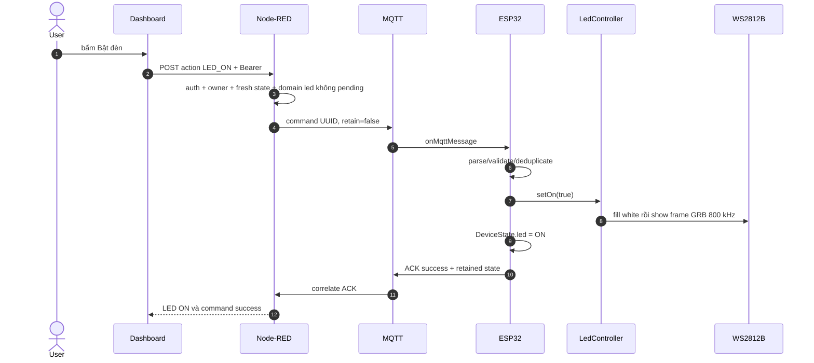

YC3 dùng chung Node-RED path ở mục 12. Khác CB2 ở chỗ LED action được xử lý
ngay, không cần state machine chờ 2 giây.

### 15.2. `LedController` — đọc được toàn bộ

```cpp
LedController::LedController()
    : pixels_(
        AppConfig::WS2812_PIXEL_COUNT,
        static_cast<int>(PinMap::WS2812B_DATA),
        NEO_GRB + NEO_KHZ800) {
  // Tạo strip với số pixel cấu hình, GPIO25, byte order GRB, 800 kHz.
}

void LedController::begin() {
  pixels_.begin();
  pixels_.setBrightness(AppConfig::WS2812_BRIGHTNESS); // 32/255
  pixels_.clear();
  pixels_.show(); // clear buffer chưa đủ; show mới tắt phần cứng
  on_ = false;
}

void LedController::setOn(bool on) {
  // Idempotent: cùng state thì không gửi lại frame.
  if (on_ == on) return;

  if (on) {
    // Fill mọi pixel màu trắng RGB 255,255,255.
    // Brightness 32 khiến thư viện pre-scale dữ liệu ghi vào pixel buffer.
    pixels_.fill(pixels_.Color(255, 255, 255));
  } else {
    pixels_.clear();
  }

  // Truyền toàn bộ frame tuần tự; pixel giữ màu sau khi frame kết thúc.
  pixels_.show();
  on_ = on;
}

bool LedController::isOn() const {
  return on_;
}
```

`Color(255,255,255)` không mâu thuẫn `brightness=32`: packed color vẫn mô tả
màu trắng logic; khi `fill()` gọi đường set-pixel, Adafruit_NeoPixel pre-scale
các byte lưu trong buffer theo brightness. `show()` truyền buffer đã scale ra
strip. Vì thư viện scale trong RAM nên đổi brightness nhiều lần có thể gây mất
độ chính xác do lượng tử hóa; code này chỉ đặt brightness một lần lúc `begin()`.

### 15.3. Nhánh firmware nhận LED command

```cpp
if (command.action == CommandAction::LED_ON
    || command.action == CommandAction::LED_OFF) {
  const bool shouldBeOn = command.action == CommandAction::LED_ON;

  // Controller tự idempotent và chốt frame bằng show().
  ledController.setOn(shouldBeOn);

  // Đồng bộ logical DeviceState dùng cho ACK/full state.
  stateManager.setLed(
    shouldBeOn ? LedState::ON : LedState::OFF
  );

  // Lưu result theo command_id rồi phát ACK/state.
  rememberAndPublish(makeAck(
    command,
    AckResult::SUCCESS,
    CommandError::NONE,
    ""
  ));
  return;
}
```

Hai lớp chống side effect lặp:

- Node-RED thường trả `ALREADY_IN_STATE` mà không publish nếu LED đã đúng state.
- Firmware `setOn()` cũng return khi `on_ == on`, bảo vệ nếu command vẫn tới.
- Cache `command_id` còn ngăn cùng một UUID hoàn tất bị thực hiện lại.

### 15.4. WS2812B khác LED thường thế nào?

- LED thường có thể bật/tắt bằng một GPIO hoặc PWM.
- WS2812B có IC điều khiển trong từng pixel; một data wire mang chuỗi bit cho
  toàn bộ pixel theo timing khoảng 800 kHz.
- Mỗi pixel đọc phần dữ liệu của mình rồi chuyển phần còn lại cho pixel sau.
- `show()` tạm chiếm timing để phát toàn bộ frame; số pixel càng nhiều thì thời
  gian truyền và dòng tổng càng tăng.
- Dữ liệu dùng thứ tự `GRB`, dù API `Color(r,g,b)` vẫn nhận tham số RGB.

Phần cứng cần nhớ:

- WS2812B dùng rail 5 V, ESP32 logic 3.3 V.
- Đường robust dùng level shifter phù hợp họ HCT/AHCT, điện trở 330–470 Ω gần
  DIN và common GND.
- Tụ điện gần strip hỗ trợ xung dòng; không thay thế nguồn đủ công suất.
- Số pixel local là 10 nên dòng/nguồn phải tính cho 10, không lấy example 1.

### 15.5. Câu hỏi chốt YC3

**Tại sao `clear()` rồi còn phải `show()`?**

`clear()` chỉ sửa buffer trong RAM; `show()` mới phát frame để pixel đổi thật.

**Tại sao không dùng `analogWrite()`?**

WS2812B không nhận duty cycle cho từng LED; nó cần protocol số tuần tự chứa màu
của từng pixel.

**Nếu ACK success thì có chắc LED sáng không?**

ACK xác nhận code đã gọi controller và cập nhật logical state. Không có cảm biến
quang hoặc feedback dòng, nên dây đứt/nguồn hỏng vẫn có thể không sáng.

**Đổi từ 1 lên 10 pixel cần sửa gì?**

Sửa `WS2812_PIXEL_COUNT` trong cấu hình local; thư viện cấp buffer tương ứng và
`fill()` tác động tất cả. Đồng thời phải đánh giá lại nguồn và wiring.

## 16. YC12 — WiFiManager captive portal và Wi-Fi status

### 16.1. Hai luồng tách biệt

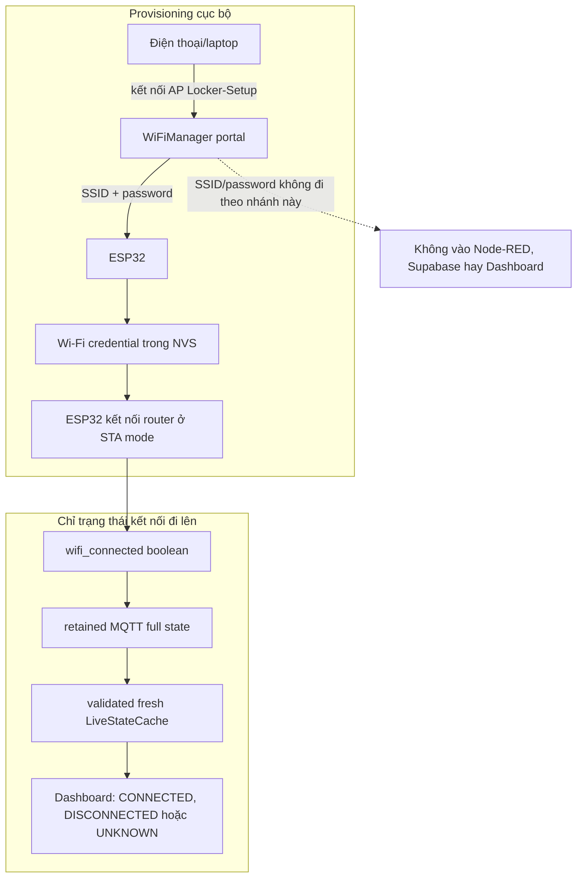

Provisioning portal và Dashboard là hai giao diện khác nhau. Dashboard chỉ
hướng dẫn người dùng kết nối `Locker-Setup`; form nhập credential nằm trên AP
cục bộ do ESP32 phát.

### 16.2. `WifiProvisioning.begin()`

```cpp
void WifiProvisioning::begin() {
  // Chọn station mode làm chế độ kết nối chính.
  WiFi.mode(WIFI_STA);

  // Không in chi tiết Wi-Fi ra serial log.
  manager_.setDebugOutput(false);

  // autoConnect không giữ CPU trong một vòng portal blocking.
  manager_.setConfigPortalBlocking(false);

  // Portal tự hết hạn sau 180 giây.
  manager_.setConfigPortalTimeout(
    AppConfig::WIFI_PORTAL_TIMEOUT_SECONDS
  );

  // Khi user lưu cấu hình xong, thoát portal để thử kết nối.
  manager_.setBreakAfterConfig(true);

  // Có credential hợp lệ: thử STA.
  // Thiếu/sai credential: mở AP "Locker-Setup" và portal cục bộ.
  manager_.autoConnect(AppConfig::WIFI_PORTAL_AP_NAME);
  started_ = true;
}
```

`autoConnect()` ưu tiên credential đã lưu. WiFiManager dựa trên Wi-Fi stack của
ESP32 để lưu thông tin mạng vào NVS; credential không nằm trong source Git.

### 16.3. `tick()` — portal và trạng thái luôn tiến triển

```cpp
void WifiProvisioning::tick() {
  if (!started_) return;

  // Bắt buộc gọi thường xuyên vì portal đang ở chế độ non-blocking.
  manager_.process();

  const bool connected = WiFi.status() == WL_CONNECTED;

  if (connected && !wasConnected_) {
    // Bắt đầu NTP sau khi lần đầu có mạng.
    startTimeSync();
    Serial.println("Wi-Fi connected");
  } else if (!connected && wasConnected_) {
    Serial.println("Wi-Fi disconnected");
  }
  wasConnected_ = connected;
}

bool WifiProvisioning::isConnected() const {
  return WiFi.status() == WL_CONNECTED;
}
```

`manager_.process()` phải được gọi trong `loop()`; nếu bỏ, DNS/web portal ở chế
độ non-blocking sẽ không xử lý request đúng cách.

### 16.4. Reset credential chỉ qua USB local

```cpp
void WifiProvisioning::resetConfigurationAndRestart() {
  // Xóa credential do WiFiManager/Wi-Fi stack đã lưu trong NVS.
  manager_.resetSettings();
  Serial.println("Wi-Fi configuration erased; restarting");
  ESP.restart();
}

void processUsbMaintenanceCommand() {
  while (Serial.available() > 0) {
    const int input = Serial.read();
    if (input == 'r' || input == 'R') {
      wifiProvisioning.resetConfigurationAndRestart();
    }
  }
}
```

Không có route web/cloud để xóa Wi-Fi vì đó là side effect có thể làm thiết bị
mất liên lạc. Đường USB local yêu cầu hiện diện vật lý và không in credential.

### 16.5. Từ `WiFi.status()` đến MQTT full state

```cpp
// main.cpp, mỗi vòng loop:
wifiProvisioning.tick();
stateManager.setWifiConnected(
  wifiProvisioning.isConnected()
);

// mqtt_client.cpp, khi serialize full state:
document["wifi_connected"] = state.wifiConnected;
document["mqtt_connected"] = state.mqttConnected;
```

`wifi_connected` và `mqtt_connected` khác nhau:

- Wi-Fi connected: ESP32 đã gắn vào access point/router.
- MQTT connected: trên kết nối mạng đó, MQTT client còn phiên với broker.
- Có thể Wi-Fi `true` nhưng MQTT `false` do broker/credential/TLS/Internet lỗi.
- Khi MQTT mất, Node-RED không nhận được boolean mới; nó phải đánh state cũ là
  stale thay vì tiếp tục hiển thị một giá trị đã lỗi thời.

### 16.6. Node-RED validate và chỉ lộ status khi fresh

```js
function validateState(topic, payload) {
  const result = common(payload, topic, 'state');
  if (!result.ok) return result;
  const value = result.value;

  // Cả hai connectivity field phải thật sự là boolean.
  if (!validDeviceState(value)
      || typeof value.wifi_connected !== 'boolean'
      || typeof value.mqtt_connected !== 'boolean'
      || !utc(value.timestamp, true)) {
    return { ok: false, code: 'INVALID_STATE' };
  }
  return result;
}
```

```js
snapshot(lockerId, now = Date.now()) {
  const item = this.entry(lockerId);

  const availabilityFresh = item.availability === 'ONLINE'
    && item.availabilityGeneration === this.connectionGeneration
    && now - item.availabilityObservedAt <= this.staleAfterMs;

  const stateFresh = Boolean(item.state)
    && now - item.stateObservedAt <= this.staleAfterMs
    && item.stateGeneration === this.connectionGeneration
    && item.stateObservedAt >= item.availabilityObservedAt;

  const trusted = this.mqttConnected
    && availabilityFresh
    && stateFresh;

  return {
    // ...
    state: trusted ? { ...item.state, door: item.door } : {
      door: 'UNKNOWN',
      lock: item.state?.lock || 'UNKNOWN',
      alarm: item.state?.alarm || 'UNKNOWN',
      led: item.state?.led || 'UNKNOWN',
      wifi_connected: null, // không lộ boolean cũ như dữ liệu hiện tại
    },
    fresh: trusted,
    stale: !trusted,
  };
}
```

```js
// dashboard-state.js
wifi: snapshot.fresh
      && typeof snapshot.state.wifi_connected === 'boolean'
  ? (snapshot.state.wifi_connected ? 'CONNECTED' : 'DISCONNECTED')
  : 'UNKNOWN',
```

Đây là fail-closed về thông tin: nếu không chứng minh được freshness thì nói
`UNKNOWN`, không đoán từ retained packet cũ.

### 16.7. Captive portal hoạt động thế nào?

1. ESP32 không kết nối được credential đã lưu.
2. WiFiManager mở AP `Locker-Setup` và web server/DNS cục bộ.
3. Điện thoại kết nối AP; captive detection có thể tự mở trang. Nếu không, dùng
   địa chỉ mặc định thường là `192.168.4.1`.
4. Người dùng chọn/nhập Wi-Fi và password trong portal do ESP32 phục vụ.
5. ESP32 lưu credential vào NVS, thoát portal và thử STA.
6. Khi STA connected, firmware bắt đầu time sync rồi MQTT kết nối.

Portal timeout không xóa credential cũ. Nó chỉ ngăn portal tồn tại vô hạn; có
thể reboot hoặc reset local để mở lại quy trình.

### 16.8. Câu hỏi chốt YC12

**WiFiManager khác `WiFi.h` thế nào?**

`WiFi.h` là API nền cho mode/status/connect; WiFiManager thêm provisioning AP,
DNS/web portal và quản lý credential trên nền đó.

**Mật khẩu Wi-Fi có đi qua Node-RED không?**

Không. Chỉ nhập trong portal ESP32 cục bộ và lưu on-device. MQTT chỉ có boolean
`wifi_connected`.

**Tại sao Dashboard có thể hiện `UNKNOWN` thay vì `DISCONNECTED`?**

`DISCONNECTED` chỉ đúng khi một full state fresh nói boolean false. Nếu backend
không còn dữ liệu đáng tin, đáp án trung thực là `UNKNOWN`.

**Tại sao connected Wi-Fi chưa chắc MQTT connected?**

Wi-Fi chỉ là lớp truy cập mạng; MQTT còn cần DNS/routing, TLS, broker sống,
credential và ACL đúng.

**Tại sao bắt đầu NTP sau Wi-Fi?**

NTP cần network. Khi có giờ đáng tin, firmware mới áp dụng giới hạn stale/future
cho `issued_at` và tạo UTC timestamp cho event/state.

## 17. Tờ nhớ nhanh riêng của Huy

### 17.1. Bốn câu một dòng

- **CB2:** Dashboard `LOCK/UNLOCK` → Node-RED gate → MQTT → firmware stable/raw
  door interlock → SG90 attach/write → tick 2 giây → detach → ACK/state.
- **YC1:** DHT22 GPIO4 → đọc mỗi 2,5 giây → `valid`/`NaN` → OLED I2C 0x3C;
  không có MQTT nhiệt độ/độ ẩm.
- **YC3:** Dashboard `LED_ON/OFF` → command correlation → `fill/clear` →
  `show()` GRB 800 kHz → ACK/state.
- **YC12:** WiFiManager portal `Locker-Setup` → credential ở NVS → STA → chỉ
  boolean `wifi_connected` đi trong fresh full state.

### 17.2. Những cặp tuyệt đối không nhầm

| Không nhầm | Câu đúng |
|---|---|
| cửa và chốt | MC-38 đo cửa; SG90 điều khiển chốt |
| logical state và physical feedback | ACK/state là logic; không có sensor góc chốt/ánh sáng LED |
| `write()` và completion | `servo.write()` bắt đầu; `tick()` đủ 2 giây mới complete |
| `clear()` và `show()` | sửa buffer khác với phát frame ra pixel |
| DHT và I2C | DHT có giao thức một dây riêng; OLED mới dùng I2C |
| Wi-Fi và MQTT | có Wi-Fi chưa chắc broker connected |
| retained và fresh | retained là last-known; fresh cần ONLINE + state cùng generation |
| HTTP `202` và success | `202` là pending; ACK hợp lệ mới hoàn tất command |
| command retry và reconciliation | không tự lặp actuator; dùng `GET_STATE` để đối soát |

### 17.3. Nếu thầy yêu cầu mở code ngay

| Thầy hỏi | Mở theo thứ tự |
|---|---|
| “Mở chốt chạy thế nào?” | `dispatcher.js:dispatch` → `runtime.js:protectedCommand/ingest` → `main.cpp:onMqttMessage/loop` → `lock_controller.cpp` |
| “Tại sao mở cửa được tính hợp lệ?” | `door_security.cpp:grantNextOpen/evaluateTransition` → `main.cpp:processDoorSensor` |
| “DHT/OLED?” | `environment_monitor.cpp` → `display_controller.cpp` → hai lời gọi cuối `loop()` |
| “Đèn?” | `dispatcher.js` → `main.cpp:handleImmediateCommand` → `led_controller.cpp` |
| “Wi-Fi?” | `wifi_provisioning.cpp` → `main.cpp` setter → `mqtt_client.cpp:publishState` → `live-state.js` → `dashboard-state.js` |

---

# PHẦN III — NGUYỄN VĂN MINH: CB1, YC6, YC8, YC9

## 18. Bản đồ phần Minh

| Yêu cầu | Trách nhiệm | File chính |
|---|---|---|
| CB1 | MC-38 raw GPIO → stable OPEN/CLOSED → telemetry/cache/UI | `door_sensor.cpp`, `main.cpp`, `mqtt_client.cpp`, `live-state.js` |
| YC6 | xác định mở trái phép, bật còi, tạo event, gửi Telegram đúng owner | `door_security.cpp`, `security.js`, `telegram*.js`, `runtime.js` |
| YC8 | phân loại câu hỏi, lấy facts live/history, gửi context an toàn cho Gemini | `chatbot.js`, `runtime.js`, `data.js` |
| YC9 | Supabase Auth, owner check, one-time claim, RLS | `auth.js`, Dashboard auth code, migrations Phase 2 |

## 19. CB1 — MC-38 và trạng thái cửa

### 19.1. Bản chất điện

MC-38 là reed contact thụ động. GPIO27 dùng `INPUT_PULLUP`:

- pull-up nội giữ chân HIGH khi contact hở;
- contact nối chân về GND khi đóng;
- baseline `MC38_CLOSED_LEVEL_HIGH=false`, nghĩa là LOW được map thành CLOSED;
- polarity vẫn là cấu hình phụ thuộc cách đặt nam châm/contact.

### 19.2. Debounce state machine

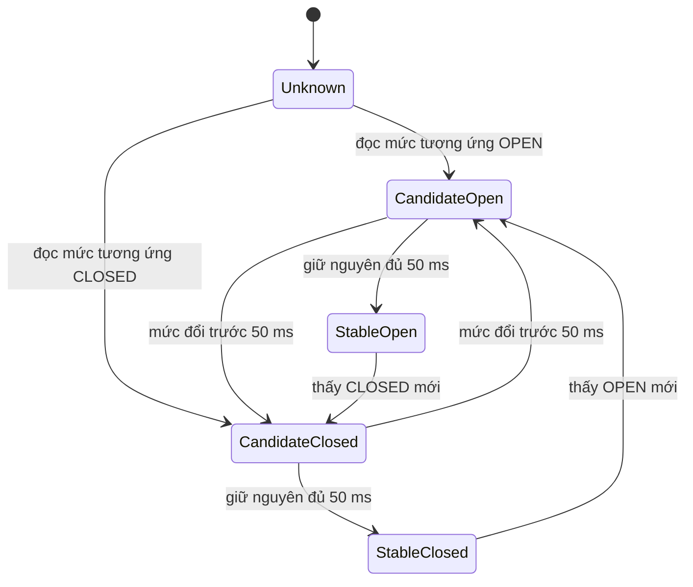

Logic cốt lõi của `sample()`:

```cpp
const DoorState observed = mapLevel(electricalHigh);

// Mức mới trở thành candidate; bắt đầu đếm lại thời gian ổn định.
if (!candidateValid_ || observed != candidate_) {
  candidateValid_ = true;
  candidate_ = observed;
  candidateSinceMs_ = nowMs;
  return false;
}

// Chưa đủ debounce hoặc trùng stable cũ thì chưa tạo transition.
if (observed == stable_
    || static_cast<uint32_t>(nowMs - candidateSinceMs_) < debounceMs_) {
  return false;
}

const DoorState previous = stable_;
stable_ = observed;
transition->previous = previous;
transition->current = stable_;
transition->initialStableSample = previous == DoorState::UNKNOWN;
return true;
```

Boot sample đầu tiên chỉ thiết lập stable state và có
`initialStableSample=true`; nó không được xem là một cạnh cửa thật để gửi cảnh
báo hoặc auto-lock.

### 19.3. Từ transition đến MQTT

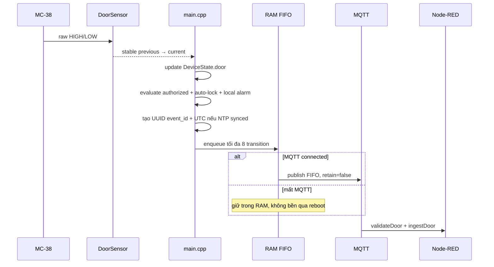

Door telemetry có `previous_state`, `state`, `event_id`, `timestamp`,
`time_synced`, và trên cạnh OPEN có `authorized=true/false`. Cạnh CLOSED đặt
`authorized=null`. Transition không retained vì replay một lần mở cũ cho
consumer mới sẽ sai nghĩa.

## 20. YC6 — phát hiện mở trái phép và Telegram

### 20.1. Quy tắc quyết định

Firmware là nguồn quyết định chính cho producer hiện tại:

```text
authorized = grantAvailable
             AND lock == UNLOCKED
             AND elapsed < 30 seconds
```

Chỉ đánh giá tại cạnh ổn định `CLOSED→OPEN`, và grant luôn bị consume ở cạnh
đầu tiên. Không có grant hợp lệ thì firmware:

- đặt `authorized=false` trong telemetry;
- bật buzzer local ngay, kể cả mất cloud;
- queue transition để gửi lại khi MQTT phục hồi.

### 20.2. Luồng local và cloud

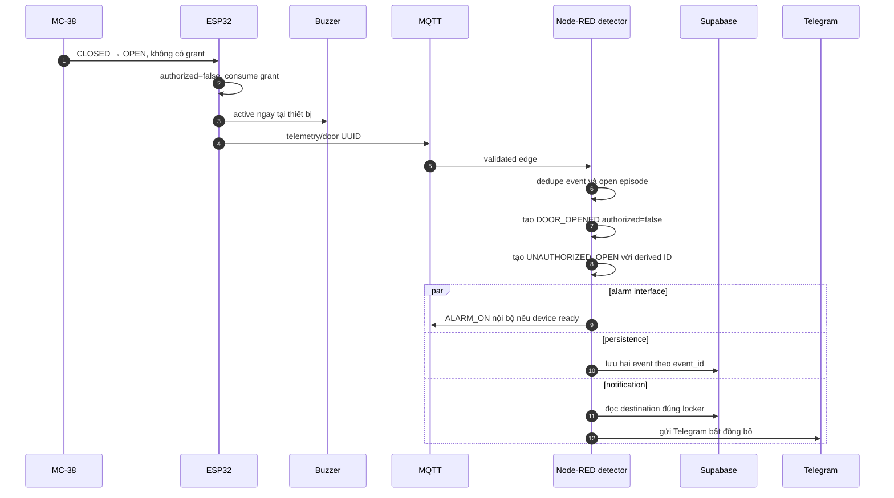

Node-RED tạo hai event vì hai ý nghĩa khác nhau:

- `DOOR_OPENED`: dùng đếm mọi lần mở;
- `UNAUTHORIZED_OPEN`: dùng đếm cảnh báo/an ninh.

`UnauthorizedDetector` dùng `openEpisodes` để một episode OPEN không gửi lặp;
episode chỉ được reset khi nhận CLOSED. `event_id` từ firmware còn chống replay.
Derived unauthorized ID được hash ổn định từ source event ID nên cùng một cạnh
không sinh nhiều cảnh báo/persistence side effect.

### 20.3. Vì sao vừa bật còi local vừa gửi `ALARM_ON` từ backend?

- Local path phản ứng được khi Wi-Fi/MQTT/cloud mất.
- Backend path đồng bộ command/event/cloud khi kết nối sẵn sàng.
- `AlarmController.setActive(true)` idempotent, nên yêu cầu trùng state không
  tạo một chuyển đổi output mới.
- Telegram chạy promise bất đồng bộ; provider chậm không được giữ đường bật còi.

### 20.4. Liên kết Telegram đúng owner

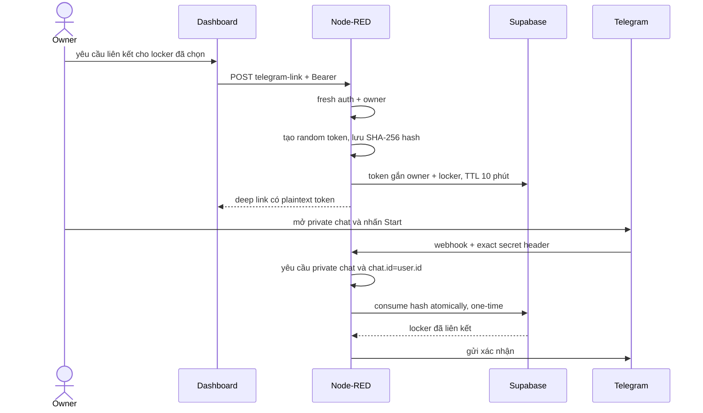

Không có Chat ID dùng chung toàn hệ thống. Browser không nhập, không lưu và
không nhận Chat ID. Token hash giúp database không giữ bearer token plaintext;
webhook secret, TTL, one-time consume, private-chat equality và owner binding
là các lớp kiểm tra độc lập.

### 20.5. Câu hỏi chốt YC6

**Node-RED có tự đoán authorized không?**

Producer hiện tại gửi boolean từ firmware và đó là nguồn chính. Backend window
chỉ là đường tương thích cho producer cũ thiếu field.

**Telegram lỗi có làm còi không bật không?**

Không. Còi local bật trước; notification được tách bất đồng bộ.

**Tại sao không retained door telemetry?**

Đó là một cạnh lịch sử. Consumer mới không được nhận lại OPEN cũ như vừa xảy ra.

**Mất MQTT thì sao?**

Local state/alarm vẫn chạy; firmware giữ tối đa 8 transition trong RAM để gửi
lại theo FIFO. Reboot trước khi gửi có thể làm mất queue vì nó không durable.

## 21. YC8 — chatbot Gemini có grounding

### 21.1. Sáu intent được hỗ trợ

| Intent | Route | Nguồn facts |
|---|---|---|
| `current_lock_state` | live | fresh `LiveStateCache` |
| `current_door_state` | live | fresh `LiveStateCache` |
| `latest_alert` | history | Supabase event history |
| `open_count_7_days` | history | backend đếm `DOOR_OPENED` |
| `unauthorized_open_today` | history | backend lọc `UNAUTHORIZED_OPEN` |
| `latest_activity` | history | event mới nhất |

Input rỗng/không khớp trả `QUESTION_UNSUPPORTED`. Live state stale/offline trả
`LIVE_STATE_UNAVAILABLE`; chatbot không đoán từ retained state cũ.

### 21.2. Flow grounding

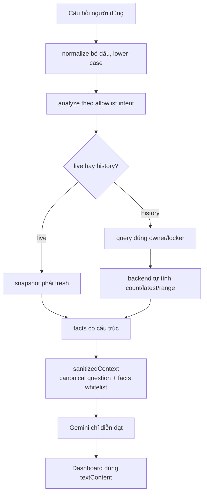

Context cho provider chỉ có schema, route, intent, canonical question,
locker ID, instruction và facts. Không gửi raw question, JWT, cookie, service
role, Telegram destination, email hay password.

Gemini không phải nguồn dữ liệu. Backend mới là nơi:

- kiểm owner;
- chọn route;
- yêu cầu freshness;
- query history;
- tính số lượng và chọn event mới nhất.

Provider timeout/quota/HTTP/empty response trả lỗi có kiểm soát; facts nguồn
không bị sửa.

### 21.3. Câu hỏi chốt YC8

**Grounding là gì?**

Giới hạn câu trả lời vào facts có nguồn đã xác minh, thay vì để model tự truy
cập hoặc tưởng tượng state/history.

**Tại sao không gửi raw question cho Gemini?**

Classifier đổi sang canonical intent/question, giảm prompt injection và tránh
vô tình đưa token/secret người dùng dán vào provider context.

**Ai đếm số lần mở?**

Code backend đếm event. Gemini chỉ diễn đạt kết quả đã tính.

## 22. YC9 — Supabase Auth, ownership, claim và RLS

### 22.1. Ba lớp phân quyền

```mermaid
flowchart LR
    TOKEN["Bearer access token"] --> AUTH["Authentication<br/>token thuộc user nào?"]
    AUTH --> OWNER["Authorization<br/>user có sở hữu locker này?"]
    OWNER --> RLS["Database RLS<br/>row nào role hiện tại được đọc?"]
    RLS --> ACTION["route hoặc query được phép"]
```

- Authentication trả lời “ai đang gọi?”.
- Authorization/ownership trả lời “người đó được tác động locker nào?”.
- RLS bảo vệ row ở tầng database nếu application query sai.

### 22.2. AuthGate

Node-RED lấy token từ đúng header `Authorization: Bearer <token>`, gọi
`/auth/v1/user`, rồi dùng `user.id` trả về làm identity tin cậy. Nó không tin
`user_id` hay `requested_by` trong body.

Auth/ownership read cache có TTL 15 giây, key là SHA-256 digest của access token
chứ không phải token thô. Route có side effect như command, claim, settings
write và Telegram mutation dùng `forceFresh=true`.

### 22.3. One-time claim

```mermaid
sequenceDiagram
    actor U as Authenticated user
    participant N as Node-RED
    participant R as claim_locker RPC
    participant D as lockers table

    U->>N: locker_code + Bearer
    N->>N: verify token fresh
    N->>R: requested_code
    R->>R: lấy auth.uid(), fixed search_path
    R->>D: UPDATE WHERE owner_id IS NULL
    alt cập nhật đúng một row
        D-->>R: claimed locker
        R-->>N: success
    else đã claim hoặc code sai
        D-->>R: không có row
        R-->>N: conflict
    end
```

Không cho browser tự `UPDATE lockers.owner_id`; RPC thực hiện conditional update
atomic. Hai người claim đồng thời thì chỉ một transaction thắng.

### 22.4. RLS và service role

| Dữ liệu | User thường | Backend service role |
|---|---|---|
| profile | đọc/sửa profile của mình trong phạm vi policy | quản trị khi cần |
| lockers | đọc locker mình sở hữu; claim qua RPC | trusted operations |
| events/settings/deliveries | owner đọc row liên quan | ghi event, setting, delivery qua adapter |
| Telegram link tokens | không có quyền | issue/consume atomically |

Service role bypass RLS nên chỉ ở Node-RED environment. Nó không biến code sai
thành an toàn; adapter vẫn phải dùng locker/owner đã verify và query có scope.

### 22.5. Session browser

- Browser nhận access/refresh token trực tiếp từ Supabase Auth.
- Session lưu trong `sessionStorage`, không phải database app tự tạo.
- Refresh token chỉ đi giữa browser và Supabase; Node-RED chỉ nhận access token.
- Callback fragment chứa token được đọc rồi xóa khỏi URL.
- Logout xóa UI/session cục bộ ngay cả khi remote logout lỗi.
- Session/locker generation ngăn response cũ ghi đè context mới.

### 22.6. Câu hỏi chốt YC9

**Anon key có phải bí mật tuyệt đối không?**

Không; nó được phép tới browser. An toàn dựa vào Auth/RLS và grant đúng. Service
role mới là key quyền cao không được lộ.

**Có RLS rồi tại sao Node-RED còn kiểm owner?**

Command MQTT không đi qua table RLS và cần policy trước side effect. Hai tầng
bảo vệ các biên khác nhau và tạo defense-in-depth.

**401 và 403 khác gì?**

401 là chưa xác thực/phiên sai; 403 là đã biết user nhưng user không sở hữu tài
nguyên được yêu cầu.

## 23. Tờ nhớ nhanh riêng của Minh

- **CB1:** GPIO27 `INPUT_PULLUP` → candidate giữ đủ 50 ms → stable transition →
  UUID telemetry; boot sample đầu không phải event.
- **YC6:** firmware quyết định authorized trên `CLOSED→OPEN`; không hợp lệ thì
  còi local + hai normalized events + Telegram đúng owner.
- **YC8:** allowlist sáu intent → facts từ fresh live/history → backend tính →
  Gemini chỉ diễn đạt context đã làm sạch.
- **YC9:** Bearer token → `/auth/v1/user` → owner check → RLS; claim là RPC
  atomic chỉ khi `owner_id IS NULL`.

---

# PHẦN IV — MAI PHƯƠNG THÙY: CB3, YC4, YC5, YC7

## 24. Bản đồ phần Thùy

| Yêu cầu | Trách nhiệm | File chính |
|---|---|---|
| CB3 | bật/tắt active buzzer an toàn, từ Dashboard hoặc local unauthorized | `alarm_controller.cpp`, `main.cpp`, `dispatcher.js` |
| YC4 | chuẩn hóa và lưu lịch sử event theo owner | `events.js`, `data.js`, `runtime.js`, migrations Phase 3 |
| YC5 | tổng hợp biểu đồ 7/30 ngày đúng timezone, kể cả ngày có 0 | `statistics.js`, `report-time.js`, Dashboard chart code |
| YC7 | lập lịch báo cáo ngày trước, reserve và gửi email không trùng | `runtime.js:runDailyReports`, `email.js`, delivery RPC |

## 25. CB3 — active buzzer LOW-trigger

### 25.1. Bản chất phần cứng

Module hiện tại là active buzzer LOW-trigger:

- VCC dùng ESP32 3.3 V theo wiring hiện tại;
- GPIO26 đi tới input qua điện trở 4.7 kΩ;
- LOW làm còi kêu, HIGH làm còi im;
- active buzzer tự tạo tần số âm khi được kích; passive buzzer cần waveform/PWM.

`SPL_BUZZER_ACTIVE_HIGH=0` được chuyển thành
`RuntimeConfig::BUZZER_ACTIVE_HIGH=false`. Code không rải các mức HIGH/LOW khắp
nơi mà gom polarity trong `AlarmController`.

### 25.2. Công thức polarity

```cpp
bool AlarmController::outputLevelHigh(bool active) const {
  return active ? activeHigh_ : !activeHigh_;
}
```

Với `activeHigh_=false`:

| Logical state | `outputLevelHigh()` | GPIO thực |
|---|---:|---|
| ACTIVE | `false` | LOW, còi kêu |
| INACTIVE | `true` | HIGH, còi im |

### 25.3. Safe boot và controller

```cpp
// main.cpp: nạp mức inactive trước khi đổi pin thành OUTPUT.
digitalWrite(
  static_cast<int>(PinMap::BUZZER_CONTROL),
  RuntimeConfig::BUZZER_ACTIVE_HIGH ? LOW : HIGH
);
pinMode(static_cast<int>(PinMap::BUZZER_CONTROL), OUTPUT);

alarmController.begin();
stateManager.setAlarm(AlarmState::INACTIVE);
```

Việc ghi output latch trước `pinMode(OUTPUT)` giảm nguy cơ xung active-low lúc
boot.

```cpp
void AlarmController::begin() {
  active_ = false;
  initialized_ = true;
  if (outputWriter_ != nullptr) {
    outputWriter_(outputLevelHigh(false)); // inactive theo polarity
  }
}

bool AlarmController::setActive(bool active) {
  if (!initialized_) return false;
  if (active_ == active) return true;       // idempotent
  if (outputWriter_ == nullptr) return false;

  outputWriter_(outputLevelHigh(active));
  active_ = active;
  return true;
}
```

### 25.4. Hai nguồn bật còi

```mermaid
flowchart TD
    A{"Nguồn yêu cầu"}
    A -->|"Dashboard ALARM_ON/OFF"| C["Node-RED command path"]
    C --> M["firmware handleImmediateCommand"]
    A -->|"CLOSED→OPEN unauthorized"| L["firmware local security path"]
    M --> AC["AlarmController.setActive"]
    L --> AC
    AC --> GPIO["GPIO26 theo polarity"]
    AC --> STATE["DeviceState.alarm"]
    M --> ACK["ACK + state"]
    L --> EVENT["door telemetry + state"]
```

Local unauthorized path không chờ MQTT. Dashboard command path có UUID/ACK.
Nếu `setActive()` thất bại trong command path, firmware trả
`ACTUATION_FAILED`; nó không cập nhật state thành ACTIVE giả.

### 25.5. Câu hỏi chốt CB3

**Active-low nghĩa là gì?**

Mức logic thấp kích hoạt module; logical ACTIVE được ánh xạ sang GPIO LOW.

**Tại sao cần abstraction polarity?**

Để logic nghiệp vụ luôn gọi `setActive(true/false)`; thay module active-high chỉ
đổi cấu hình, không đảo HIGH/LOW ở nhiều nơi.

**Active buzzer và passive buzzer khác gì?**

Active buzzer có oscillator bên trong, chỉ cần mức bật/tắt. Passive buzzer cần
tín hiệu tần số để phát tone.

## 26. YC4 — event normalization, Supabase và lịch sử

### 26.1. Vì sao phải chuẩn hóa event?

MQTT có nhiều payload riêng: ACK, state, door, availability. UI/history/report
cần một schema thống nhất. `normalizedEvent()` chuyển chúng thành event v1:

| Field | Ý nghĩa |
|---|---|
| `event_id` | UUID, khóa idempotency |
| `event_type` | loại như `DOOR_OPENED`, `LOCK_COMMAND`, `UNAUTHORIZED_OPEN` |
| `locker_id` | phạm vi tủ |
| `device`, `action`, `source`, `result` | phân loại nguồn/kết quả |
| `authorized` | chỉ có nghĩa với mở cửa |
| `command_id` | correlation nếu event sinh từ command |
| `device_state` | snapshot bốn state logic |
| `occurred_at` | lúc sự kiện được cho là xảy ra |
| `recorded_at` | lúc backend ghi nhận |
| `principal` | user/service đã được xác minh, nếu có |
| `notification_status`, `metadata`, `error` | thông tin bổ sung đã giới hạn |

`occurred_at` và `recorded_at` khác nhau vì mạng/retry có thể làm backend nhận
sau thời điểm thiết bị quan sát sự kiện.

Metadata có key chứa `token`, `jwt`, `authorization`, `password`, `secret`,
`cookie` bị loại trước khi tạo event.

### 26.2. Mô hình dữ liệu

```mermaid
erDiagram
    AUTH_USERS ||--|| PROFILES : has
    AUTH_USERS o|--o{ LOCKERS : owns
    LOCKERS ||--o{ DEVICE_EVENTS : records
    LOCKERS ||--o| NOTIFICATION_SETTINGS : configures
    LOCKERS ||--o{ NOTIFICATION_DELIVERIES : tracks
    LOCKERS ||--o{ TELEGRAM_LINK_TOKENS : issues

    LOCKERS {
        uuid id PK
        text locker_code UK
        uuid owner_id FK
        timestamptz claimed_at
    }
    DEVICE_EVENTS {
        uuid event_id PK
        text locker_id FK
        text event_type
        text result
        boolean authorized
        uuid command_id
        timestamptz occurred_at
        timestamptz recorded_at
    }
    NOTIFICATION_SETTINGS {
        text locker_id PK
        boolean telegram_enabled
        boolean email_enabled
        time report_time
        text timezone
    }
    NOTIFICATION_DELIVERIES {
        uuid id PK
        text locker_id FK
        text channel
        date report_date
        text status
        int attempts
    }
```

`device_events.event_id` là primary key nên cùng event được retry không tạo row
trùng. Owner đọc dữ liệu qua RLS; trusted insert/update dùng service role ở
backend.

### 26.3. Persistence outbox

```mermaid
flowchart LR
    E["normalizedEvent"] --> R["bounded in-memory events"]
    E --> O["persistence outbox Map<br/>key=event_id, tối đa 256"]
    O --> S["Supabase insert"]
    S -->|"success hoặc duplicate"| X["xóa khỏi outbox"]
    S -->|"transient failure"| B["bounded exponential backoff"]
    B -->|"chưa quá 5 lần"| S
    B -->|"hết lần hoặc queue full"| D["bounded dead letter + health error"]
```

Outbox này tăng khả năng chịu lỗi nhưng vẫn là RAM-only. Node-RED restart có
thể làm mất item chưa ghi; không được gọi nó là durable queue. Idempotency ở DB
giải quyết duplicate khi retry tới nơi, không giải quyết item chưa từng tới DB.

### 26.4. History ordering và pagination

History sắp theo cặp ổn định:

```text
occurred_at DESC, event_id DESC
```

`event_id` làm tie-break khi hai event cùng timestamp. Adapter lấy theo page,
dedupe overlap bằng immutable event ID và có safety ceiling; nếu dataset vượt
giới hạn thì trả lỗi rõ, không trả con số có vẻ đúng nhưng bị cắt ngầm.

### 26.5. Câu hỏi chốt YC4

**Idempotent là gì?**

Thực hiện lại cùng logical operation không đổi kết quả cuối ngoài lần đầu. Ở
đây cùng `event_id` không tạo thêm row.

**RLS có tác dụng gì với lịch sử?**

Ngay tại database, user chỉ thấy event thuộc locker mình sở hữu; API owner gate
là lớp bảo vệ bổ sung.

**RAM outbox và database khác nhau thế nào?**

Outbox là tạm thời để retry; database là lưu trữ bền vững. Reboot có thể mất
outbox nhưng không xóa row đã commit.

## 27. YC5 — lịch sử và biểu đồ 7/30 ngày

### 27.1. Tại sao timezone quan trọng?

Một timestamp được lưu UTC nhưng “ngày 18/08” phải hiểu theo timezone của
locker. Event gần nửa đêm UTC có thể thuộc ngày khác ở Việt Nam. History,
chart, chatbot và email phải dùng cùng timezone để không đếm lệch.

Range dùng half-open interval:

```text
[from, to)  nghĩa là from <= timestamp < to
```

Như vậy event đúng biên `to` chỉ thuộc kỳ kế tiếp, không bị đếm hai lần.

### 27.2. Tạo đủ zero bucket rồi mới cộng event

```js
function aggregateChart(events, { days, now, timezone }) {
  const range = calendarRange(days, now, timezone);

  // Khởi tạo trước mọi ngày với 0 để ngày không có event vẫn xuất hiện.
  const byDate = new Map(
    range.dates.map((date) => [date, { date, opens: 0, alerts: 0 }])
  );

  for (const event of events) {
    if (!withinRange(event, range)) continue;
    const key = localDateKey(event.occurred_at, timezone);
    const bucket = byDate.get(key);
    if (!bucket) continue;

    if (event.event_type === 'DOOR_OPENED') bucket.opens += 1;
    if (event.event_type === 'UNAUTHORIZED_OPEN') bucket.alerts += 1;
  }

  const buckets = [...byDate.values()];
  return {
    days,
    timezone,
    range: { from: range.from, to: range.to },
    buckets,
    totals: {
      opens: buckets.reduce((sum, item) => sum + item.opens, 0),
      alerts: buckets.reduce((sum, item) => sum + item.alerts, 0),
    },
  };
}
```

Nếu chỉ `GROUP BY` trên event đang có, ngày không có row sẽ biến mất. Khởi tạo
danh sách ngày trước giúp biểu đồ luôn đủ 7 hoặc 30 bucket.

### 27.3. Flow Dashboard

```mermaid
sequenceDiagram
    participant W as Dashboard
    participant N as Node-RED
    participant D as Data adapter
    participant S as Supabase

    W->>N: GET history và chart song song
    N->>N: Bearer + owner
    N->>D: đọc timezone của locker
    par history
        D->>S: recent events trong range
        S-->>D: ordered rows
        D-->>W: event list
    and chart
        D->>S: mọi event liên quan trong range
        S-->>D: paginated rows
        D->>D: aggregate 7/30 bucket và totals
        D-->>W: buckets kể cả zero
    end
```

Frontend dùng `Promise.allSettled`: history lỗi không xóa chart hợp lệ và
ngược lại. Biểu đồ trực quan có bảng dữ liệu tương đương cho người dùng screen
reader; zero phải thật sự là zero, không vẽ cột tối thiểu gây hiểu sai.

### 27.4. Câu hỏi chốt YC5

**Tại sao không dùng UTC date trực tiếp để group?**

Yêu cầu báo cáo theo ngày địa phương; UTC midnight không trùng local midnight.

**Tại sao `[from,to)` tốt hơn hai đầu đóng?**

Hai khoảng liên tiếp ghép nhau không trùng event ở biên.

**Vì sao phải có bucket 0?**

Không có sự kiện cũng là thông tin. Bỏ ngày đó làm trục thời gian méo và khiến
người xem tưởng dữ liệu thiếu.

## 28. YC7 — báo cáo email hằng ngày

### 28.1. Nội dung report

Scheduler tổng hợp **ngày địa phương trước đó**, không phải “24 giờ vừa qua”:

- số `DOOR_OPENED`;
- số `UNAUTHORIZED_OPEN`;
- hoạt động thiết bị gần nhất, loại trừ chính event notification/report;
- range UTC tương ứng ngày local và timezone.

### 28.2. Flow scheduler

```mermaid
flowchart TD
    T["tick mỗi phút"] --> S["lấy settings email_enabled"]
    S --> V["validate timezone + report_time HH:MM"]
    V --> D{"giờ local đã đến?"}
    D -->|"chưa"| X["bỏ qua locker"]
    D -->|"đã đến"| C["tính previous local day"]
    C --> R["reserve delivery theo<br/>locker + channel + report_date"]
    R --> Q{"reservation claimed?"}
    Q -->|"không"| N["đã xử lý, đang gửi hoặc bị suppress"]
    Q -->|"có"| A["query events + aggregate + render email"]
    A --> B["beginDelivery: status sending"]
    B --> M["Nodemailer SMTP send"]
    M -->|"accepted"| OK["mark delivered + sent_at"]
    M -->|"chắc chắn chưa gửi"| F["mark failed, có thể retry giới hạn"]
    M -->|"outcome mơ hồ"| U["delivery_unknown, không tự gửi lại"]
```

### 28.3. Delivery state machine

```mermaid
stateDiagram-v2
    [*] --> Pending: reserve thành công
    Pending --> Sending: bắt đầu gọi SMTP
    Pending --> Pending: reclaim nếu stale trước khi gửi
    Sending --> Delivered: SMTP accepted và DB cập nhật
    Sending --> Failed: biết chắc provider chưa nhận
    Sending --> DeliveryUnknown: timeout/crash sau điểm có thể đã nhận
    Failed --> Pending: retry nếu attempts dưới 3
    DeliveryUnknown --> [*]: cần kiểm tra thủ công, không auto-resend
    Delivered --> [*]
```

Điểm khó nhất là “exactly once” với hệ thống ngoài. Nếu SMTP đã nhận mail nhưng
process chết trước khi cập nhật DB, backend không thể chắc mail đã gửi hay chưa.
Tự retry có thể tạo email trùng, nên state đúng là `delivery_unknown`.

### 28.4. Nodemailer làm gì và không làm gì?

Nodemailer quản lý SMTP transport, TLS/auth, message envelope và gửi nội dung.
Nó không tự giải quyết:

- owner/setting nào được dùng;
- ngày nào phải tổng hợp;
- idempotency theo locker/ngày;
- reservation và retry policy;
- ambiguous outcome sau crash.

Những việc đó thuộc runtime và database RPC.

### 28.5. Câu hỏi chốt YC7

**Tại sao scheduler chạy mỗi phút mà không gửi lặp?**

Database reserve key theo locker + channel + local report date; tick sau không
claim được cùng logical delivery đã xử lý.

**Lỗi nào được retry?**

Lỗi xác định chắc chưa gửi, hoặc reservation pending cũ trước khi bắt đầu gửi,
và chỉ dưới giới hạn attempts. Outcome có thể đã gửi thì không retry tự động.

**Tại sao dùng ngày trước đó thay vì 24 giờ?**

Người dùng hiểu báo cáo theo lịch địa phương; previous-day range ổn định và
khớp chart/history.

## 29. Tờ nhớ nhanh riêng của Thùy

- **CB3:** logical ACTIVE/INACTIVE → `outputLevelHigh()` → active-low GPIO26;
  safe boot ghi inactive trước `pinMode(OUTPUT)`.
- **YC4:** mọi nguồn → normalized event UUID → RAM outbox → Supabase primary
  key idempotency; owner đọc qua RLS.
- **YC5:** tính local calendar range `[from,to)` → tạo đủ 7/30 zero buckets →
  cộng `DOOR_OPENED` và `UNAUTHORIZED_OPEN`.
- **YC7:** tick → previous local day → reserve → aggregate/render → sending →
  delivered/failed/delivery_unknown; không retry outcome mơ hồ.

---

# PHẦN V — CÂU HỎI TÍCH HỢP VÀ TỪ ĐIỂN NHANH

## 30. Các câu “tại sao” quan trọng nhất

### 30.1. Firmware và phần cứng

**Tại sao boot door/lock là `UNKNOWN`?**

Vì chưa có stable MC-38 sample và không có feedback vị trí SG90; đoán state cũ
có thể làm logic an toàn sai.

**Tại sao không dùng `delay()` cho servo/DHT?**

Vì firmware cần phục vụ MQTT, portal, debounce và interlock liên tục; state
machine theo `millis()` cho phép cooperative concurrency.

**Tại sao raw door và debounced door cùng tồn tại?**

Debounced state dùng cho business event ổn định; raw edge dùng ngắt servo sớm.

**Tại sao auto-lock không có ACK?**

ACK cần `command_id` của một command. Auto-lock là quyết định local nên chỉ
publish full state sau completion.

**Tại sao DHT lỗi không dừng hệ thống?**

Đó là peripheral hiển thị; fail-soft bằng `valid=false` giúp chức năng khóa và
an ninh tiếp tục.

### 30.2. MQTT và phân tán

**Tại sao command không retained?**

Nếu retained, ESP32 reconnect có thể chạy lại một lệnh actuator cũ.

**Tại sao state retained?**

Consumer mới cần last-known snapshot, nhưng vẫn phải kết hợp availability và
freshness trước khi tin.

**Tại sao ACK phải có expected-state check?**

Khớp UUID chưa đủ; ACK có thể sai locker/action/state do bug hoặc message lạ.

**Tại sao duplicate command không chạy lại?**

QoS/timeout có thể gây gửi trùng; cache command ID replay kết quả cũ để actuator
idempotent ở mức protocol.

**Tại sao heartbeat không retained?**

Liveness phải là bằng chứng của phiên hiện tại. Retain heartbeat sẽ biến tín
hiệu cũ thành dấu hiệu sống giả.

**LWT là gì?**

Last Will and Testament là message broker publish thay client khi kết nối mất
bất thường; ở đây là retained `OFFLINE`.

### 30.3. Backend và bảo mật

**Tại sao browser không publish MQTT trực tiếp?**

Nếu browser giữ broker credential, user có thể bypass owner/readiness gate và
giả `requested_by`. Node-RED là command egress duy nhất.

**Tại sao command dùng fresh authorization?**

Đó là side effect vật lý; không nên dùng ownership cache cũ sau khi quyền đã đổi.

**Tại sao service role vẫn phải scope query?**

Service role bypass RLS; lỗi filter có thể đọc/ghi chéo owner nếu adapter không
giữ đúng locker boundary.

**Tại sao Telegram lưu hash token?**

Backend chỉ cần so khớp khi consume, không cần phục hồi token; database lộ hash
không trực tiếp cho phép dùng deep link plaintext.

**Tại sao Gemini không được tự query database?**

Model không phải policy engine. Backend phải kiểm owner, chọn facts và tính số
liệu trước, rồi model chỉ diễn đạt.

### 30.4. Dữ liệu

**State và event khác nhau thế nào?**

State trả lời “hiện tại là gì”; event trả lời “điều gì đã xảy ra lúc nào”.

**Idempotency và deduplication khác nhau thế nào?**

Deduplication phát hiện bản lặp; idempotency bảo đảm lặp lại operation vẫn cho
kết quả cuối tương đương một lần. Primary key event ID là cơ chế hỗ trợ cả hai.

**Tại sao cần cả device time và observed time?**

Device time gần thời điểm vật lý; observed time đáng tin ở backend khi thiết bị
chưa sync hoặc message bị trễ.

## 31. Trace nhanh bốn tình huống tích hợp

### 31.1. `UNLOCK` hợp lệ

```text
Dashboard → Bearer/owner/readiness → pending UUID → MQTT command
→ firmware validate + closed-door interlock → SG90 170° → tick 2 s → detach
→ logical UNLOCKED + one-time grant → ACK/state
→ Node-RED correlation/cache/event → Dashboard.
```

### 31.2. `LED_ON`

```text
Dashboard → Node-RED domain led → MQTT → firmware LedController
→ fill white + brightness scale + show → DeviceState.led=ON
→ correlated ACK/state → Dashboard.
```

### 31.3. Mở cửa trái phép

```text
MC-38 raw → debounce CLOSED→OPEN → firmware authorized=false
→ buzzer local + UUID door telemetry → Node-RED dedupe episode
→ DOOR_OPENED + UNAUTHORIZED_OPEN → persistence + Telegram async
→ history/latest alert trên Dashboard.
```

### 31.4. Cấu hình Wi-Fi mới

```text
Không có credential hợp lệ → ESP32 mở Locker-Setup → user nhập trên portal local
→ NVS → STA connected → NTP → MQTT → ONLINE + state
→ Node-RED thấy fresh wifi_connected=true → Dashboard hiện CONNECTED.
```

## 32. Từ điển ngắn

| Thuật ngữ | Định nghĩa trong dự án |
|---|---|
| ACK | phản hồi tương quan cho một command có UUID |
| actuator domain | nhóm action cùng tài nguyên: `lock`, `led`, `alarm` |
| backoff | tăng dần thời gian chờ giữa các lần reconnect/retry |
| captive portal | trang cấu hình cục bộ xuất hiện khi kết nối AP provisioning |
| correlation | ghép response với request bằng ID và các field kỳ vọng |
| debounce | chỉ chấp nhận input sau khi ổn định đủ thời gian |
| fail-closed | thiếu bằng chứng thì từ chối/UNKNOWN, không đoán là an toàn |
| freshness | dữ liệu còn mới và thuộc phiên kết nối hiện tại |
| grounding | ràng buộc câu trả lời AI vào facts đã xác minh |
| idempotent | lặp operation không tạo kết quả cuối ngoài ý muốn |
| interlock | điều kiện an toàn chặn actuator khi state vật lý không phù hợp |
| LWT | broker publish Last Will khi client mất kết nối bất thường |
| NVS | vùng lưu key-value không mất khi reboot trên ESP32 |
| open-loop | điều khiển không có feedback để xác nhận output vật lý |
| pending | command đã phát nhưng chưa có ACK hợp lệ |
| RLS | Row Level Security, policy bảo vệ từng row trong Postgres |
| retained | broker giữ message cuối của topic cho subscriber mới |
| service role | backend credential quyền cao, bypass RLS |
| stale | dữ liệu quá cũ/khác generation nên không còn tin cậy |
| trust boundary | nơi hệ thống xác minh dữ liệu/quyền trước khi cho side effect |

## 33. Các giới hạn phải trình bày trung thực

- SG90 không có feedback góc, lực hoặc dòng; logical ACK không chứng minh cơ khí.
- MC-38 chỉ phát hiện khoảng cách reed/magnet, không chứng minh chốt đã ăn khớp.
- WS2812B không có feedback quang; LED logical ON không chứng minh pixel sáng.
- Active buzzer không có microphone/current feedback.
- Firmware recent-command cache và door FIFO đều ở RAM, mất khi reboot.
- Node-RED persistence retry outbox cũng ở RAM; chỉ row đã commit mới durable.
- QoS 0 có thể làm outcome mơ hồ; reconciliation không biến mất mát message
  thành bảo đảm exactly-once cho actuator.
- Retained state là last-known, không phải chứng cứ liveness.
- DHT22/OLED là local path; không được nói Dashboard có temperature/humidity.
- Wi-Fi credential chỉ local; Dashboard chỉ biết connectivity boolean khi state fresh.

## 34. Nguồn đọc khi cần đối chiếu sâu hơn

- [Kiến trúc](docs/architecture.md)
- [MQTT contract](docs/mqtt-contract.md)
- [Auth và ownership](docs/auth-ownership.md)
- [Event contract](docs/event-contract.md)
- [Thiết kế database](docs/database-design.md)
- [Chatbot grounding](docs/chatbot-grounding.md)
- [Pin map](hardware/pin-map.md)
- [Firmware source](firmware/src/main.cpp)
- [Node-RED runtime](node-red/lib/runtime.js)
- [Dashboard source](dashboard/app.js)
