# Cẩm nang ôn vấn đáp toàn diện — Smart Privacy Locker

> Phiên bản ôn cuối: 2026-08-18
>
> Dùng cho nhóm 12: Thái Quang Huy — 24127177, Nguyễn Văn Minh — 24127205,
> Mai Phương Thùy — 24127249.
>
> Lịch vấn đáp do nhóm xác nhận: **16:40, thứ Tư ngày 19/08/2026**.
>
> Artifact báo cáo để nộp: `report/12_24127177_24127205_24127249_FINAL.pdf`.

Tài liệu này là **một file ôn độc lập**, được đối chiếu với source hiện tại của
Dashboard, Node-RED, firmware Arduino/PlatformIO, MQTT contract, Supabase,
Telegram, Gemini, email và phần cứng. Mục tiêu không phải học thuộc một đoạn
văn, mà là nhìn được một yêu cầu rồi lần theo đúng chuỗi:

`giao diện → HTTP → auth/owner → Node-RED runtime → MQTT → firmware → phần cứng → ACK/state/event → database/UI`.

Giảng viên có thể đổi điều kiện, hỏi chéo phần tích hợp hoặc yêu cầu chỉ ngay
vào code/mạch. Theo quy định đồ án, mức hiểu khi vấn đáp ảnh hưởng hệ số `K`;
vì vậy “chức năng chạy” nhưng không giải thích được vẫn có thể làm giảm điểm cá
nhân.

**Cách dùng nhanh trong chưa đầy một ngày:**

1. Đọc mục 3–4 để tự nói kiến trúc và tự vẽ lại các luồng.
2. Đọc mục 8–11 khi đang mở đồng thời `dashboard/app.js`, `node-red/flows.json`,
   `node-red/lib/runtime.js` và `firmware/src/main.cpp`.
3. Chọn ngẫu nhiên một nút hoặc một sensor rồi trace đến tận ACK/event/UI, không
   nhìn đáp án.
4. Hỏi chéo ngân hàng câu hỏi; người trả lời phải nêu được **file + hàm + điều
   kiện + nhánh lỗi**, không chỉ kể tên công nghệ.
5. Với mỗi thư viện ở mục 8.9, tự nói đủ năm vế: **vai trò → API/file → lớp dữ
   liệu → lý do chọn → giới hạn/phương án thay thế**.
6. Trước giờ vấn đáp, chỉ xem lại bảng hằng số, pin map, câu gài và checklist;
   không cố nhồi lại toàn bộ tài liệu.

## 1. Bốn nguyên tắc khi trả lời

1. **Nói đúng mức bằng chứng.** Phân biệt “test tự động đạt”, “người lắp ráp đã
   quan sát”, “đã test live trước đây” và “chưa test E2E cuối”.
2. **Trả lời từ nguyên nhân đến hệ quả.** Ví dụ: servo kéo dòng xung lớn → rail
   có thể sụt áp → ESP32 brownout → cần nguồn, dây, tụ và phép đo phù hợp.
3. **Không che giới hạn.** SG90 là chốt quay nhưng không có feedback góc; ACK
   không tự chứng minh chốt đã tới vị trí. MC-38 chỉ đo cửa OPEN/CLOSED.
4. **Chỉ nhận phần việc thật.** Mỗi người phải biết phần tích hợp chung nhưng
   không nhận code/evidence của thành viên khác là của mình.

## 2. Trạng thái trung thực phải nhớ

### 2.1. Có thể khẳng định

- Source firmware, Node-RED, Dashboard, Supabase, simulator và Wokwi hiện diện
  trong repository và đã được rà soát.
- Native firmware đạt 28/28 test; clean PlatformIO ESP32 build dùng 16,4% RAM
  và 84,5% flash; Arduino mirror 32 tệp đồng bộ và compile đạt.
- Node suite vừa rerun trên working tree ngày 2026-08-18 đạt **180/180**; mốc
  đã ghi trong report/audit trước ba test bổ sung là **177/177**. Simulator đạt
  28 assertion trên 22 scenario; broker cục bộ có xác thực đạt 18 assertion;
  audit dependency/config không có finding.
- Chrome/CDP audit đạt 18 check ở 1280 × 720 và exact 320 × 800: action gates,
  auth privacy, focus, effective target, reduced motion, biểu đồ/bảng, polling
  và không tràn ngang với classic scrollbar.
- Người lắp ráp đã quan sát riêng lẻ OLED, DHT22, MC-38/Telegram, 10 WS2812B và
  SG90 hoạt động.
- Mapping as-built hiện tại: servo khóa chốt `80°`, mở chốt `170°`; buzzer active-low
  dùng VCC 3.3 V, GPIO26 qua 4.7 kΩ.

### 2.2. Chưa được khẳng định

- chưa thể nói toàn hệ thống E2E thật đã PASS;
- chưa có bảng đo nguồn/tải đồng thời hoàn chỉnh; P1-05 được người dùng chấp
  nhận cho demo, nhưng không được gọi là measured PASS;
- chưa chốt jack, công tắc, phân phối và bảo vệ nhánh bằng phép đo;
- chưa đủ bằng chứng còi GPIO26 phát/tắt, ACK/state, cold boot và full-load;
- chưa chứng minh servo không kẹt trong mọi chu kỳ hoặc cửa chống bị cạy;
- các gate live Supabase/Telegram/Gemini/email có bằng chứng lịch sử, nhưng
  audit ngày 2026-08-18 không chạy lại toàn bộ trên dịch vụ thật;
- `playwright-cli` riêng lẻ không chạy được trên Node 24 do assertion upstream;
  đây là giới hạn tool đã ghi, không phải bằng chứng giao diện fail.

Một câu trả lời tốt khi bị hỏi “sản phẩm hoàn tất chưa?” là:

> Phần mềm và từng linh kiện chính đã có bằng chứng mạnh ở các mức khác nhau,
> nhưng nhóm chưa gọi sản phẩm là final-release-ready vì còn còi tích hợp, các
> chu kỳ vật lý và luồng E2E thật. Gate nguồn P1-05 đã được chấp nhận riêng cho
> demo, không phải kết quả đo. Nhóm dùng
> `HUONG_DAN_TEST_END_TO_END.md` để đóng các gate còn lại trước khi tuyên bố
> sản phẩm đạt mức final-release-ready.

## 3. Bài giới thiệu mẫu

### 3.1. Phiên bản 30 giây

> Smart Privacy Locker là mô hình tủ riêng tư dùng ESP32. MC-38 cung cấp trạng
> thái cửa; SG90 khóa/mở chốt quay; người dùng đóng/mở cánh cửa; WS2812B và buzzer là đầu ra; DHT22
> hiển thị cục bộ trên OLED. ESP32 giao tiếp MQTT với Node-RED, còn Dashboard
> dùng Supabase Auth và ownership để người dùng chỉ điều khiển tủ của mình. Sự
> kiện được lưu ở Supabase, hiển thị lịch sử/biểu đồ, có cảnh báo Telegram, báo
> cáo email và chatbot Gemini được grounding bằng dữ liệu tin cậy.

### 3.2. Phiên bản 2 phút

> Hệ thống chia thành bốn lớp. Lớp vật lý có MC-38, SG90, WS2812B, buzzer,
> DHT22 và OLED. Firmware ESP32 chạy loop không chặn, boot an toàn, debounce
> cửa, kiểm tra command schema và phát ACK/state tương quan. MQTT v1 dùng topic
> theo locker; command không retained, state/availability retained, có LWT và
> `GET_STATE` để hòa giải khi QoS0 mất ACK. Node-RED là trust boundary: xác thực
> Bearer token, kiểm tra owner, tạo command ID và không để browser giữ MQTT hay
> service-role credential. Supabase RLS là lớp bảo vệ độc lập cho dữ liệu.
>
> Khi MC-38 mở trái phép, detector tạo một episode, yêu cầu `ALARM_ON`, lưu sự
> kiện và gửi Telegram theo liên kết riêng của đúng owner. Dữ liệu lịch sử được
> tổng hợp theo 7/30 ngày và dùng cho email ngày trước đó cũng như câu trả lời
> Gemini đã giới hạn intent/facts. Điểm nhóm đặc biệt lưu ý là SG90 open-loop:
> ACK sau thời gian settle chỉ xác nhận chu kỳ điều khiển logic; MC-38 mới là
> tín hiệu cửa vật lý. Sản phẩm hiện dùng tay servo làm chốt quay nhưng không có
> feedback góc, nên nhóm không suy diễn ACK thành bằng chứng cơ khí tuyệt đối.

### 3.3. Phiên bản 5 phút

Trình bày theo thứ tự:

1. vấn đề: theo dõi/điều khiển một tủ riêng tư và phát hiện mở trái phép;
2. sơ đồ hai chiều bắt buộc của đề;
3. thiết bị vào/ra và pin map;
4. firmware an toàn, non-blocking và MQTT contract;
5. Node-RED auth/ownership/ACK/timeout;
6. Supabase history/RLS, Telegram, email và Gemini;
7. demo một input→frontend và một frontend→output;
8. test/evidence;
9. giới hạn và hướng cải tiến.

Không dành cả 5 phút đọc danh sách thư viện. Chỉ nêu version khi được hỏi về
tái lập hoặc tương thích.

## 4. Kiến trúc và các sơ đồ phải tự vẽ lại được

### 4.1. Kiến trúc toàn hệ thống

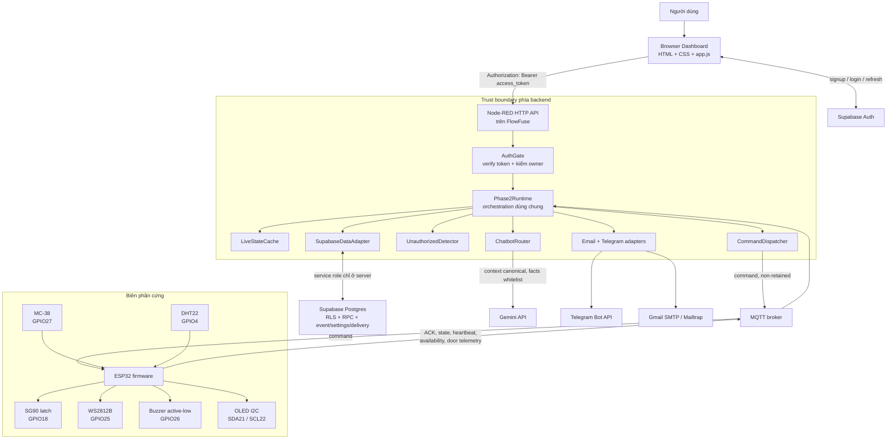

Điểm phải nói được từ sơ đồ:

- Browser không có MQTT credential và không có Supabase service-role key.
- Node-RED là policy/egress boundary: chỉ nó được phát command sau khi verify
  token, owner và trạng thái thiết bị.
- ESP32 quyết định các interlock cục bộ và cảnh báo mở trái phép ngay cả khi
  đường cloud tạm mất.
- Supabase giữ lịch sử bền vững; `LiveStateCache` mới là lớp live state đã kiểm
  freshness. Retained MQTT không tự trở thành realtime.
- DHT22/OLED là luồng cục bộ, không đi qua MQTT trong phiên bản này.

### 4.2. Hai luồng bắt buộc của đề bài

Luồng input vật lý đến frontend:

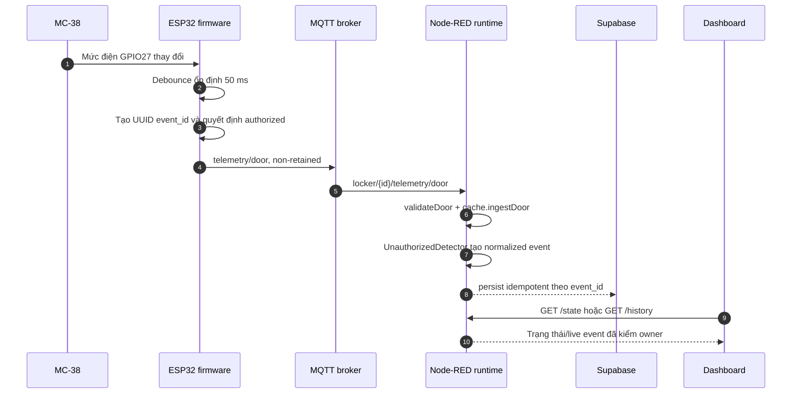

Luồng frontend đến output vật lý:

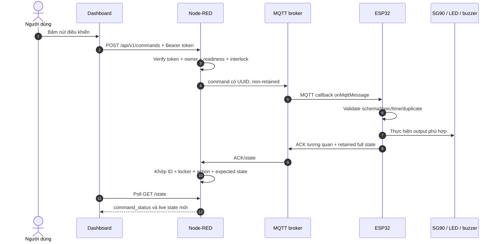

Giảng viên có thể hỏi “DHT22 có đi lên cloud không?”. Câu đúng là **không**:
YC1 cố ý local `DHT22 → EnvironmentMonitor → DisplayController → OLED`; source
không có publisher nhiệt độ hoặc độ ẩm.

### 4.3. Ba loại state không được đánh đồng

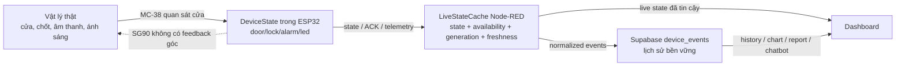

`lock=LOCKED/UNLOCKED` chỉ là kết quả chu trình lệnh chốt sau deadline 2 giây;
nó không đo được tay servo đã vào đúng khớp. `door=OPEN/CLOSED` là trạng thái
MC-38, cũng không phải cảm biến góc chốt.

### 4.4. Bản đồ source of truth — mở file nào khi bị hỏi

| Câu hỏi | Source phải mở | Hàm/lớp chính |
|---|---|---|
| “`.ino` chạy gì?” | `arduino/SmartPrivacyLocker/SmartPrivacyLocker.ino` và các `.cpp/.h` cùng thư mục | `.ino` chỉ include thư viện; Arduino IDE tự biên dịch toàn bộ translation unit trong sketch |
| Thứ tự boot/loop | `firmware/src/main.cpp` | `setup()`, `loop()`, `onMqttMessage()`, `processDoorSensor()` |
| Parse command | `firmware/src/command_handler.cpp` | `parseAndValidateCommand()`, `parseIso8601Utc()` |
| Servo | `firmware/src/lock_controller.cpp` | `start()`, `tick()`, `cancel()` |
| MC-38/debounce/quyền mở | `door_sensor.cpp`, `door_security.cpp` | `sample()`, `evaluateTransition()`, `expireIfDue()`, `observeTransition()` |
| MQTT/LWT/heartbeat/reconnect | `firmware/src/mqtt_client.cpp` | `tick()`, `connect()`, `publishState()`, `disconnectWithOfflineFallback()` |
| MQTT contract backend | `node-red/lib/contracts.js` | `validateState/Door/Ack/Availability/Heartbeat()` |
| Command backend | `node-red/lib/dispatcher.js` | `dispatchUser()`, `dispatch()`, `processAck()`, `expire()` |
| Orchestration chung | `node-red/lib/runtime.js` | `ingest()`, `protectedCommand()`, `runDailyReports()` |
| Fresh/stale state | `node-red/lib/live-state.js` | `ingressGeneration()`, `snapshot()` |
| Cảnh báo trái phép | `node-red/lib/security.js` | `UnauthorizedDetector.onDoor()` |
| HTTP/MQTT wiring | `node-red/flows.json` | các Function node gọi `Phase2Runtime`; không đặt business logic lớn trong flow |
| Artifact deploy | `node-red/flows.flowfuse.json` | file sinh từ script; không sửa tay |
| Web | `dashboard/app.js` | `protectedFetch()`, `pollState()`, `renderState()`, các event listener |
| Auth/owner | `node-red/lib/auth.js`, migrations Phase 2 | `AuthGate.authorize()`, `claim_locker()` |
| History/chart/settings | `node-red/lib/data.js`, `statistics.js`, `report-time.js` | `allEvents()`, `chart()`, `aggregateChart()`, `calendarRange()` |
| Telegram | `telegram-link.js`, `telegram.js`, `runtime.js` | token/hash/secret/private chat/consume/link/send |
| Gemini | `node-red/lib/chatbot.js` | `analyze()`, `sanitizedContext()`, `ChatbotRouter.ask()` |
| Email | `node-red/lib/email.js`, `runtime.js` | `renderDailyEmail()`, `EmailAdapter.send()`, `runDailyReports()` |
| Schema/RLS/RPC | `supabase/migrations/` | table, policy, grant, claim/link/delivery RPC |

## 5. Phân công theo đề xuất

| Thành viên | Chức năng đăng ký | Phải trình bày sâu |
|---|---|---|
| Thái Quang Huy — 24127177 | CB2, YC1, YC3, YC12 | SG90, DHT/OLED, WS2812B, WiFiManager và phần firmware tích hợp liên quan |
| Nguyễn Văn Minh — 24127205 | CB1, YC6, YC8, YC9 | MC-38, unauthorized detector/Telegram, Gemini grounding, Auth/ownership/RLS |
| Mai Phương Thùy — 24127249 | CB3, YC4, YC5, YC7 | buzzer, persistence/history, chart 7/30 ngày, daily email |

Mỗi người vẫn phải giải thích được contract chung, vì một chức năng E2E luôn
đi qua phần của nhiều người. “Em không làm nên em không biết” không phải câu trả
lời tốt cho interface mà phần mình trực tiếp dùng.

## 6. Pin map và ý nghĩa điện

| Thiết bị | Nguồn | GPIO | Ý nghĩa |
|---|---|---:|---|
| DHT22 | 3.3 V | 4 | data; pull-up lên 3.3 V nếu module chưa có |
| SG90 | rail tải 5 V | 18 | PWM/control signal; không cấp dòng servo từ GPIO |
| OLED SSD1306 | 3.3 V | SDA 21, SCL 22 | I2C; pull-up không được lên 5 V |
| WS2812B | rail tải 5 V | DI 25 | data qua 330–470 Ω gần DIN; tụ 470–1000 µF gần tải |
| Active buzzer LOW-trigger | ESP32 3.3 V | I/O 26 | active-low, signal qua 4.7 kΩ |
| MC-38 | dry contact về GND | 27 | `INPUT_PULLUP`; mapping LOW=CLOSED phải test thật |

GPIO 0, 2, 12 và 15 được tránh vì liên quan boot strapping; GPIO34–39 chỉ input
nên không dùng cho output. ESP32 là logic 3.3 V, vì vậy không đưa tín hiệu 5 V
trực tiếp vào GPIO.

## 7. Kiến thức vật lý và điện tử cần thuộc bản chất

### 7.1. Định luật và công thức

| Khái niệm | Công thức | Cách liên hệ sản phẩm |
|---|---|---|
| Định luật Ohm | `V = I × R` | điện trở hạn dòng/độ sụt áp trên dây và contact |
| Công suất | `P = V × I` | chọn adapter, dây, switch và đánh giá nhiệt |
| Sụt áp dây | `V_drop = I × R_wire` | servo/LED kéo dòng lớn làm điện áp tại tải thấp hơn đầu nguồn |
| Năng lượng tụ | `E = 1/2 × C × V²` | tụ hỗ trợ xung ngắn nhưng không cấp đủ công suất liên tục |
| Điện tích tụ | `Q = C × V` | tụ lớn hơn lưu nhiều điện tích ở cùng điện áp |
| Hằng số RC | `τ = R × C` | minh họa lọc/bounce; firmware đang debounce theo thời gian ổn định |
| Dự phòng nguồn | `I_supply ≥ 1.25 × I_continuous_max` | chính sách acceptance của dự án, còn phải kiểm peak/stall |

### 7.2. Điều phải nói chính xác

- Adapter 5 V/3 A không “đẩy 3 A” vào mọi linh kiện; tải lấy dòng theo mạch,
  miễn là điện áp đúng và nguồn đủ khả năng cung cấp.
- Nguồn dòng lớn không tự gây cháy, nhưng short, sai điện áp, dây/connector yếu
  hoặc thiết bị lỗi có thể kéo dòng nguy hiểm; cần bảo vệ và định mức.
- Common GND tạo cùng mốc 0 V cho signal. Không chung GND, mức HIGH/LOW ở phía
  nhận không có tham chiếu đáng tin cậy.
- Tụ 470 µF giảm transient/noise gần WS2812B, nhưng không sửa được adapter thiếu
  dòng hoặc dây quá mảnh.
- Điện trở 470 Ω nối tiếp data WS2812B giảm ringing/inrush vào input và bảo vệ
  phần nào đường signal; nó không phải điện trở hạn dòng cho nguồn LED.
- 4.7 kΩ của buzzer nằm trên đường I/O để giới hạn/giảm rủi ro dòng input; vẫn
  phải test module thật vì mạch trigger bên trong clone có thể khác.
- Pull-up DHT22 giữ đường data ở HIGH khi không thiết bị nào kéo xuống; pull-up
  phải về 3.3 V để bảo vệ GPIO.

### 7.3. Servo PWM

SG90 nhận chuỗi xung điều khiển lặp lại; độ rộng xung được ánh xạ thành góc bởi
thư viện. Nó không được điều khiển bằng cách cấp “170 V” hay thay đổi nguồn DC
theo góc. `170°/80°` là giá trị lệnh, còn góc/lực thật phụ thuộc servo, horn,
nguồn và cơ khí. Stall current thường lớn hơn dòng không tải, nhưng phải lấy
giá trị từ datasheet đúng specimen hoặc đo an toàn, không dùng một con số mạng
cho mọi SG90 clone.

### 7.4. I2C

I2C dùng SDA/SCL kiểu open-drain/open-collector: thiết bị kéo LOW, điện trở kéo
lên tạo HIGH. Nhiều thiết bị dùng chung hai dây và phân biệt bằng địa chỉ; OLED
thường là `0x3C` nhưng phải scan part thật. Pull-up lên 5 V có thể đưa mức quá
cao vào ESP32 dù OLED được quảng cáo “hỗ trợ 5 V”.

### 7.5. MC-38 và debounce

MC-38 là reed contact thụ động, không tự xuất logic 3.3 V. `INPUT_PULLUP` kéo
GPIO27 HIGH khi hở; contact nối GND khi đóng. Công tắc cơ/reed có thể rung quanh
chuyển trạng thái, nên firmware chỉ phát event sau trạng thái ổn định 50 ms.
Boot là `UNKNOWN` để không báo sai trước khi có mẫu ổn định.

### 7.6. Cơ cấu cơ khí: cửa, chốt và sensor là ba thứ khác nhau

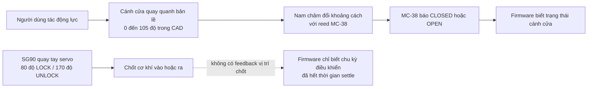

Phải phân biệt chính xác:

- **SG90 không tự mở cánh cửa.** Nó chỉ quay tay servo/thanh truyền/chốt để cho
  phép hoặc ngăn người dùng mở cửa.
- **MC-38 không biết chốt đang ở góc nào.** Nó chỉ suy ra cửa OPEN/CLOSED từ
  reed switch và nam châm.
- **ACK `LOCKED`/`UNLOCKED` không phải encoder feedback.** Firmware gửi kết quả
  sau state machine và thời gian settle; servo có thể vẫn kẹt, trượt tay hoặc
  lệch cơ khí.
- **Góc 80°/170° là calibration của specimen hiện tại**, không phải thông số
  tuyệt đối của mọi SG90. Sau khi thay servo/tay/chốt phải hiệu chỉnh lại và
  kiểm không ép stall ở hai đầu hành trình.
- Chốt chỉ nên đi vào khi raw MC-38 đang CLOSED. Nếu cửa bật mở trong lúc servo
  chạy, firmware hủy latch, trả lock state về `UNKNOWN` và báo lỗi command liên
  quan.

### 7.7. Mô hình Fusion 360 và cách demo khi thầy hỏi thiết kế 3D

File chính là
`THUYETMINH/03_SMART_PRIVACY_LOCKER_VIVA_FINAL/01_MO_HINH_FUSION_CHINH/Smart_Privacy_Locker_v2.1_Final.f3d`.
STEP chỉ là dự phòng hình học vì không giữ đầy đủ timeline, parameter, joint và
Named View như F3D.

Trình tự demo an toàn:

1. Mở F3D, chọn Named View `VIVA_00_START_HERE`.
2. Trong Browser, nhấp phải `Joint_Door_Revolute` → **Drive Joint** và chạy
   `0° → 105°`; dùng `VIVA_03_Interior_Open` hoặc
   `VIVA_08_Annotated_Interior_Context` khi cửa mở.
3. Muốn xem khoang kỹ thuật, tắt visibility của
   `19_Technical_Compartment_Cover`; khi cần có thể tắt thêm `Top_Panel` và
   `Front_Technical_Fascia`, rồi dùng `VIVA_04`, `VIVA_09` hoặc `VIVA_14`.
4. `VIVA_10` tập trung cơ cấu khóa, `VIVA_11` tập trung MC-38,
   `VIVA_06`/`VIVA_07` cho kích thước và `VIVA_05`/`VIVA_12` cho nguồn phía sau.
5. Kết thúc phải đưa joint về 0°, bật lại các component/body đã ẩn và không Save
   đè file gốc chỉ vì trình diễn.

Bằng chứng của **gói CAD**: fresh reopen F3D và STEP đạt; F3D/STEP đều có 340
solid body; 28 Named View; 26 tuyến dây chức năng; joint cửa 0°–105°; quét 22
góc cách nhau 5° không có va chạm nghiêm trọng. Những kết quả này chứng minh
tính nhất quán của model CAD trong phạm vi audit, **không chứng minh** nguồn,
wiring, lực chốt hoặc full-load của sản phẩm thật.

### 7.8. Thứ tự nguồn sự thật khi CAD, report và specimen khác nhau

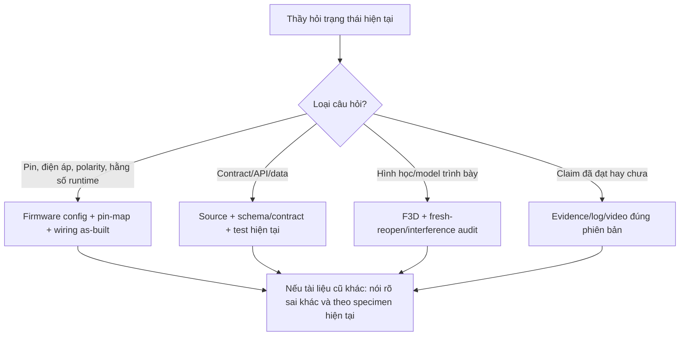

Ví dụ quan trọng: mapping CAD/thuyết minh cũ có nhãn **“Active Buzzer 5 V”**,
nhưng specimen và baseline hiện tại dùng module TMB12A05/LOW-trigger cấp **3.3
V**, GPIO26 qua điện trở nối tiếp 4.7 kΩ, inactive HIGH. Khi thầy hỏi mạch đang
chạy, trả lời theo as-built hiện tại và nói CAD thể hiện vị trí/chức năng danh
nghĩa, không dùng nhãn cũ để suy ra điện áp. Tương tự, số GPIO phải lấy từ
`app_config.h`/pin map hiện tại chứ không suy diễn từ model 3D.

## 8. Firmware phải giải thích được

### 8.0. Vì sao `.ino` gần như trống mà firmware vẫn chạy?

`arduino/SmartPrivacyLocker/SmartPrivacyLocker.ino` chỉ include tám thư viện để
Arduino IDE nhìn thấy dependency. Logic thật nằm trong các `.cpp/.h` cùng thư
mục sketch: `main.cpp`, `mqtt_client.cpp`, `command_handler.cpp`, v.v. Arduino
build system tự biên dịch các file source trong sketch rồi linker ghép chúng với
`setup()` và `loop()` ở `main.cpp`.

Source phát triển chính nằm dưới `firmware/src` và `firmware/include` để
PlatformIO build/test. `arduino/sync-sketch.ps1` sao chép 32 file source sang
sketch Arduino và chế độ `-Check` so SHA-256 để bảo đảm mirror không lệch. Vì
vậy, khi thầy nói “mở file `.ino`”, phải trả lời thêm: **`.ino` là entry artifact
cho Arduino IDE; hãy mở `main.cpp` để xem chương trình chạy**.

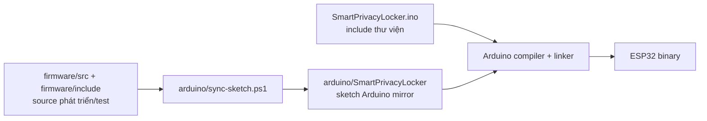

### 8.0.1. Trách nhiệm từng module firmware

| Module | State/thiết bị sở hữu | Điều quan trọng cần nói |
|---|---|---|
| `main.cpp` | ghép toàn bộ hệ thống | boot, loop, MQTT callback, interlock, auto-lock, ACK/state ordering |
| `state_manager` | một `DeviceState` đầy đủ | cold boot và setter; không tự suy diễn cơ khí |
| `command_handler` | parse/validate command | JSON, UUID, schema, action, requester, locker/topic, ISO-8601, stale/future |
| `ack_publisher` | ACK và cache 16 command | replay kết quả gốc với `duplicate:true`, không actuate lại |
| `mqtt_client` | connection lifecycle | TLS CA, unique client ID, LWT, subscribe, backoff, outbox-first bootstrap, heartbeat |
| `lock_controller` | SG90 state machine | attach → write angle → chờ 2 giây bằng `tick()` → detach; có `cancel()` |
| `door_sensor` | raw level → stable state | candidate + `candidateSinceMs` + debounce 50 ms + initial stable sample |
| `door_security` | one-time grant, auto-lock policy, door FIFO | grant 30 giây, consume một lần, unauthorized, lock-on-close, queue 8 edge |
| `alarm_controller` | buzzer | active-high/low abstraction, boot inactive, idempotent set |
| `led_controller` | WS2812B | 10 pixel as-built, brightness 32, GRB 800 kHz, ON trắng/OFF clear |
| `environment_monitor` | DHT22 | poll 2,5 giây, kiểm `NaN`, giữ reading gần nhất |
| `display_controller` | OLED SSD1306 | I2C 0x3C, refresh tối đa 1 giây, chỉ redraw khi data/state đổi |
| `wifi_provisioning` | WiFiManager | portal non-blocking, timeout 180 giây, `R` qua USB để xóa cấu hình |
| `time_utils` | NTP/UTC | chỉ coi thời gian đáng tin khi epoch ≥ 1700000000; trước đó timestamp null |

### 8.1. Vì sao loop không chặn?

Wi-Fi, MQTT, servo completion, debounce, DHT/OLED và buzzer phải tiến triển gần
đồng thời. Nếu dùng `delay()` dài trong callback, MQTT keepalive/reconnect và
sensor có thể bị đói. Thiết kế lưu state/timestamp, mỗi vòng xử lý một bước nhỏ.

Thứ tự trong `setup()`:

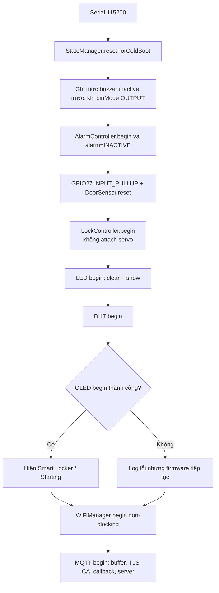

Thứ tự trong mỗi vòng `loop()`:

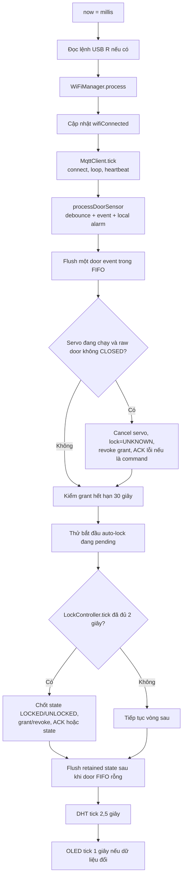

Hai lần lấy thời gian (`now` đầu vòng và `actuatorNow=millis()` sau MQTT callback)
là có chủ ý. `mqttClient.tick()` có thể nhận command và gọi `LockController.start()`
đồng bộ; dùng timestamp cũ hơn thời điểm start có thể làm phép tính elapsed sai.

### 8.2. Safe boot

State lạnh:

```json
{"door":"UNKNOWN","lock":"UNKNOWN","alarm":"INACTIVE","led":"OFF"}
```

Servo không attach/move trong `setup()`, buzzer được đưa về inactive, LED off,
không replay command cũ. Đây là lựa chọn an toàn vì retained state chỉ là last
known, không đủ quyền làm actuator chạy sau reboot.

### 8.3. Chu trình command

1. Node-RED tạo UUID, thời gian, requester đã xác thực.
2. ESP32 parse JSON và kiểm schema, UUID, locker/topic, action, timestamp.
3. Nếu duplicate đã hoàn tất, replay ACK cache với `duplicate:true`, không chạy
   actuator lần hai.
4. Nếu hợp lệ, controller bắt đầu state machine.
5. Sau completion/settle, state manager cập nhật và phát ACK + full state.
6. Node-RED chỉ hoàn tất pending nếu ID, locker, action và expected state khớp.

Cache firmware mặc định giữ 16 command kết quả gần nhất trong RAM; reboot làm
mất cache nhưng command là non-retained/clean session nên không bị broker replay.

Flow chính bên trong `onMqttMessage()`:

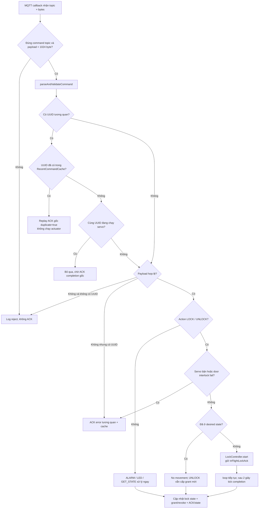

Các nhánh action:

| Action | Controller | Điều kiện đặc biệt | Khi nào ACK success? |
|---|---|---|---|
| `LOCK` | `LockController` | stable **và raw** door đều `CLOSED`; revoke grant ngay | sau 2 giây settle, hoặc no-op nếu đã `LOCKED` |
| `UNLOCK` | `LockController` | stable **và raw** door đều `CLOSED` | sau 2 giây; cấp một grant 30 giây. Nếu đã `UNLOCKED`, không quay nhưng vẫn cấp grant mới |
| `ALARM_ON/OFF` | `AlarmController` | controller đã `begin()` | ngay sau khi output được ghi/idempotent |
| `LED_ON/OFF` | `LedController` | không có servo interlock | ngay sau `pixels.show()` |
| `GET_STATE` | không actuator | chỉ đọc state | ACK ngay và yêu cầu retained full-state publish |

Lưu ý dễ bị hỏi: ACK được publish trước để giảm latency, nhưng retained state
có thể bị hoãn cho đến khi FIFO door transition rỗng. Mục đích là không cho
snapshot mới vượt qua một physical edge cũ đang đợi gửi.

### 8.4. Giới hạn timestamp và cách đã harden

Sau khi NTP hợp lệ, firmware chặn command quá cũ hơn 120 giây và command xa
hơn 30 giây trong tương lai. Quá cũ trả `STALE_COMMAND`; quá xa tương lai trả
`INVALID_ISSUED_AT`. Khi NTP chưa sync, firmware không giả vờ biết wall-clock:
nó dựa thêm command non-retained, clean session và backend timeout. Đây là giới
hạn trung thực, không phải bỏ kiểm tra sau khi đồng hồ đã đáng tin cậy.

### 8.5. State machine SG90 và interlock hai lớp

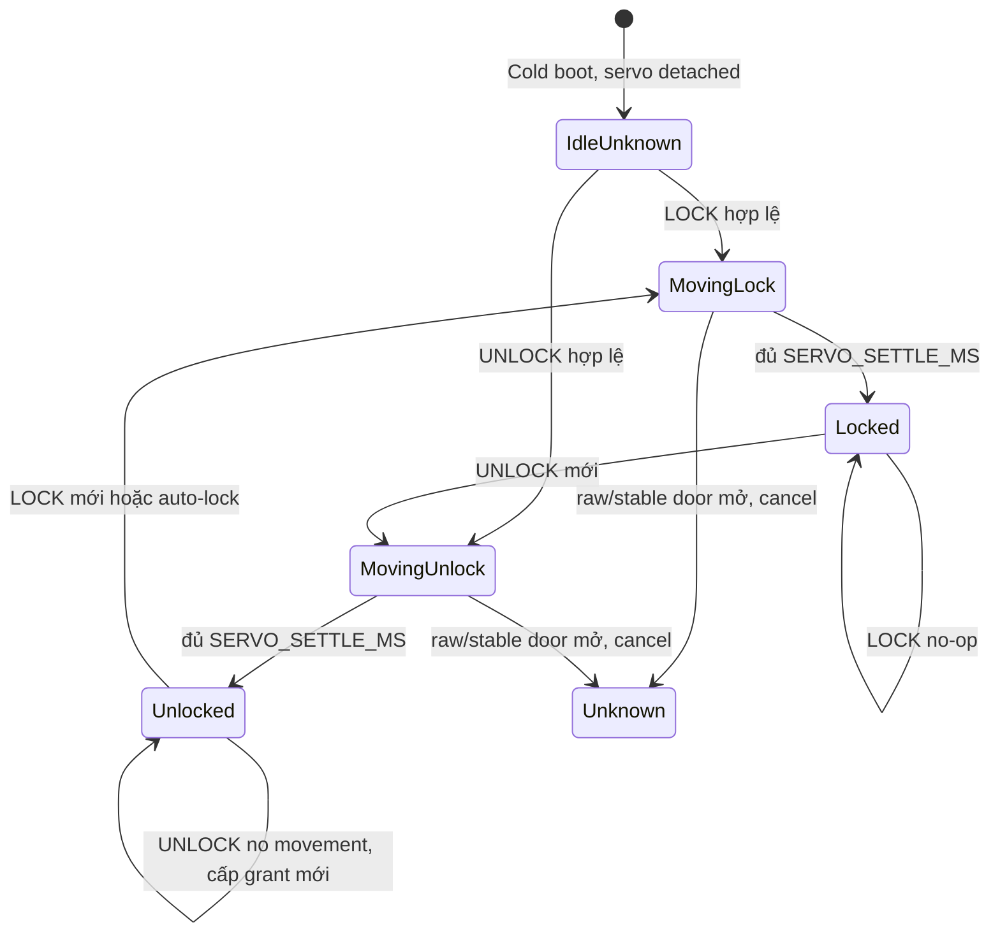

Interlock dùng cả:

- **stable door** từ debounce để quyết định business state/event;
- **raw door** đọc tức thời để ngắt servo sớm, không chờ đủ 50 ms nếu cửa bị mở
  trong lúc latch đang chạy.

Khi cancel, firmware detach servo, đặt `lock=UNKNOWN`, revoke grant. Nếu đây là
command từ MQTT, ACK đang giữ được đổi thành error `DOOR_NOT_CLOSED` hoặc
`DOOR_NOT_CLOSED_FOR_ACCESS`; nếu là auto-lock thì chỉ publish state vì không có
`command_id` để tạo ACK.

### 8.6. State machine một lượt mở và auto-lock

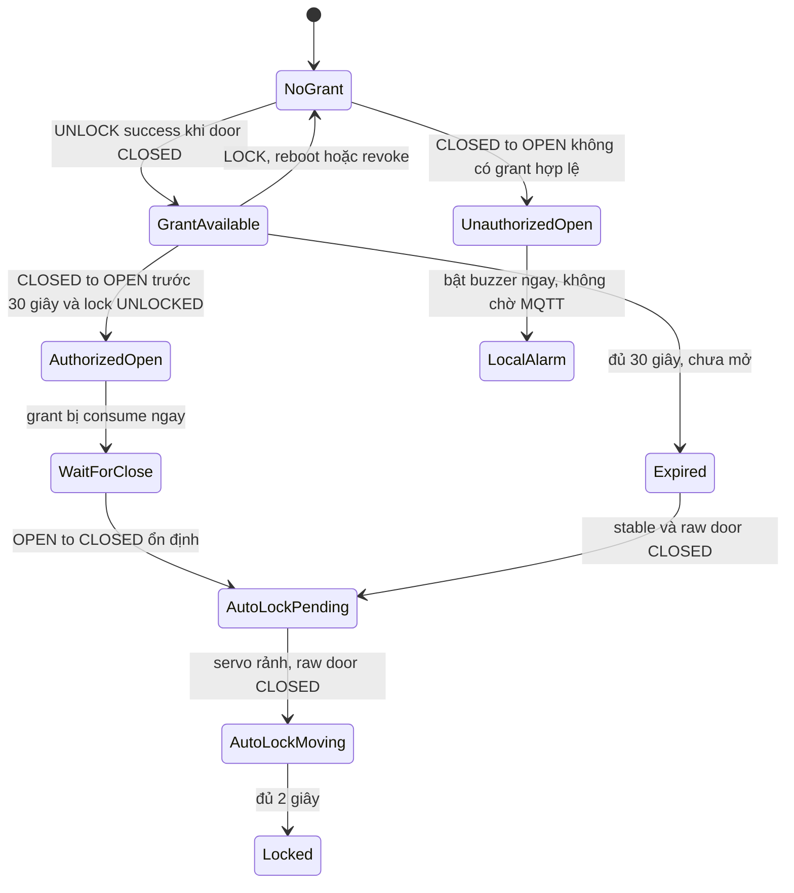

`DoorAccessController` quyết định `AUTHORIZED/UNAUTHORIZED`; `DoorAutoLockPolicy`
chỉ nhớ rằng một OPEN thật đã xảy ra để khóa ở lần CLOSED kế tiếp. Hai lớp này
tách nhau vì quyền mở và thời điểm khóa lại là hai trách nhiệm khác nhau.

Mẫu CLOSED đầu tiên sau boot có `initialStableSample=true`, chỉ khởi tạo state,
không phát transition, không arm auto-lock và không quay servo. Đây là chỗ thầy
có thể hỏi “tại sao boot thấy cửa đóng mà không tự khóa?”.

### 8.7. Door event outbox và ordering

FIFO có tối đa 8 `DoorTransitionRecord` trong RAM. Mỗi record giữ previous/current,
`authorized`, UUIDv4, timestamp và `timeSynced`. Nếu MQTT mất, local state/alarm
vẫn xử lý rồi record được queue. Khi reconnect:

1. firmware subscribe command và publish retained `ONLINE`;
2. `MqttClient.tick()` chưa chạy callback command và chưa publish bootstrap state;
3. `main.cpp` phát từng door edge theo FIFO;
4. khi FIFO rỗng mới publish retained full state và bắt đầu heartbeat.

Nhờ vậy event cũ không bị snapshot mới vượt mặt. Giới hạn trung thực: queue đầy
thì record mới nhất bị từ chối; reboot làm mất queue vì đây không phải durable
storage. Local alarm/state vẫn không phụ thuộc queue.

### 8.8. Các hằng số phải nhớ

| Hằng số | Giá trị hiện tại | Ý nghĩa |
|---|---:|---|
| `SERVO_SETTLE_MS` | 2.000 ms | deadline logic trước khi detach và ACK success |
| `LOCK_ANGLE` / `UNLOCK_ANGLE` | 80° / 170° | calibration của cơ cấu as-built |
| one-time opening window | 30.000 ms | một OPEN sau UNLOCK |
| `DOOR_DEBOUNCE_MS` | 50 ms | thời gian mức contact phải ổn định |
| `DOOR_EVENT_OUTBOX_SIZE` | 8 | FIFO transition trong RAM |
| `RECENT_COMMAND_CACHE_SIZE` | 16 | kết quả command gần nhất trong RAM |
| `MQTT_PACKET_SIZE` | 1.024 byte | buffer runtime PubSubClient |
| heartbeat/state refresh | 10.000 ms | giữ thiết bị yên lặng vẫn fresh |
| reconnect backoff | 1.000 → 30.000 ms | nhân đôi có giới hạn |
| command max age | 120 giây | chỉ áp sau NTP sync |
| future skew | 30 giây | chỉ áp sau NTP sync |
| DHT poll | 2.500 ms | tránh đọc DHT22 quá dày |
| OLED refresh cap | 1.000 ms | chỉ redraw khi reading/state thay đổi |
| Wi-Fi portal timeout | 180 giây | portal non-blocking không tồn tại vô hạn |
| WS2812 as-built | 10 pixel, brightness 32 | local config; example mặc định chỉ 1 pixel |

### 8.9. Toolchain và thư viện — phải hiểu vai trò, không chỉ thuộc version

Khi thầy hỏi một thư viện, trả lời theo **năm vế**:

1. nó giải quyết việc gì;
2. code dự án gọi class/hàm nào và ở file nào;
3. nó nằm ở lớp nào, nhận đầu vào gì và tạo đầu ra gì;
4. vì sao phù hợp hơn phương án gần nhất trong phạm vi dự án;
5. giới hạn/rủi ro của nó và phải test lại gì nếu thay thế.

Không trả lời kiểu “thư viện này để kết nối” vì chưa nói kết nối gì, bằng giao
thức nào, ở phía nào và giới hạn ra sao.

#### 8.9.1. Từ điển để không nhầm khái niệm

| Khái niệm | Nghĩa đúng trong dự án | Ví dụ |
|---|---|---|
| Library/thư viện | Mã tái sử dụng mà code gọi qua API; thư viện không tự quyết định toàn bộ vòng đời chương trình | `ArduinoJson`, `PubSubClient`, `Nodemailer` |
| Framework | Khung thực thi và convention lớn hơn; framework gọi code của ta ở các điểm mở rộng | Arduino gọi `setup()/loop()`; Node-RED chạy các node/Function |
| Runtime | Môi trường thực thi chương trình | Node.js; Arduino runtime trên ESP32 |
| SDK | Bộ công cụ/API theo một nền tảng hoặc dịch vụ, thường rộng hơn một library đơn lẻ | Dự án **không** dùng `supabase-js` hay Gemini SDK; backend gọi REST trực tiếp |
| Driver | Lớp điều khiển phần cứng/protocol cụ thể | `Adafruit_SSD1306` điều khiển chip OLED SSD1306 |
| Protocol | Quy tắc trao đổi dữ liệu, không phải library | MQTT, HTTP, TLS, I2C, SMTP |
| Toolchain | Compiler, linker, uploader và công cụ build | Xtensa GCC + esptool do PlatformIO quản lý |
| Development platform | Gói PlatformIO ghép board, framework, toolchain và metadata | `espressif32@6.10.0` |
| Direct dependency | Package được dự án khai báo trực tiếp | chín dòng thư viện pin trong `firmware/platformio.ini` |
| Transitive dependency | Package do dependency khác kéo theo | `DNSServer`/`WebServer` qua WiFiManager; `Adafruit BusIO` qua stack màn hình |
| Built-in/core library | Đi cùng framework/runtime, không cài như package ứng dụng độc lập | `WiFi`, `Wire`, `node:crypto`, `node:test` |
| API | Hợp đồng hàm/class mà code dùng | `deserializeJson()`, `mqtt_.publish()`, `fetch()` |

Thư viện và giao thức không phải một: `PubSubClient` là implementation client;
MQTT mới là giao thức. Tương tự, `Nodemailer` là library; SMTP mới là giao thức.

#### 8.9.2. Các lớp dependency thực tế

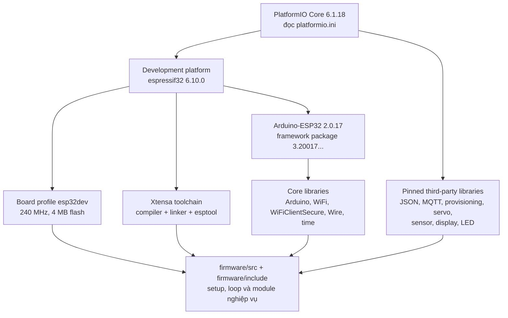

Mấu chốt: `PlatformIO Core 6.1.18`, `espressif32@6.10.0` và Arduino-ESP32
`2.0.17` là **ba lớp khác nhau**. Nói “PlatformIO version 6.10.0” là thiếu chính
xác; `6.10.0` là version của development platform Espressif 32.

#### 8.9.3. Version/profile đã xác minh

| Lớp | Version/profile thật | Lấy từ đâu/ý nghĩa |
|---|---|---|
| PlatformIO Core | `6.1.18` trên máy kiểm tra | chương trình `pio` điều phối build/test/package |
| PlatformIO Development Platform | `espressif32@6.10.0` | dòng `platform` trong `firmware/platformio.ini` |
| Board | `esp32dev` | ESP32 Dev Module, 240 MHz, 320 KiB RAM được build profile công bố, 4 MiB flash |
| Framework | Arduino-ESP32 upstream `2.0.17` | package thực tế `framework-arduinoespressif32@3.20017.241212+sha.dcc1105b` |
| Compiler toolchain | `toolchain-xtensa-esp32@8.4.0+2021r2-patch5` | package do development platform resolve |
| Upload tool | esptool.py `4.5.1` | đóng gói/nạp firmware, không phải code nghiệp vụ |
| Test framework firmware | Unity | `test_framework = unity`; native suite hiện đạt 28/28 |
| Arduino CLI | `1.5.1` đi kèm Arduino IDE đang cài | clean compile profile `esp32dev_2_0_17` của mirror |
| Node.js manifest | `>=20` | ngưỡng hỗ trợ trong `node-red/package.json` |
| Node.js lúc rà soát | `24.14.1` | runtime thật của lượt test ngày 2026-08-18 |
| Node-RED | peer `>=4.1.13 <5` | host tương thích; không phải dependency được app tự nhúng |

Kết quả PlatformIO build vừa xác minh là RAM 53.580/327.680 byte (16,4%) và
flash 1.108.145/1.310.720 byte (84,5%). Clean Arduino CLI profile trên mirror
cũng PASS: RAM 53.608 byte và flash 1.112.269 byte. Hai pipeline có một số build
flag/package resolution khác nên số byte không cần giống hệt; điều bắt buộc là
mỗi pipeline dùng đúng profile pin và PASS trên 32 source file byte-identical.
Version pin giúp tái lập đúng build; không có nghĩa version mới hơn luôn xấu.
Không nâng core/library ngay trước vấn đáp nếu chưa chạy lại compile, test và
E2E liên quan.

#### 8.9.4. Chín thư viện firmware được pin trực tiếp

| Thư viện | Vai trò và API dự án thật sự dùng | Phân biệt/giới hạn phải nói được |
|---|---|---|
| `ArduinoJson 7.4.2` | `command_handler.cpp` dùng `JsonDocument` + `deserializeJson()` để parse command; `ack_publisher.cpp` và `mqtt_client.cpp` dùng `serializeJson()` để tạo ACK/state/event/availability | JSON chỉ là format payload, không vận chuyển dữ liệu. V7 dùng `JsonDocument` co giãn và quản lý bộ nhớ; các buffer output của dự án vẫn có kích thước cố định và phải kiểm tra tràn/truncation |
| `PubSubClient 2.8.0` | `MqttClient` đặt server/callback/buffer, connect, subscribe, `loop()` và publish các topic MQTT | Nhẹ và synchronous, hợp loop nhỏ; publish chỉ QoS0, subscribe yêu cầu QoS0/1, không expose đầy đủ SUBACK grant. `setBufferSize(1024)` là packet buffer, không phải “payload được đúng 1.024 byte” vì còn header/topic |
| `WiFiManager 2.0.17` | `WifiProvisioning` gọi `setConfigPortalBlocking(false)`, timeout, `autoConnect()`, `process()` và reset settings | Là lớp provisioning/captive portal **trên** `WiFi.h`; không thay Wi-Fi driver, MQTT hay TLS. Non-blocking đòi `process()` được gọi đều trong loop |
| `ESP32Servo 3.0.7` | `LockController` đặt 50 Hz, `attach(GPIO18, 500, 2400)`, `write(80/170)`, kiểm `attached()` và `detach()` | Bọc PWM/LEDC theo API Servo; không tạo feedback góc. Return của `attach()` là channel, channel 0 hợp lệ nên không cast thành boolean |
| `DHT sensor library 1.4.6` | `EnvironmentMonitor` tạo `DHT(pin, DHT22)`, `begin()`, `readTemperature()`, `readHumidity()` và loại `NaN` | API trực tiếp, đơn giản; DHT22 chậm nên dự án poll 2,5 giây. Đọc thành công không chứng minh sensor đã hiệu chuẩn tuyệt đối |
| `Adafruit Unified Sensor 1.1.15` | Được pin để cố định dependency của DHT package; code hiện tại **không** tạo `DHT_Unified`, `sensor_t` hay `sensors_event_t` | Unified Sensor chuẩn hóa metadata/event và đơn vị SI giữa nhiều sensor; DHT direct API trả float trực tiếp. Không được nói dự án đang dùng unified event abstraction |
| `Adafruit SSD1306 2.5.15` | `DisplayController` sở hữu framebuffer 128×64, `begin(..., 0x3C)`, clear/draw rồi `display()` | Driver dành cho controller SSD1306; nó không phải bus I2C và không thay GFX. `display()` mới đẩy framebuffer ra màn hình |
| `Adafruit GFX 1.12.1` | Cung cấp primitive text/line/shape mà `Adafruit_SSD1306` kế thừa; code gọi qua object `display_` | GFX là lớp đồ họa chung, không biết phần cứng SSD1306 cụ thể và tự nó không làm OLED sáng |
| `Adafruit NeoPixel 1.12.5` | `LedController` cấu hình `NEO_GRB + NEO_KHZ800`, `begin()`, brightness 32, `fill()`, `clear()` và `show()` cho 10 WS2812B | `fill/clear` sửa buffer; `show()` mới truyền bit ra DIN. `setBrightness()` là scale dữ liệu màu, không thay thế tính toán nguồn hay giới hạn dòng phần cứng |

`SmartPrivacyLocker.ino` include **tám** header chính để Arduino IDE nhận
dependency: GFX, NeoPixel, SSD1306, ArduinoJson, DHT, ESP32Servo, PubSubClient
và WiFiManager. Unified Sensor vẫn được pin vì quan hệ dependency của DHT nhưng
source dùng API `DHT` trực tiếp, nên không cần include `Adafruit_Sensor.h` hoặc
`DHT_U.h` trong `.ino`.

#### 8.9.5. Thư viện core và dependency kéo theo

| Thành phần | Dự án dùng để làm gì | Không được nhầm với |
|---|---|---|
| `Arduino.h` | GPIO, `millis()`, `Serial`, kiểu/core Arduino | PlatformIO; một cái là core API, một cái là công cụ build |
| `WiFi.h` | STA mode, trạng thái kết nối và TCP nền cho WiFiManager/MQTT | WiFiManager chỉ lo provisioning; nó vẫn dựa trên WiFi core |
| `WiFiClient` | TCP thường khi cấu hình broker không TLS | `WiFiClientSecure` có TLS; plain TCP không xác thực/mã hóa đường truyền |
| `WiFiClientSecure` | TLS client; dự án nạp CA bằng `setCACert()` | `setInsecure()` bỏ kiểm chứng server và dự án cố ý **không gọi** nó |
| `Wire` | I2C master cho OLED qua SDA21/SCL22 | SSD1306 là thiết bị/driver ở trên bus; GFX là primitive đồ họa |
| `time.h` + SNTP | `configTime()`, `time()`, `gmtime_r()`, `strftime()` để tạo/kiểm timestamp UTC | `millis()` là thời gian tăng từ boot, không phải thời gian lịch |
| `esp_system.h`/`ESP` | device ID từ eFuse và restart khi reset provisioning | Không phải thư viện MQTT hay database |
| `DNSServer`, `WebServer` | dependency kéo theo để WiFiManager dựng captive portal | Dự án không tự viết REST backend trên ESP32 bằng các package này |
| `Adafruit BusIO`, `SPI` | dependency có thể xuất hiện trong build graph của stack Adafruit | OLED as-built đang dùng I2C; package hỗ trợ SPI không có nghĩa wiring hiện tại dùng SPI |

##### So sánh cặp thư viện/phương án firmware hay bị hỏi

| Cặp so sánh | Khác nhau cốt lõi | Vì sao lựa chọn hiện tại hợp lý / khi nào đổi |
|---|---|---|
| ArduinoJson vs parse chuỗi thủ công | ArduinoJson hiểu cấu trúc/type JSON và báo lỗi parse; tìm substring dễ nhận sai escape, thứ tự field và malformed input | Dùng ArduinoJson vì command có schema; vẫn phải validate field sau parse. Parse tay chỉ hợp format cực nhỏ, cố định và có parser được chứng minh |
| ArduinoJson vs cJSON | ArduinoJson có API C++ tối ưu hệ Arduino; cJSON là C, thao tác tree/ownership khác | Không có lợi ích cụ thể để thêm cJSON vào stack hiện tại; đổi parser phải test malformed input, memory và serialization parity |
| PubSubClient vs MQTT.js | Cả hai là MQTT client nhưng PubSubClient chạy C++ trên MCU; MQTT.js chạy JavaScript/Node/browser | ESP32 dùng PubSubClient; simulator/test Node dùng MQTT.js. Không thể tráo import giữa hai runtime |
| PubSubClient vs Aedes/Mosquitto | PubSubClient là **client**; Aedes/Mosquitto là **broker** nhận và định tuyến client | Aedes chỉ dựng broker in-process khi test; production cần broker được cấu hình TLS/auth/ACL, không dùng PubSubClient làm broker |
| PubSubClient vs client MQTT async | PubSubClient dựa trên `loop()` và thao tác mạng tương đối synchronous; async client dùng callback/event và có thể giảm block khi tải lớn | Với payload/tần suất nhỏ và loop được giữ ngắn, PubSubClient dễ kiểm thử. Nếu tăng throughput/QoS/connection concurrency thì đánh giá client khác và viết lại contract tests |
| WiFiManager vs `WiFi.h` | `WiFi.h` là Wi-Fi core; WiFiManager thêm lưu credential, AP fallback và captive portal | Dùng cả hai theo tầng. Nếu SSID/password cố định trong môi trường quản trị, có thể bỏ portal nhưng giảm khả năng provisioning tại chỗ |
| `WiFiClient` vs `WiFiClientSecure` | Cùng cung cấp stream TCP; bản Secure bọc TLS và xác thực certificate/CA | Internet broker phải ưu tiên Secure; plain chỉ phù hợp lab/network tin cậy. Không dùng `setInsecure()` để “sửa nhanh” lỗi CA |
| ESP32Servo vs raw LEDC | ESP32Servo ánh xạ góc/pulse/50 Hz theo API quen thuộc; raw LEDC cho kiểm soát duty/channel thấp hơn nhưng tự quản pulse và tài nguyên | Servo đơn lẻ hợp wrapper. Raw LEDC phù hợp nếu cần timing/tài nguyên đặc thù, nhưng vẫn không tạo closed-loop feedback |
| `DHT` vs `DHT_Unified` | `DHT` trả temperature/humidity float trực tiếp; unified trả event + metadata theo interface chung | Dự án chỉ có một DHT22 nên direct API gọn. Unified đáng dùng nếu kiến trúc cần hoán đổi/norm hóa nhiều loại sensor |
| SSD1306 vs GFX vs Wire | SSD1306 = driver/controller; GFX = primitive; Wire = transport I2C | Ba lớp bổ sung nhau, không phải ba thư viện cạnh tranh |
| I2C vs SPI cho OLED | I2C dùng SDA/SCL và địa chỉ, ít dây hơn; SPI thường nhiều dây/chip-select nhưng có thể nhanh hơn | Màn 128×64 nhỏ, refresh tối đa 1 giây nên I2C 0x3C đủ. Đổi SPI phải đổi wiring, constructor và test |
| NeoPixel vs FastLED | NeoPixel API nhỏ, trực tiếp cho pixel one-wire; FastLED hỗ trợ nhiều chipset, palette, color math/effect phong phú hơn | Dự án chỉ bật/tắt/fill 10 WS2812B nên NeoPixel đủ và ít bề mặt code. FastLED hợp khi có hiệu ứng/phần cứng đa dạng; không có thư viện nào tự giải quyết sụt áp/level shifting |
| Arduino IDE vs PlatformIO | Arduino IDE thuận tiện mở sketch/tab và upload; PlatformIO pin dependency/profile, có native test và build lặp lại bằng CLI | Source of truth là `firmware/`; mirror `arduino/SmartPrivacyLocker` phục vụ IDE. Không sửa mirror rồi quên đồng bộ |

#### 8.9.6. Dependency phía Node-RED/web

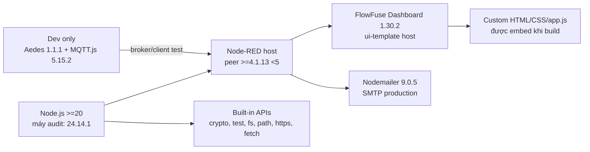

| Package/API | Loại | Vai trò thật trong repo |
|---|---|---|
| `@flowfuse/node-red-dashboard 1.30.2` | `dependencies` | cung cấp `ui-base/theme/page/group/template`; custom Dashboard được nhúng trong một `ui-template` |
| `nodemailer 9.0.5` | `dependencies` | tạo SMTP transport cho email báo cáo; production path, không chỉ test |
| `aedes 1.1.1` | `devDependencies` | broker MQTT in-process có auth/ACL dùng trong live-broker test; không phải broker production |
| `mqtt 5.15.2` (MQTT.js) | `devDependencies` | MQTT clients trong simulator/broker test; không chạy trên ESP32 và không nằm trong browser production |
| `node-red >=4.1.13 <5` | optional `peerDependency` | khai báo app/plugin cần host Node-RED tương thích; host FlowFuse cung cấp, package này không bắt buộc cài lồng trong repo |
| `node:test` + `node:assert/strict` | built-in Node | test runner/assertion, không cần Jest/Mocha |
| `node:crypto` | built-in Node | `randomUUID`, `randomBytes`, SHA-256 và `timingSafeEqual`; không cần `crypto-js` |
| `node:fs`, `node:path`, `node:vm`, `node:https` | built-in Node | build artifact, test browser sandbox và HTTPS adapter trong generated flow |
| Browser `fetch` | Web API built-in | Dashboard gọi Node-RED/Supabase Auth; không import Axios |
| `globalThis.fetch` | Node API built-in | default injectable transport khi chạy module/test; artifact FlowFuse inject wrapper HTTPS dựa trên `https.request` |

`dependencies` cần khi chạy production; `devDependencies` phục vụ build/test;
`peerDependencies` nói package phải sống cùng một host tương thích. Vì Node-RED
peer được đánh dấu optional, `npm ls` cục bộ có thể báo host chưa cài mà unit
suite vẫn hợp lệ; khi deploy thì FlowFuse/Node-RED phải thỏa range.

##### So sánh cặp thư viện/phương án backend hay bị hỏi

| Cặp so sánh | Khác nhau cốt lõi | Câu trả lời theo dự án |
|---|---|---|
| Node-RED vs Express/custom Node server | Node-RED mạnh ở wiring MQTT/HTTP, flow visualization và deploy cấu hình; Express cho routing/middleware code-first và quyền kiểm soát server sâu hơn | Dự án dùng Node-RED làm orchestration, nhưng tách logic quan trọng vào `node-red/lib/*.js` để test được thay vì nhồi hết vào Function node |
| FlowFuse Dashboard vs legacy `node-red-dashboard` | FlowFuse Dashboard là thế hệ hiện tại; legacy dashboard cũ dựa Angular v1 và chỉ còn maintenance hạn chế | Chọn FlowFuse. Tuy nhiên UI của dự án là custom HTML/CSS/JS được host trong `ui-template`, không phải tập hợp widget mặc định |
| Custom HTML/CSS/JS vs framework React/Vue | Custom app không cần build framework và có ít dependency; React/Vue có component/state ecosystem mạnh hơn | Quy mô hiện tại phù hợp vanilla JS; đổi framework không tự cải thiện auth, MQTT contract hay accessibility và sẽ cần lại toàn bộ browser tests |
| Nodemailer vs tự viết raw SMTP | Nodemailer xử lý SMTP session, TLS/auth/message transport; raw SMTP phải tự xử lý protocol/MIME/error | Nodemailer giảm lỗi protocol. Logic reservation/idempotency vẫn thuộc app/DB, không được thư viện email giải quyết hộ |
| Nodemailer/SMTP vs provider HTTP API | SMTP ít khóa vào một nhà cung cấp; provider API có template, telemetry, webhook và idempotency riêng tốt hơn | Gmail/Mailtrap SMTP đủ cho đồ án; production lớn có thể dùng API nhưng phải thiết kế lại delivery state/reconciliation |
| Aedes vs Mosquitto/managed broker | Aedes là broker JavaScript nhúng thuận tiện cho test; Mosquitto/managed broker là service vận hành độc lập với persistence/TLS/ACL/monitoring phù hợp hơn | Không deploy Aedes test harness làm broker production chỉ vì test pass |
| MQTT.js vs PubSubClient | MQTT.js là client Node/browser nhiều tính năng; PubSubClient là client MCU C++ nhỏ | MQTT.js kiểm contract ở phía test; PubSubClient thực thi contract trên ESP32 |
| Native `fetch` vs Axios | `fetch` đã có trong browser và Node hỗ trợ của dự án; Axios thêm wrapper/interceptor/convenience và dependency ngoài | Các request hiện đơn giản, có timeout/abort/validation riêng nên `fetch` đủ. Không nói Axios “an toàn hơn” mặc định |
| REST trực tiếp vs `supabase-js` | REST trực tiếp gọi Auth/PostgREST/RPC endpoint bằng `fetch`; SDK cung cấp API tiện dụng, session/realtime/type ecosystem | Browser/backend hiện kiểm soát header/body/timeout rõ và không cần thêm SDK; nếu thêm phải kiểm lại token boundary, bundle và error mapping |
| REST trực tiếp vs Gemini/Telegram SDK | Direct HTTPS giảm dependency và chỉ dùng endpoint nhỏ; SDK thường tiện retry/type/streaming/webhook | Dự án gọi REST có timeout/validation; không được nói đang dùng Google SDK hay Telegraf |
| `node:test` vs Jest/Mocha | `node:test` tích hợp runtime, ít dependency; Jest có mocking/snapshot/ecosystem lớn, Mocha linh hoạt nhưng cần assertion/mocking bổ sung | Suite CommonJS hiện dùng dependency injection và built-in test đủ; đổi runner không làm test tự tốt hơn |
| `node:crypto` vs `crypto-js` | `node:crypto` là native server API; `crypto-js` là package JS ngoài, hữu ích ở runtime không có Node crypto nhưng tăng dependency | Backend Node dùng native crypto đã đủ. Browser không cần giữ/generate server secret |
| Hash vs encryption | Hash một chiều để so/dedupe/không lưu token thô; encryption hai chiều cần key để giải mã | Telegram link token lưu hash SHA-256; không cần lấy lại token gốc. Password do Supabase Auth quản lý, app không tự hash password |
| `randomUUID()` vs `randomBytes(32)` | UUID v4 có cấu trúc 128-bit, trong đó version/variant chiếm 6 bit; 32 random bytes tạo secret 256-bit rồi base64url | Command/event ID dùng UUID để correlation; Telegram link token dùng random bytes vì đó là bearer secret |
| `timingSafeEqual()` vs `===` | `timingSafeEqual` so byte theo thời gian ít phụ thuộc vị trí khác nhau; hai buffer phải cùng độ dài và code xung quanh vẫn phải an toàn | Webhook/link secret check chuẩn hóa buffer/độ dài trước khi gọi; không tuyên bố một hàm này loại bỏ mọi side-channel |

#### 8.9.7. Source, generated artifact và cách build không bị nhầm

- `firmware/platformio.ini` là nguồn pin dependency/profile PlatformIO.
- `firmware/src` + `firmware/include` là source firmware chính.
- `arduino/SmartPrivacyLocker` là mirror cho Arduino IDE; chạy
  `arduino/sync-sketch.ps1 -Check` để chứng minh 32 file đồng bộ.
- `node-red/package.json` là nguồn version/package Node.
- `dashboard/*`, `node-red/flows.json` và `node-red/lib/*` là source.
- `node-red/flows.flowfuse.json` là artifact được
  `node-red/scripts/build-flowfuse-flow.js` sinh ra; không sửa tay.

Repo nằm trong đường dẫn có tiếng Việt. Xtensa GCC có thể làm hỏng tên response
file khi chạy `pio run` trực tiếp từ đường dẫn Unicode. Script
`firmware/build-esp32.ps1` chỉ map tạm repository sang một drive-letter ASCII,
build đúng source rồi gỡ mapping; nó không “sửa cho code pass”. Lượt kiểm tra
hiện tại đã dùng script này và build thành công.

Nếu thay bất kỳ library/version nào, tối thiểu phải:

1. đọc changelog/API và xác định breaking change;
2. clean build ESP32 và kiểm RAM/flash;
3. chạy 28 native firmware tests và Arduino mirror parity/profile build;
4. nếu đổi MQTT/JSON thì chạy simulator + authenticated broker tests;
5. nếu đổi Node package thì `npm test`, build FlowFuse và audit generated parity;
6. chạy lại E2E vật lý liên quan; compile pass không chứng minh timing, nguồn,
   sensor hoặc actuator thật vẫn đúng.

#### 8.9.8. Nguồn chính thức để kiểm chứng nhanh

- PlatformIO: [Espressif 32 platform](https://docs.platformio.org/en/stable/platforms/espressif32.html),
  [`platform` option](https://docs.platformio.org/en/latest/projectconf/sections/env/options/platform/platform.html),
  [`lib_deps`](https://docs.platformio.org/en/latest/projectconf/sections/env/options/library/lib_deps.html).
- ArduinoJson 7: [`JsonDocument`](https://arduinojson.org/v7/api/jsondocument/) và
  [`deserializeJson()`](https://arduinojson.org/v7/api/json/deserializejson/).
- MQTT/provisioning: [PubSubClient 2.8](https://github.com/knolleary/pubsubclient/blob/v2.8/README.md),
  [trạng thái maintenance upstream hiện tại](https://github.com/knolleary/pubsubclient/blob/master/README.md),
  [WiFiManager](https://github.com/tzapu/WiFiManager) và
  [Arduino-ESP32 Wi-Fi API](https://docs.espressif.com/projects/arduino-esp32/en/latest/api/wifi.html).
- Thiết bị: [ESP32Servo 3.0.7](https://github.com/madhephaestus/ESP32Servo/blob/3.0.7/README.md),
  [DHT](https://github.com/adafruit/DHT-sensor-library),
  [Adafruit Unified Sensor](https://github.com/adafruit/Adafruit_Sensor),
  [Adafruit GFX](https://github.com/adafruit/Adafruit-GFX-Library),
  [SSD1306](https://github.com/adafruit/Adafruit_SSD1306),
  [NeoPixel](https://github.com/adafruit/Adafruit_NeoPixel),
  [FastLED overview](https://github.com/FastLED/FastLED/wiki/Overview) và
  [Arduino-ESP32 I2C](https://docs.espressif.com/projects/arduino-esp32/en/latest/api/i2c.html).
- Backend: [Node-RED Function](https://nodered.org/docs/user-guide/writing-functions),
  [Node-RED context](https://nodered.org/docs/creating-nodes/context),
  [FlowFuse Dashboard migration](https://dashboard.flowfuse.com/user/migration.html),
  [Nodemailer SMTP](https://nodemailer.com/smtp),
  [Node globals/fetch](https://nodejs.org/docs/latest-v24.x/api/globals.html),
  [Node crypto](https://nodejs.org/docs/latest-v24.x/api/crypto.html),
  [`node:test`](https://nodejs.org/docs/latest-v24.x/api/test.html) và
  [npm dependency fields](https://docs.npmjs.com/cli/v11/configuring-npm/package-json/).

## 9. MQTT và đồng bộ phải giải thích được

### 9.1. Topic/retain

| Topic | Retained? | Vì sao |
|---|---:|---|
| `command` | Không | tránh lệnh actuator cũ chạy lại khi reconnect |
| `ack` | Không | kết quả tương quan theo pending hiện tại, không phải state mới nhất |
| `state` | Có | client mới nhận last-known full state |
| `heartbeat` | Không | chứng minh application liveness hiện tại; không tạo history online lặp |
| `telemetry/door` | Không | transition event, không phải replay log |
| `availability` | Có | biểu diễn ONLINE/OFFLINE hiện tại; LWT hỗ trợ mất kết nối bất thường |

### 9.2. Tại sao ACK nếu đã có MQTT?

Publish thành công chỉ cho biết client đã chuyển packet theo khả năng của nó,
không chứng minh ESP32 nhận và output hoàn tất. ACK có `command_id` nối request
với kết quả. Với QoS0, ACK vẫn có thể mất, nên timeout không được biến thành
success; backend gửi một `GET_STATE` để reconcile.

### 9.3. Retained state có phải realtime không?

Không. Nó là last-known. Phải kết hợp availability, receive-time freshness và
connection generation. Bản hiện tại đã sửa để UI đưa door/lock/alarm/LED/Wi-Fi
về `UNKNOWN` khi context stale/untrusted và khóa toàn bộ actuator control; test
hồi quy đã bao phủ nhánh này.

### 9.4. LWT

ESP32 đăng ký retained LWT `OFFLINE`; broker publish nếu kết nối mất bất thường.
Sau reconnect và subscribe send-level thành công, firmware publish ONLINE rồi
full state. PubSubClient 2.8 không cho code đọc SUBACK grant/reject, nên ACL
broker phải được kiểm tra như điều kiện deployment.

### 9.5. Topic, publisher, retain và consumer

| Topic đầy đủ | Publisher → consumer | Retain | Nội dung |
|---|---|---:|---|
| `locker/{id}/command` | Node-RED → ESP32 | Không | 7 action, UUID, requester, issued time |
| `locker/{id}/ack` | ESP32 → Node-RED | Không | kết quả tương quan, complete device state, error, duplicate |
| `locker/{id}/state` | ESP32 → Node-RED | Có | snapshot đầy đủ + Wi-Fi/MQTT + timestamp nullable |
| `locker/{id}/heartbeat` | ESP32 → Node-RED | Không | liveness hiện tại; không tạo history |
| `locker/{id}/telemetry/door` | ESP32 → Node-RED | Không | physical edge, event ID, time sync, authorized |
| `locker/{id}/availability` | ESP32/LWT → Node-RED | Có | ONLINE/OFFLINE hiện tại |

Firmware dùng QoS0 vì PubSubClient không có publish QoS1 trong implementation
này. Độ tin cậy vì vậy nằm ở application protocol: UUID, ACK, timeout, duplicate
cache, `GET_STATE`, retained state, outbox và idempotency — không được nói “MQTT
đã bảo đảm đúng một lần”.

### 9.6. Node-RED flow thực sự được tổ chức thế nào?

`flows.json` là wiring nguồn; logic chính nằm trong `lib/*.js`. Các tab:

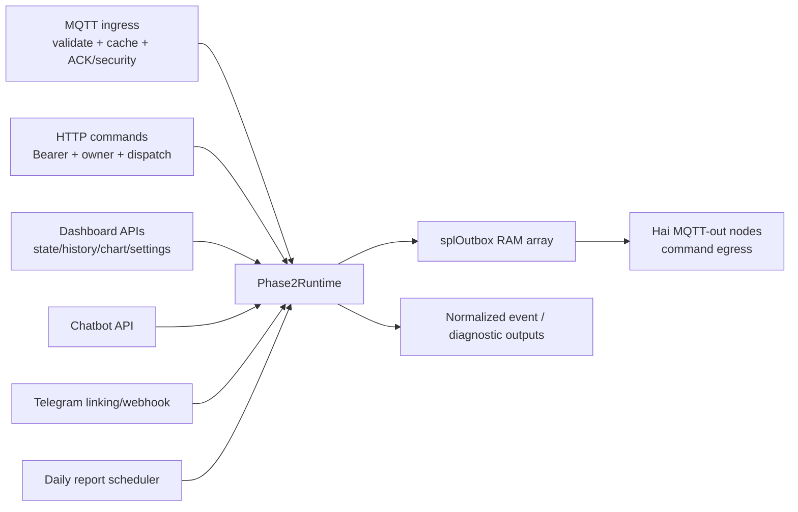

Function node “Ensure one shared runtime” lấy factory từ global context, tạo
duy nhất một `Phase2Runtime` và một `splOutbox`. Mọi nơi phát MQTT chỉ push object
vào outbox; Function node drain thành message cho **MQTT out**. Điều này giữ
policy trong module testable nhưng vẫn dùng flow trực quan cho transport.

`flows.flowfuse.json` là artifact deploy được script ghép từ `flows.json`,
`lib/` và Dashboard. Không sửa tay vì lần build sau sẽ ghi đè và test artifact
có thể phát hiện drift.

### 9.7. Flow một lệnh `UNLOCK` từ web đến ACK

```mermaid
sequenceDiagram
    autonumber
    actor U as User
    participant A as dashboard/app.js
    participant F as Node-RED flow
    participant R as Phase2Runtime
    participant G as AuthGate
    participant D as CommandDispatcher
    participant Q as MQTT
    participant E as ESP32
    participant S as SG90

    U->>A: Bấm Mở chốt
    A->>A: hasRenderedContext, domain lock chưa pending
    A->>F: POST /api/v1/commands + Bearer
    F->>R: protectedCommand
    R->>G: authorize(forceFresh=true)
    G->>G: verify /auth/v1/user + owns locker
    G-->>R: principal.id
    R->>D: dispatchUser(principal, locker, UNLOCK)
    D->>D: MQTT + ONLINE + fresh state + door CLOSED + no pending
    D->>Q: command UUID, requested_by=principal.id
    D-->>A: HTTP 202 pending, chưa phải success
    Q->>E: command callback
    E->>E: validate + duplicate + door stable/raw CLOSED
    E->>S: attach, write 170 degrees
    Note over E,S: loop vẫn chạy; không delay 2 giây
    E->>S: đủ 2 giây, detach
    E->>E: lock=UNLOCKED, grant một OPEN 30 giây
    E->>Q: ACK success + retained state
    Q->>R: ingest ACK
    R->>D: processAck
    D->>D: match ID + locker + action + expected state
    R->>R: cache state + command event + persistence
    A->>F: poll GET /state
    F-->>A: UNLOCKED + COMMAND_SUCCEEDED
```

HTTP `202` chỉ nói backend đã chấp nhận và publish intent; thiết bị thành công
chỉ được ghi sau ACK phù hợp. Dashboard thể hiện hai giai đoạn này bằng message
“đã gửi, đang chờ ACK” rồi poll `command_status`.

### 9.8. Timeout, ACK lạ và kết quả mơ hồ

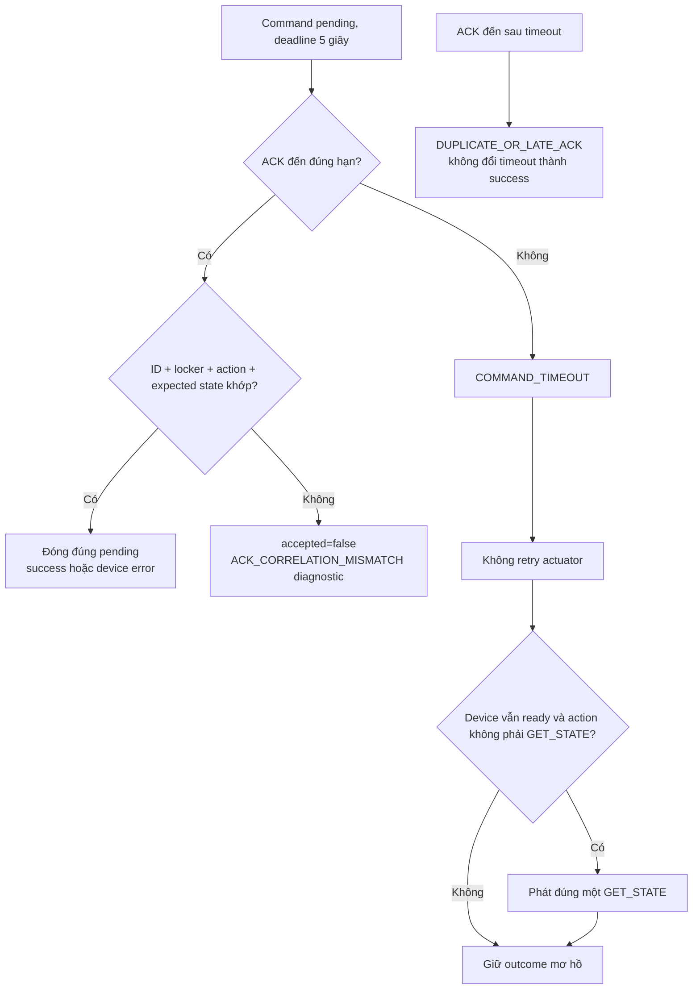

Một ACK error **đúng correlation** vẫn được accepted để đóng pending ở failure
và cập nhật state do thiết bị báo. ACK schema-valid nhưng unknown/late/mismatch
không được quyền hoàn tất command; diagnostic chỉ chứa code/topic/locker/ID,
không lưu raw payload hoặc credential.

### 9.9. Freshness và connection generation khi reconnect

`LiveStateCache` không tin đơn giản “state vừa nhận” vì retained message cũ có
thể được broker replay. Nó yêu cầu đồng thời:

1. Node-RED MQTT transport đang connected;
2. retained availability là `ONLINE`, còn trong 30 giây và thuộc generation
   kết nối hiện tại;
3. full state còn trong 30 giây, thuộc cùng generation;
4. state được quan sát **sau hoặc cùng lúc** với ONLINE của generation đó.

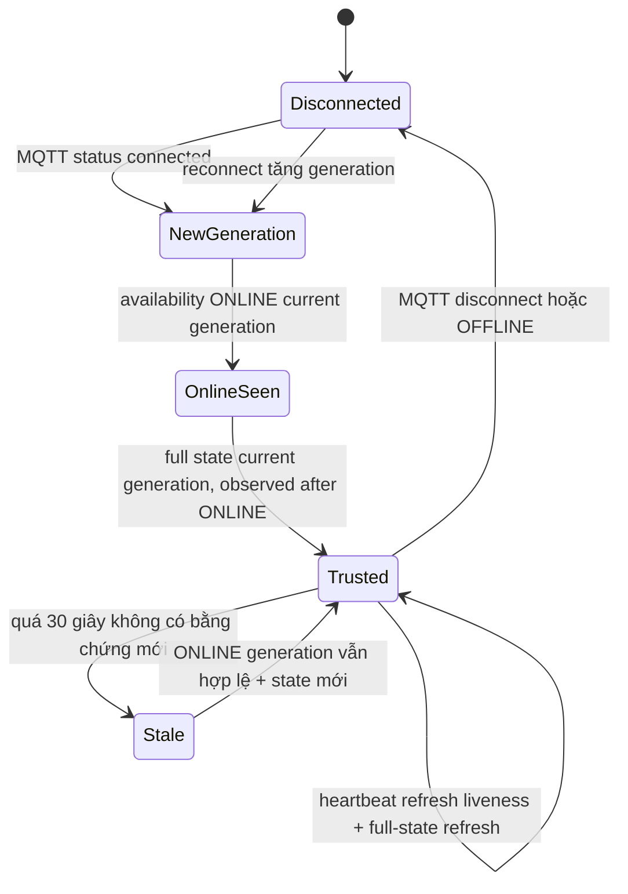

Heartbeat không tự hồi sinh một retained-only state. `ingestHeartbeat()` chỉ
refresh receive time khi entry đang ONLINE đúng ingress generation. Firmware
ngay sau heartbeat còn publish full state, nên control vẫn dựa vào data mới.

### 9.10. Bảy action và các error code phải biết

Action allowlist: `LOCK`, `UNLOCK`, `ALARM_ON`, `ALARM_OFF`, `LED_ON`,
`LED_OFF`, `GET_STATE`.

Firmware error quan trọng:

| Code | Ý nghĩa |
|---|---|
| `MISSING_FIELD` | field bắt buộc sai/mất/chuỗi rỗng hoặc quá dài |
| `INVALID_SCHEMA` | `schema_version` không phải integer 1 |
| `INVALID_ACTION` | action ngoài allowlist |
| `INVALID_REQUESTED_BY` | không phải user UUID hoặc service principal cho phép |
| `INVALID_ISSUED_AT` | UTC format sai hoặc quá xa tương lai |
| `LOCKER_MISMATCH` | locker trong payload/topic/config không khớp |
| `STALE_COMMAND` | lệnh quá 120 giây khi NTP đã sync |
| `DOOR_NOT_CLOSED` | không được LOCK khi stable/raw door chưa đóng |
| `DOOR_NOT_CLOSED_FOR_ACCESS` | không được cấp lượt UNLOCK mới khi cửa chưa đóng |
| `ACTUATION_FAILED` | controller chưa sẵn sàng/bận/attach fail |

Malformed JSON hoặc UUID không hợp lệ không có ID đáng tin để correlate, nên
firmware **không tạo ACK `command_id:null`**. Backend để request timeout và
reconcile; đó là đúng contract.

### 9.11. HTTP route map của Node-RED

| Method + path | Guard | Gọi logic nào | Kết quả chính |
|---|---|---|---|
| `GET /api/v1/public-config` | public | env allowlist | chỉ Supabase URL + anon key |
| `POST /api/v1/lockers/claim` | Bearer fresh | `protectedClaim()` | claim RPC atomic |
| `GET /api/v1/lockers/:id/state` | Bearer + owner | `uiState()` | stale-aware live UI state |
| `POST /api/v1/commands` | Bearer + owner fresh + ready | `protectedCommand()` | 200 no-op hoặc 202 pending |
| `POST /api/v1/chatbot` | Bearer + owner | `protectedChat()` | live/history grounded answer |
| `GET /api/v1/lockers/:id/history` | Bearer + owner | `protectedHistory()` | tối đa 50 recent rows cho UI |
| `GET /api/v1/lockers/:id/chart` | Bearer + owner | `protectedChart()` | 7/30 bucket + totals |
| `GET/PUT /api/v1/lockers/:id/notification-settings` | owner; PUT force fresh | `protectedSettings()` | sanitized setting |
| `POST/DELETE /api/v1/lockers/:id/telegram-link` | owner fresh | link/disconnect | URL 10 phút hoặc revoke |
| `POST /api/v1/lockers/:id/telegram-test` | owner fresh + linked | test adapter | controlled Telegram message |
| `POST /api/v1/telegram/webhook` | exact webhook secret | `telegramWebhook()` | consume private Start hoặc handle command |

## 10. Backend, dữ liệu và bảo mật

### 10.1. Trust boundary

Browser đăng nhập Supabase Auth và gửi `Authorization: Bearer <access token>`
đến route bảo vệ. Node-RED xác minh token, lấy identity từ token và kiểm owner;
browser không được tự gửi `requested_by` đáng tin. Browser không chứa MQTT
password hay service-role key và không publish thẳng ESP32.

### 10.2. Vì sao cần cả ownership check và RLS?

Ownership check ngăn command/API sai từ backend; RLS là defense-in-depth ở
database nếu một query/application path sai. Service-role bypass RLS nên chỉ
được giữ server-side và các thao tác của nó phải dùng identity/locker đã kiểm
tra.

### 10.3. Event idempotency

Mỗi normalized event có UUID `event_id`; Supabase insert dùng khóa đó để không
ghi trùng. Unauthorized OPEN tạo hai ý nghĩa: `DOOR_OPENED` để đếm lượt mở và
`UNAUTHORIZED_OPEN` để đếm cảnh báo. Một episode OPEN ổn định được dedupe đến
khi CLOSED.

### 10.4. Telegram

Không có Chat ID global. Owner yêu cầu deep link một lần, token tồn tại 10 phút
và chỉ hash được lưu. Webhook phải có secret header, private `/start` mới consume
token atomically. Browser chỉ thấy metadata đã làm sạch, không thấy Chat ID.
Cảnh báo Telegram chạy bất đồng bộ; còi không chờ provider.

### 10.5. Gemini grounding

Raw câu hỏi không được trao quyền truy cập tùy ý. Backend phân loại một trong
sáu intent/câu hỏi canonical, tự lấy facts live/history đúng owner và tính số
liệu; Gemini chỉ diễn đạt trên context whitelist. Provider lỗi trả 503 an toàn,
không sửa state.

### 10.6. Báo cáo email

Scheduler tính ngày địa phương trước đó theo timezone, reserve một delivery
duy nhất trên `(locker_id, channel, report_date)` và giới hạn retry. Lỗi chắc
chắn chưa gửi có thể retry; trạng thái SMTP mơ hồ chuyển `delivery_unknown` và
không tự gửi lại để tránh người dùng nhận hai email.

### 10.7. Flow đăng nhập, authorize và claim locker

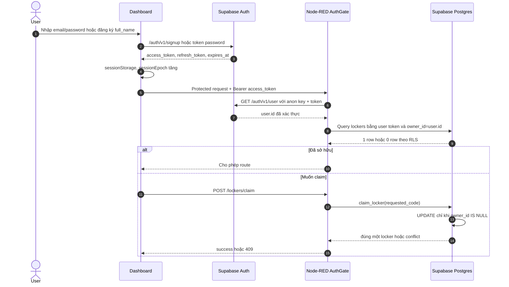

`AuthGate` cache 15 giây theo **SHA-256 digest của token**, không dùng raw token
làm key. Read-only route có thể dùng cache; command, claim, settings write và
Telegram mutations dùng `forceFresh`. Mỗi provider request có timeout 5 giây;
toàn authorize có deadline 9 giây. 401 là session sai; 403 là user hợp lệ nhưng
không sở hữu; provider lỗi là 503, không được giả thành 401.

Dashboard có `sessionEpoch` và các generation counter để response cũ không ghi
đè login/locker mới. Refresh token chỉ đi giữa browser và Supabase Auth; Node-RED
chỉ nhận access token hiện tại.

### 10.8. Flow mở cửa trái phép — đường local và đường cloud

```mermaid
sequenceDiagram
    autonumber
    participant M as MC-38
    participant F as ESP32
    participant B as Buzzer
    participant Q as MQTT
    participant N as Node-RED
    participant S as Supabase
    participant T as Telegram
    participant W as Dashboard

    M->>F: CLOSED to OPEN ổn định, không có grant
    F->>F: authorized=false, consume/revoke grant
    F->>B: setActive(true) ngay tại thiết bị
    F->>F: enqueue DoorTransitionRecord UUID
    alt MQTT đang online
        F->>Q: telemetry/door authorized=false
    else MQTT mất
        Note over F: Giữ tối đa 8 edge trong RAM; alarm vẫn kêu
        F->>Q: Replay FIFO sau reconnect
    end
    Q->>N: validateDoor + ingestDoor
    N->>N: Dedupe event ID và episode
    N->>N: Tạo DOOR_OPENED authorized=false
    N->>N: Tạo UNAUTHORIZED_OPEN bằng derived deterministic UUID
    par Alarm handoff
        N->>Q: ALARM_ON internal nếu device ready
    and Persistence
        N-->>S: Persist cả hai event idempotent
    and Telegram async
        N->>S: Lấy setting đúng locker
        N->>T: sendMessage đúng private Chat ID
        T-->>N: delivered hoặc failed
        N-->>S: TELEGRAM_NOTIFICATION event
    end
    W->>N: Poll state/history
    N-->>W: alarm/latest alert/history
```

Tại sao vừa local buzzer vừa `ALARM_ON` qua backend? Local alarm phản ứng khi
mạng mất; command backend giúp state/ACK/cloud orchestration đồng bộ khi đường
truyền sẵn sàng. `AlarmController.setActive(true)` idempotent nên lệnh lặp đúng
state không làm output có side effect mới.

Nếu Node-RED chỉ nhận full state `door=OPEN` sau khi bỏ lỡ telemetry, nó chỉ
reconcile thành unauthorized khi state đồng thời có `alarm=ACTIVE`. Nếu không,
nó chờ physical transition thay vì bịa cảnh báo. Replay event sau reconcile
được suppress trong cửa sổ ngắn để tránh side effect hai lần.

### 10.9. Mô hình dữ liệu và quan hệ

```mermaid
erDiagram
    AUTH_USERS ||--|| PROFILES : "user_id"
    AUTH_USERS o|--o{ LOCKERS : "owner_id"
    LOCKERS ||--o{ DEVICE_EVENTS : "locker_code to locker_id"
    LOCKERS ||--o| NOTIFICATION_SETTINGS : "locker_id"
    LOCKERS ||--o{ NOTIFICATION_DELIVERIES : "locker_id"
    LOCKERS ||--o{ TELEGRAM_LINK_TOKENS : "locker_id"
    AUTH_USERS ||--o{ TELEGRAM_LINK_TOKENS : "owner_id"

    PROFILES {
        uuid user_id PK
        text full_name
        timestamptz created_at
        timestamptz updated_at
    }
    LOCKERS {
        uuid id PK
        text locker_code UK
        text display_name
        uuid owner_id FK
        timestamptz claimed_at
    }
    DEVICE_EVENTS {
        uuid event_id PK
        text locker_id FK
        text event_type
        text source
        text result
        boolean authorized
        uuid command_id
        timestamptz occurred_at
        timestamptz recorded_at
    }
    NOTIFICATION_SETTINGS {
        text locker_id PK
        boolean telegram_enabled
        text telegram_chat_id
        text telegram_user_id
        boolean email_enabled
        text email_address
        time report_time
        text timezone
    }
    NOTIFICATION_DELIVERIES {
        uuid id PK
        text locker_id FK
        text channel
        date report_date UK
        text status
        int attempts
    }
    TELEGRAM_LINK_TOKENS {
        uuid id PK
        text token_hash UK
        text locker_id FK
        uuid owner_id FK
        timestamptz expires_at
        timestamptz consumed_at
    }
```

Các lớp bảo vệ:

- `profiles`: user chỉ select/update chính mình; chỉ update `full_name`.
- `lockers`: user chỉ select locker mình sở hữu; không có browser policy để
  tự insert/update owner.
- `device_events`, `notification_settings`, `notification_deliveries`: owner
  chỉ đọc row liên quan qua RLS; trusted write đi qua backend.
- `telegram_link_tokens`: service-role only, không có browser policy/grant.
- Service role bypass RLS nên runtime vẫn phải filter đúng locker và chỉ dùng
  identity đã verify; RLS không bảo vệ khỏi code service-role sai.

### 10.10. Event normalization, persistence retry và history

```mermaid
flowchart LR
    I["MQTT ACK/state/door/availability<br/>hoặc scheduler/provider result"] --> N["normalizedEvent v1"]
    N --> M["RAM events ring buffer"]
    N --> O["Persistence outbox Map<br/>key = event_id"]
    O --> P["Supabase insert<br/>ignore duplicate"]
    P -->|"success/duplicate"| X["Xóa khỏi outbox"]
    P -->|"transient error"| R["Exponential retry<br/>1 giây đến 60 giây"]
    R -->|"tối đa 5 attempts"| P
    R -->|"hết attempts / queue full"| D["Bounded dead letter + health error"]
```

Persistence outbox mặc định tối đa 256, retry tối đa 5. Đây là RAM-only nên
Node-RED restart có thể mất event chưa ghi DB; không được gọi là durable queue.
Khi retry thành công, primary key `event_id` khiến replay không tạo row trùng.

History query sắp `occurred_at DESC,event_id DESC`, page 1.000 row và giới hạn
100 page. Offset pagination có thể overlap nếu concurrent insert làm dịch biên,
nên adapter dedupe theo immutable `event_id`. Nếu chạm 100.000 row safety ceiling,
nó trả `EVENT_DATASET_TOO_LARGE`, không trả con số có vẻ hợp lý nhưng bị cắt.

### 10.11. Flow history và chart 7/30 ngày

```mermaid
sequenceDiagram
    participant W as Dashboard
    participant N as Node-RED
    participant D as SupabaseDataAdapter
    participant S as Supabase

    W->>N: GET history và GET chart song song
    N->>N: Bearer + owner
    N->>D: getSettings để lấy timezone của locker
    D->>S: notification_settings
    par History
        D->>S: 50 event mới nhất trong local calendar range
        S-->>D: ordered events
        D-->>W: event list + range + timezone
    and Chart
        D->>S: mọi DOOR_OPENED / UNAUTHORIZED_OPEN trong range
        S-->>D: paginated events
        D->>D: tạo đủ zero bucket, tính totals
        D-->>W: buckets 7 hoặc 30 ngày
    end
```

Dashboard dùng `Promise.allSettled`, nên history fail không xóa chart hợp lệ và
ngược lại. Chart có visual bars **và** bảng dữ liệu tương đương cho screen reader.
Range là half-open `[from,to)`, dùng IANA timezone đã validate; event đúng nửa
đêm chỉ thuộc một bucket.

### 10.12. Flow liên kết Telegram an toàn

```mermaid
sequenceDiagram
    autonumber
    actor U as Owner
    participant W as Dashboard
    participant N as Node-RED
    participant S as Supabase
    participant T as Telegram

    U->>W: Bấm Liên kết Telegram
    W->>N: POST /telegram-link + Bearer
    N->>N: Verify fresh owner
    N->>N: random 32 bytes to base64url; SHA-256 token
    N->>S: issue_telegram_link(hash, locker, owner)
    S->>S: advisory lock; xóa token cũ; TTL 10 phút
    N-->>W: t.me/bot?start=plaintext_token + expires_at
    W->>T: Mở bot; user bấm Start
    T->>N: Webhook + exact secret header + private chat update
    N->>N: chat.type=private và chat.id=user.id
    N->>S: consume_telegram_link(hash, chat/user/username)
    S->>S: advisory lock + owner unchanged + atomic consume
    S-->>N: linked locker
    N->>T: Gửi xác nhận
    W->>N: Poll sanitized settings 2/5/10 giây
    N-->>W: connected, username, linked_at; không có Chat ID
```

Hash trong DB không thay thế entropy của token; mục đích là DB không giữ deep
link plaintext. Webhook secret chỉ chứng minh request biết secret deployment;
token TTL/one-time, private chat equality và owner binding vẫn là các gate độc
lập. Exact webhook retry sau lost HTTP response được xử lý idempotent nếu cùng
account đã link; token không thể đổi sang account khác.

### 10.13. Flow chatbot Gemini có grounding

```mermaid
flowchart TD
    Q["Raw user question"] --> A["normalize + analyze"]
    A --> B{"Khớp 1 trong 6 intent?"}
    B -->|"Không"| X["422 QUESTION_UNSUPPORTED"]
    B -->|"current door/lock"| L["LiveStateCache snapshot fresh"]
    B -->|"alert/count/latest"| H["Owner-scoped history adapter"]
    L -->|"stale"| Y["LIVE_STATE_UNAVAILABLE"]
    L --> F["Structured facts"]
    H --> C["Backend tính count/latest/range"] --> F
    F --> S["sanitizedContext<br/>canonical question + intent + facts"]
    S --> G["Gemini render text"]
    G --> R["Dashboard textContent"]
```

Sáu intent: current lock, current door, latest alert, open count 7 days,
unauthorized today, latest activity. Raw question không được đưa thẳng vào
provider context; model không nhận JWT, service role, Telegram/email/password
hoặc raw user row. Backend tính count trước, Gemini chỉ diễn đạt. Provider lỗi
không thay facts và không làm các route khác hỏng.

### 10.14. Flow báo cáo email và delivery state machine

```mermaid
flowchart TD
    A["Inject mỗi phút"] --> B["enabledEmailSettings"]
    B --> C["Với từng setting: validate timezone + HH:MM"]
    C --> D{"Giờ local đã đến report_time?"}
    D -->|"Chưa"| Z["Bỏ qua tick này"]
    D -->|"Rồi"| E["previousDayRange local"]
    E --> F{"SMTP đã configured?"}
    F -->|"Không"| X["EMAIL_NOT_CONFIGURED<br/>không reserve"]
    F -->|"Có"| G["reserve (locker,email,report_date)"]
    G --> H{"Claim được reservation?"}
    H -->|"Không"| Y["duplicate / in progress / unknown / exhausted"]
    H -->|"Có"| I["Query mọi event ngày trước và render email"]
    I --> J["beginDelivery: pending to sending"]
    J --> K["SMTP send với deterministic Message-ID"]
    K -->|"Accepted"| L["complete delivered + DAILY_EMAIL_REPORT event"]
    K -->|"Chắc chắn chưa gửi"| M["failed; có thể retry, max 3"]
    K -->|"Outcome mơ hồ"| N["delivery_unknown; không auto retry"]
```

Nếu SMTP đã accepted nhưng DB update delivered lỗi, row ở `sending`; lần sau
scheduler phân loại stale sending thành `delivery_unknown`, không gửi lại. Đây
là lựa chọn at-most-once ưu tiên tránh spam hơn là cố đạt chắc chắn delivery.

## 11. UI/UX: điểm mạnh và lỗi đã khắc phục

### 11.0. `dashboard/app.js` chia trách nhiệm ra sao?

| Nhóm hàm/state | Vai trò |
|---|---|
| `jsonFetch()` | timeout bằng `AbortController`, parse JSON, chuẩn hóa HTTP error |
| `supabase()` | gọi Auth REST bằng URL + anon key public |
| `protectedFetch()` | đóng access token hiện tại vào Bearer; chỉ logout khi 401 thuộc đúng session generation |
| `saveSession()` / `scheduleRefresh()` / `refresh()` | sessionStorage, refresh sớm 60 giây, single-flight, retry provider outage |
| `consumeAuthFragment()` | lấy callback token rồi xóa hash khỏi address bar ngay |
| `pollState()` / `scheduleStatePoll()` | coalesce polling, 5 giây visible / 15 giây hidden |
| `renderState()` / `renderControls()` | map protocol state sang nhãn Việt; defense-in-depth disable khi stale/pending |
| `invalidateLockerContext()` | xóa state/history/setting cũ ngay khi locker thay đổi |
| `loadPhase3Data()` | gọi history/chart song song bằng `Promise.allSettled` |
| `loadSettings()` / `applySettings()` | GET sanitized settings và điều khiển conditional fields |
| `scheduleTelegramLinkPolling()` | poll 2 giây, rồi 5/10 giây đến khi linked hoặc hết hạn |
| event listeners | auth, logout, claim, commands, Telegram, settings, chatbot |

Startup flow:

```mermaid
flowchart TD
    A["Script load"] --> B["consumeAuthFragment trước await đầu tiên"]
    B --> C{"Callback có session/error?"}
    C -->|"Session"| D["saveSession; xóa URL hash"]
    C -->|"Error"| E["clear private UI"]
    C -->|"Không"| F["Chờ config"]
    D --> F
    E --> F
    F --> G["GET /api/v1/public-config"]
    G -->|"503/lỗi"| H["Disable auth + thông báo + retry 5 giây"]
    H --> G
    G -->|"OK"| I{"Đã xử lý callback?"}
    I -->|"Không"| J["Restore sessionStorage hoặc refresh token"]
    I -->|"Rồi"| K["pollState"]
    J --> K
    K --> L["Nếu login: loadSettings"]
    L --> M["Bắt đầu serialized polling"]
```

Các biến `sessionEpoch`, `authRequestGeneration`, `claimRequestGeneration`,
`phase3RequestGeneration`, `settingsRequestGeneration`,
`telegramOperationGeneration` và `commandRequestSequence` xử lý race. Mỗi
response chỉ render nếu epoch/generation và locker hiện tại vẫn khớp. Vì vậy
response chậm từ user/locker cũ không mở nút hoặc làm lộ state sang context mới.

`commandRequests` là `Map` theo domain `lock/alarm/led`. Khi một `LOCK` đang
HTTP-pending thì cả `LOCK` và `UNLOCK` bị khóa, nhưng alarm/LED vẫn là domain
khác. Backend cũng có pending-domain gate độc lập; UI guard chỉ là UX, không
phải authorization boundary.

### 11.1. Điểm mạnh đã kiểm tra

- giao diện responsive ở 320 CSS px, không document overflow ngang;
- cấu trúc heading/lang tốt;
- tab order và skip link hợp lý;
- focus ring 3 px nhìn thấy;
- target tương tác đạt ngưỡng 24 × 24 CSS px/spacing;
- live regions và reduced-motion hiện diện;
- thiết kế màu/khối thông tin tương đối rõ, low-noise.

### 11.2. Các correction phải giải thích được

1. Command/delivery status có bảng dịch đầy đủ và fallback an toàn, không lộ raw enum.
2. Spinner dùng màu border riêng, vẫn giữ accessible status và khóa cùng domain.
3. Public config retry mỗi 5 giây; auth fail-closed cho đến khi cấu hình hồi phục.
4. No-data/stale lock, alarm và LED chuyển thành unknown; stale khóa control.
5. Auth có một submit theo mode; full-name chỉ ở registration và autocomplete đúng.
6. UI nói “đóng/mở cửa” và “vị trí tay servo”; MQTT v1 enums giữ nguyên để tương thích.

Khi demo, nếu thấy hành vi cũ thì không cắt video để che. Phải giải thích đó là
version mismatch giữa source/generated FlowFuse/browser cache, sửa deployment
và chạy lại. Giới hạn SG90 open-loop vẫn còn dù câu chữ UI đã đúng.

## 12. Playbook truy vết code — thầy chỉ vào đâu cũng lần được

### 12.1. Quy tắc trả lời một câu hỏi code

Trả lời theo sáu bước:

1. **Entry:** hành động/sự kiện bắt đầu ở đâu?
2. **Validation:** input được kiểm gì, ai có quyền từ chối?
3. **State:** state nào được đọc/ghi, ai sở hữu state đó?
4. **Side effect:** network/database/actuator được gọi ở đâu?
5. **Completion:** success được xác nhận bằng gì?
6. **Failure/recovery:** timeout, duplicate, restart hoặc offline xử lý ra sao?

Ví dụ ngắn cho `LED_ON`: click listener trong `app.js` → protected command
route → fresh AuthGate owner → dispatcher phát MQTT → firmware validate →
`LedController.setOn(true)` fill 10 pixel trắng và `show()` → state `led=ON` →
ACK có cùng UUID → dispatcher correlate → UI poll thấy success. Failure có thể
đến trước publish, do timeout/ACK mismatch hoặc thiết bị offline; không tự coi
HTTP 202 là LED đã sáng.

### 12.2. Trace 1 — đăng ký và đăng nhập

`auth-form submit` → `supabase('/auth/v1/signup' hoặc token password)` → Auth
trigger `create_profile_for_new_user()` tạo profile → `saveSession()` tăng
`sessionEpoch` và lưu sessionStorage → `pollState()` gọi protected route →
`AuthGate.authorize()` verify `/auth/v1/user` và query owner → render state.

Phải chỉ được: browser dùng anon key là thiết kế Supabase bình thường; anon key
không phải service-role. Mật khẩu đi trực tiếp đến Supabase Auth, không qua
Node-RED/MQTT/ESP32.

### 12.3. Trace 2 — claim một locker

`claim-form submit` → POST `/api/v1/lockers/claim` → `protectedClaim()` →
`AuthGate.authenticate(forceFresh)` → `SupabaseAuthAdapter.claim()` → RPC
`claim_locker(text)` → atomic `UPDATE lockers SET owner_id=auth.uid()` chỉ khi
`owner_id IS NULL` → cache auth/ownership bị clear → Dashboard thay locker,
invalidate context cũ và poll state mới.

### 12.4. Trace 3 — `LOCK/UNLOCK`

`[data-action] click` → `commandRequests` khóa domain → `protectedFetch()` →
Function node “Bearer + owner + readiness + dispatch” →
`Phase2Runtime.protectedCommand()` → `AuthGate.authorize(forceFresh)` →
`CommandDispatcher.dispatchUser()` → snapshot fresh + door interlock + pending
gate → UUID command → MQTT out → firmware `onMqttMessage()` → parser → raw/stable
door gate → `LockController.start()` → loop `tick()` → state/grant → ACK/state →
runtime `ingest()` → `processAck()` → normalized command event → persistence →
Dashboard `pollState()`.

### 12.5. Trace 4 — same-state no-op

Backend `actionAlreadyApplied()` trả no-op cho `LOCK`, alarm và LED đã đúng state,
nên không publish MQTT. **Riêng `UNLOCK` không no-op ở backend** vì một UNLOCK
mới khi door CLOSED phải cấp một lượt mở mới. Firmware nếu chốt đã `UNLOCKED`
thì không quay servo nhưng gọi `grantNextOpen()` rồi ACK success.

### 12.6. Trace 5 — cửa mở hợp lệ rồi tự khóa

UNLOCK ACK while CLOSED → grant 30 giây → MC-38 stable `CLOSED→OPEN` →
`evaluateTransition()` trả AUTHORIZED và consume grant → telemetry
`authorized=true` → `DoorAutoLockPolicy` arm close → người dùng đóng cửa →
stable `OPEN→CLOSED` → policy trả `shouldAutoLock=true` → `startAutoLock()` →
raw/stable closed gate → servo 80° → retained state LOCKED. Không có incoming
command ID nên không có ACK giả cho auto-lock.

### 12.7. Trace 6 — cửa mở trái phép

MC-38 stable OPEN không grant → `evaluateTransition()` UNAUTHORIZED → local
`AlarmController.setActive(true)` → record vào door FIFO → MQTT telemetry
`authorized=false` → Node-RED validator/cache/detector → DOOR_OPENED +
UNAUTHORIZED_OPEN → internal ALARM_ON + Supabase persist + Telegram async →
Dashboard latest alert/history.

### 12.8. Trace 7 — mất MQTT rồi reconnect

`mqtt_.loop()` phát hiện mất connection → state mqtt false, heartbeat clear,
backoff 1→30 giây → reconnect đăng ký LWT, connect TLS, subscribe command,
publish ONLINE → chờ main flush door FIFO → publish retained state → heartbeat
timer bắt đầu. Node-RED status connected tăng generation và phát một GET_STATE
cho locker config. Controls chỉ mở khi ONLINE và state mới cùng generation.

### 12.9. Trace 8 — history/chart

`loadPhase3Data()` → GET history/chart song song → owner gate → get locker
timezone → history lấy 50 recent; chart lấy toàn bộ hai event type qua paging →
`calendarRange()` tạo local-day half-open range → `aggregateChart()` khởi tạo
zero buckets rồi đếm → Dashboard render bars và table. Mỗi response có request
generation để không render cho locker cũ.

### 12.10. Trace 9 — liên kết Telegram

Dashboard POST link → owner fresh → random token + hash → backend-only RPC issue
→ browser mở deep link plaintext → Telegram private `/start` webhook có secret
→ parse private chat và equality chat/user → hash token → consume RPC atomic →
sanitized settings poll báo connected. Chat ID không đi qua browser.

### 12.11. Trace 10 — báo cáo ngày

Inject mỗi phút → `runDailyReports()` → load enabled settings → check local
`report_time` → previous day → ensure SMTP configured → reserve canonical day
→ query all events → `aggregateDailyReport()` loại notification khỏi latest
activity → render text/HTML có escape → pending→sending → SMTP → delivered,
failed-retry hoặc delivery_unknown-no-retry.

### 12.12. Trace 11 — chatbot

Chat form → protected `/chatbot` → owner gate → `analyze()` chọn một intent →
live snapshot hoặc paginated history → backend tính facts →
`sanitizedContext()` chứa canonical question, không chứa raw secret → Gemini →
answer render bằng `textContent`. Unsupported là 422; live stale là controlled
unavailable; provider lỗi không làm state thay đổi.

### 12.13. Trace 12 — DHT22/OLED local

Mỗi loop `EnvironmentMonitor.tick()` chỉ đọc sau 2,5 giây; `NaN` làm
`reading.valid=false`. `DisplayController.tick()` tối đa 1 giây một lần, so
reading/state cũ để tránh redraw thừa. OLED lỗi init chỉ log và firmware tiếp
tục. Không có MQTT/Supabase/Dashboard trong trace này.

## 13. Kịch bản demo vấn đáp 8–10 phút

### Chuẩn bị trước

- chọn account/locker thử, xóa dữ liệu gây nhiễu;
- kiểm nguồn, pin, common GND và nhiệt;
- mở Serial Monitor/log đã redaction;
- mở Dashboard desktop và Telegram test;
- có video dự phòng kèm timestamp/commit nếu mạng lỗi;
- đặt cửa CLOSED, alarm inactive, LED off;
- không để secret trong tab, history terminal hoặc ảnh nền.

### Trình tự

1. Chỉ sơ đồ và nói hai luồng bắt buộc.
2. Đăng nhập, chỉ owner/locker và fresh state.
3. Bật/tắt 10 LED; chỉ ACK/state và LED thật.
4. Đóng cửa bằng tay, khóa/mở chốt SG90 ở `80°/170°`; chỉ rõ MC-38 xác nhận cửa
   chứ không xác nhận góc chốt.
5. Mở trái phép; quan sát event, buzzer, Dashboard và Telegram.
6. Mở lịch sử/biểu đồ; hỏi chatbot một câu live và một câu history.
7. Chỉ email sandbox/record ngày trước đó.
8. Ngắt Wi-Fi/broker ngắn theo kế hoạch; chỉ offline/stale và recovery.
9. Kết thúc bằng evidence và giới hạn chốt open-loop.

Nếu phần cứng kẹt, ngắt nguồn trước; không cố lặp lệnh trước giảng viên.

## 14. Ngân hàng câu hỏi và đáp án

### Nhóm A — mục tiêu, phạm vi và kiến trúc

#### Câu 1. Sản phẩm giải quyết vấn đề gì?

Nó cho phép chủ sở hữu theo dõi trạng thái cửa, điều khiển các output và nhận
cảnh báo khi cửa mở trong lúc chốt logic đang `LOCKED`. Nó là mô hình IoT học thuật về cảm
biến–cloud–giao diện, không phải chứng nhận an ninh thương mại.

#### Câu 2. Vì sao gọi là “privacy locker” thay vì chỉ “smart box”?

Vì có ownership, lịch sử, cảnh báo riêng theo người dùng và kiểm soát truy cập
digital. Bản hiện tại có chốt quay bằng servo nhưng không có cảm biến góc, nên
“lock” trong UI là state hoàn tất chu trình chốt, không đồng nghĩa chống cạy.

#### Câu 3. Hai luồng nào đáp ứng yêu cầu đề bài?

MC-38 tạo luồng input→ESP32→MQTT→Node-RED→Dashboard/history. Dashboard tạo
luồng frontend→Node-RED→MQTT→ESP32→SG90/LED/buzzer. DHT→OLED là luồng local bổ
sung chứ không thay luồng cloud bắt buộc.

#### Câu 4. Vì sao không cho Dashboard publish MQTT trực tiếp?

Nếu làm vậy browser phải giữ broker credential và có thể tự giả requester/topic.
Node-RED tập trung auth, ownership, validation, timeout và audit trước khi phát
lệnh, giảm trust đặt vào client.

#### Câu 5. Vì sao chia firmware/backend/database thay vì viết tất cả trên ESP32?

ESP32 phù hợp realtime thiết bị và hoạt động local; backend phù hợp identity,
API/provider và điều phối; database phù hợp lịch sử/RLS. Tách lớp giúp mỗi trust
boundary rõ và test được độc lập.

#### Câu 6. DHT22 có dữ liệu trên Dashboard không?

Không theo phạm vi hiện tại. DHT22 chỉ đi qua EnvironmentMonitor đến OLED; đó
là quyết định contract, không phải thiếu topic ngoài ý muốn.

#### Câu 7. Ai là source of truth cho live state?

Trong firmware, `state_manager` giữ full device state. Trên cloud, Node-RED
cache state đã validate cùng freshness/availability; retained MQTT chỉ là
last-known. Supabase là source of truth cho lịch sử bền vững, không phải trạng
thái actuator realtime.

#### Câu 8. Tại sao cần `schema_version`?

Nó cho phép producer/consumer nhận biết hợp đồng và từ chối payload không tương
thích. Thay đổi phá vỡ field/type/semantics phải dùng version mới và cập nhật
đồng thời fixtures, firmware, backend và tài liệu.

#### Câu 9. Tại sao dùng Node-RED?

Nó phù hợp orchestration IoT, MQTT/HTTP/provider và deployment FlowFuse, nhưng
logic quan trọng vẫn được tách thành module JS/testable thay vì chỉ dựa vào dây
flow trực quan. Lựa chọn này giúp demo flow và vẫn có test semantic.

#### Câu 10. Nếu cloud mất thì tủ còn gì?

DHT/OLED local vẫn có thể cập nhật; firmware giữ loop và reconnect có backoff.
Điều khiển Dashboard/Telegram/history không khả dụng; command không được queue
retained để tự chạy muộn khi mạng trở lại.

#### Câu 11. Chức năng nào thuộc từng phase?

Phase 1 xây firmware/output/WiFiManager; Phase 2 thêm door/security/auth/chatbot;
Phase 3 thêm buzzer/data/chart/email và giao diện cuối. Interface Phase 2 vẫn
giữ ownership dù Phase 3 nối adapter persistence/UI.

#### Câu 12. Thước đo “hoàn thành” là gì?

Không chỉ compile. Phải có test contract, build, live service trong scope, test
phần cứng, hai luồng E2E, failure/recovery, nguồn tải đầy và evidence gắn đúng
phiên bản.

### Nhóm B — nguồn, wiring và thiết bị

#### Câu 13. Vì sao có rail 5 V và rail 3.3 V riêng?

SG90/WS2812B là tải 5 V, còn OLED/DHT/GPIO/buzzer specimen dùng 3.3 V. Tách
rail tránh đưa 5 V vào input ESP32 và giúp phân phối/đo tải rõ hơn.

#### Câu 14. Vì sao vẫn nối chung GND?

Signal voltage là hiệu điện thế so với GND. Không chung tham chiếu, HIGH 3.3 V
từ ESP32 có thể không được module hiểu đúng và dòng hồi không có đường xác định.

#### Câu 15. Adapter có cần sẵn nút I/O không?

Không. Có thể dùng công tắc DC rời trên dây dương, đúng định mức; jack chỉ nối
nguồn, không chia nguồn. Rút jack cũng ngắt điện nhưng kém thuận tiện và có thể
làm connector mòn.

#### Câu 16. Vì sao phải đo cực jack 5.5 × 2.5 mm?

Kích thước cơ khí không đảm bảo center-positive và chân hàn không luôn trực
quan. Đảo cực có thể phá module/tụ; phải dùng continuity và DC voltage để xác
nhận tâm/vỏ và chân.

#### Câu 17. Vì sao không cấp servo từ 3V3 ESP32?

Servo cần rail khoảng 5 V và dòng xung/stall lớn hơn khả năng regulator 3.3 V
của board. Dùng 3V3 có thể sụt áp, reset hoặc làm hỏng regulator.

#### Câu 18. Vì sao nguồn servo ngoài vẫn phải nối GND ESP32?

GPIO18 điều khiển servo dựa trên mốc GND. Common GND cho đường signal/hồi dòng
logic; không có nghĩa phải nối hai đầu dương nguồn với nhau.

#### Câu 19. Tụ 470 µF làm gì?

Nó đặt gần rail LED để cung cấp/thu transient ngắn và giảm nhiễu/sụt áp cục bộ.
Năng lượng hữu hạn `1/2CV²`, nên không thay adapter/dây đủ dòng.

#### Câu 20. Điện trở 470 Ω trước DIN làm gì?

Nó giảm ringing/reflection và dòng xung vào input đầu tiên, đặc biệt với dây
dài/cạnh nhanh. Đặt gần DIN; nó không nối tiếp đường nguồn 5 V của strip.

#### Câu 21. 3.3 V data có chắc điều khiển WS2812B 5 V không?

Không chắc cho mọi exact part/rail. Direct-D chỉ được chấp nhận nếu datasheet
và test specimen cho thấy ổn định; đường robust dùng 74AHCT125 hoặc hai gate
74HCT14 phù hợp. `SN74HC125N` thuần HC không tự có ngưỡng TTL như AHCT.

#### Câu 22. Tại sao hai inverter 74HCT14?

Một inverter đảo bitstream và làm protocol sai logic; hai inverter nối tiếp
khôi phục polarity đồng thời tạo cạnh/level phù hợp. Phải buộc input không dùng
vào mức xác định.

#### Câu 23. Vì sao DHT22 có pull-up?

Bus một dây dùng các pha kéo LOW và release; pull-up tạo HIGH khi release. Nếu
module đã có pull-up thì không nhất thiết thêm; mọi pull-up thấy bởi GPIO phải
lên 3.3 V.

#### Câu 24. OLED dùng SCK hay SCL?

Breakout có thể ghi `SCK` nhưng ở mode I2C chân đó là clock SCL. Dự án nối GPIO22
cho clock và GPIO21 cho SDA; không phải bus SPI theo cấu hình hiện tại.

#### Câu 25. Vì sao buzzer VCC 3.3 V dù ban đầu dự kiến 5 V?

Specimen LOW-trigger/TMB12A05 đã được bench quan sát inactive ổn định ở 3.3 V,
và direct input với ESP32 an toàn hơn về mức logic. Đây là hiệu chỉnh wiring
theo module thật; vẫn phải đo active current/sound và full-load trước nghiệm thu.

#### Câu 26. Active-low nghĩa là gì?

I/O LOW kích hoạt, HIGH tắt. Firmware cấu hình `SPL_BUZZER_ACTIVE_HIGH=0` và phải
đặt inactive ngay lúc boot để tránh còi kêu ngoài ý muốn.

#### Câu 27. Điện trở 4.7 kΩ có cấp nguồn cho buzzer không?

Không. VCC/GND cấp module; 4.7 kΩ chỉ nằm giữa GPIO26 và chân điều khiển I/O.
GPIO không được cấp dòng tải buzzer.

#### Câu 28. Vì sao tránh GPIO0/2/12/15?

Đó là các strapping pin có thể ảnh hưởng mode boot tùy board/mức lúc reset.
Dùng output/module ở đó tăng rủi ro không boot; dự án chọn các GPIO ít xung đột.

#### Câu 29. GPIO34–39 có dùng cho LED/buzzer được không?

Không trên ESP32 cổ điển vì chúng chỉ input. Chúng có thể đọc sensor phù hợp
nhưng không drive output.

#### Câu 30. Làm sao biết MC-38 LOW là CLOSED?

Đo continuity khi nam châm gần/xa và quan sát GPIO với `INPUT_PULLUP`. Mapping
candidate là LOW=CLOSED, nhưng lắp ngược vị trí/loại contact có thể đổi hành vi;
phải test as-built.

#### Câu 31. Vì sao servo phải detach sau di chuyển?

Thiết kế giảm giữ lực/jitter/nhiệt và chỉ attach khi có lệnh. Đổi lại, nếu cơ
cấu chốt cần holding torque thì có thể bị dịch chuyển; đó là lý do phải test cơ
khí và không suy diễn ACK thành vị trí chốt đã đo.

#### Câu 32. Làm sao chứng minh servo đã đến vị trí?

SG90 không có feedback trong mạch này, nên firmware không đo được trực tiếp.
Video xác nhận chuyển động chốt; MC-38 chỉ xác nhận kết quả cửa. Cải tiến có thể
thêm limit switch/encoder hoặc đo dòng/kẹt.

#### Câu 33. Tại sao số pixel ảnh hưởng nguồn?

Tổng dòng tăng theo số pixel, màu và brightness; 10 pixel khác một pixel Wokwi.
Phải dùng exact strip/datasheet và đo scenario release, không nhân một giá trị
ước lượng từ clone khác rồi gọi là chắc chắn.

#### Câu 34. Vì sao breadboard chưa phải phân phối nguồn cuối tốt?

Contact/rail có giới hạn dòng không rõ, dễ lỏng và có đoạn rail bị ngắt. Với
servo/LED, terminal, dây đúng định mức, strain relief và branch protection đáng
tin cậy hơn.

#### Câu 35. Kiểm tải đồng thời như thế nào?

Bật 10 LED, chạy servo, còi, Wi-Fi/MQTT và sensor cùng lúc; đo tại nguồn và tải,
quan sát reset/flicker/nhiệt. Lặp 20 chu kỳ và soak; không cố tình stall servo.

### Nhóm C — firmware, MQTT và độ tin cậy

#### Câu 36. Vì sao lock cold boot là UNKNOWN?

ESP32 không có feedback vị trí và không nên tin state cũ sau mất nguồn. UNKNOWN
trung thực hơn và tránh tự chạy servo chỉ để “đồng bộ” một giá trị lưu.

#### Câu 37. Vì sao alarm/LED cold boot không UNKNOWN?

Firmware chủ động đưa chúng về trạng thái an toàn inactive/OFF, nên biết output
được yêu cầu tắt. Lock/door phụ thuộc cơ khí/sensor nên bắt đầu UNKNOWN.

#### Câu 38. Debounce 50 ms xử lý gì?

Nó yêu cầu mẫu OPEN/CLOSED giữ ổn định đủ thời gian trước khi commit transition.
Điều này lọc rung contact nhưng vẫn phải test biên 50 ms và wrap `millis()`.

#### Câu 39. Tại sao không dùng `delay(2000)` cho servo?

Controller lưu deadline settle và loop kiểm tra. Nhờ vậy MQTT, Wi-Fi và sensor
tiếp tục chạy trong lúc servo di chuyển.

#### Câu 40. ACK thành công có nghĩa cơ khí thành công không?

Không hoàn toàn. Nó nghĩa controller nhận lệnh, bắt đầu và hết chu kỳ settle
không gặp lỗi logic đã phát hiện. Không có position/current feedback nên jam
vẫn có thể ACK success; MC-38/video là bằng chứng vật lý bổ sung.

#### Câu 41. Tại sao command có UUID?

Để correlation ACK/pending, dedupe và audit. Cùng một UUID là cùng một request;
lệnh mới phải dùng UUID mới.

#### Câu 42. Duplicate command được xử lý ra sao?

Nếu kết quả đã cache, firmware replay chính ACK gốc và thêm `duplicate:true`,
không chạy output lại. Duplicate khi servo còn pending bị bỏ qua đến completion,
không bắt đầu movement thứ hai.

#### Câu 43. Nếu ESP32 reboot thì cache duplicate còn không?

Không, cache ở RAM. Rủi ro được giảm bởi command non-retained, clean MQTT
session và backend không retry actuator sau timeout.

#### Câu 44. Vì sao command không retained?

Retained actuator command có thể tự chạy khi ESP32 reconnect/reboot, rất nguy
hiểm. Recovery dùng `GET_STATE`, không replay ý định cũ.

#### Câu 45. Vì sao state retained?

Subscriber mới cần last-known state mà không chờ hành động tiếp theo. Nhưng
phải kiểm availability/freshness vì retained không chứng minh thiết bị live.

#### Câu 46. Vì sao telemetry door không retained?

Nó là edge/transition event; retain sẽ khiến restart trông như event mới. Full
state retained đã giữ trạng thái cửa gần nhất, còn history dùng event ID/idempotency.

#### Câu 47. QoS0 có vấn đề gì?

Packet có thể mất và không có broker-level delivery guarantee. Thiết kế dùng
correlated application ACK, timeout, no actuator retry và `GET_STATE` reconcile;
vẫn phải chấp nhận outcome mơ hồ nếu ACK mất sau hành động.

#### Câu 48. Tại sao timeout là 5 giây?

Nó lớn hơn thời gian actuator settle 2.000 ms và có dư cho mạng/backend, nhưng
vẫn giới hạn UX. Đây là config/contract; tăng timeout tùy tiện không sửa nguyên
nhân mất ACK.

#### Câu 49. Tại sao không retry LOCK/UNLOCK tự động?

Không biết lệnh đầu đã chạy hay chưa; retry có thể gây chuyển động lặp hoặc
nguy hiểm. Query state an toàn hơn, rồi người dùng quyết định lệnh mới.

#### Câu 50. `GET_STATE` có làm actuator chạy không?

Không. Nó ACK và publish full state hiện tại; không suy diễn hay hiệu chỉnh cơ
khí.

#### Câu 51. LWT hoạt động khi nào?

Broker phát OFFLINE retained khi connection chết không graceful. Khi mất điện,
`sent_at` của LWT là lúc đăng ký chứ không phải lúc broker phát, nên backend ghi
`observed_at` lúc nhận.

#### Câu 52. Reconnect backoff là gì?

Khoảng thử bắt đầu 1 giây và nhân đôi đến tối đa 30 giây. Nó tránh busy loop/
flood broker nhưng vẫn phục hồi tự động.

#### Câu 53. Nếu broker từ chối subscribe ACL thì sao?

PubSubClient 2.8 chỉ biết packet subscribe đã gửi, không expose SUBACK grant.
Vì vậy broker ACL phải được kiểm tra deployment-side; local send success không
chứng minh broker cấp quyền wildcard/topic.

#### Câu 54. NTP chưa sync thì stale command xử lý ra sao?

Firmware không giả timestamp và không áp age check dựa trên thời gian vô lý;
nó dựa thêm command non-retained, clean session và backend timeout. Sau NTP
plausible mới chặn lệnh quá cũ.

#### Câu 55. Lỗi future timestamp là gì?

Khi NTP đã sync, validator giới hạn tương lai mặc định 30 giây. Xa hơn trả
`INVALID_ISSUED_AT`; regression test bao phủ cả đúng biên và vượt biên. Khi chưa
sync, không thể áp wall-clock bound đáng tin cậy và phải nói rõ điều đó.

#### Câu 56. ACK sai locker/action xử lý thế nào?

Dispatcher không hoàn tất pending vì correlation phải khớp. Runtime hiện trả
`accepted:false`, ghi diagnostic bounded với code/topic/locker/command và không
ghi raw payload/secret. ACK lỗi nhưng tương quan đúng vẫn đóng đúng pending ở
trạng thái failure và refresh reported state.

#### Câu 57. Restart Node-RED làm gì với pending?

Xóa pending, completed IDs, legacy authorization window phía backend và cache
freshness trong RAM. Không thể đánh dấu command cũ success; durable
event/settings/delivery vẫn ở Supabase. Quyền một lần còn sống trên ESP32 không
bị backend đoán lại: telemetry OPEN hiện tại mang boolean `authorized` do
firmware quyết định.

#### Câu 58. Vì sao state payload luôn đầy đủ?

Consumer nhận một snapshot nhất quán thay vì ghép nhiều retained topic có thời
điểm khác nhau. ACK cũng kèm complete state để đối chiếu kết quả.

#### Câu 59. Firmware có log secret không?

Thiết kế không nên log credential; placeholder config còn ngăn reconnect thay
vì in secret. Khi demo phải redaction SSID/token/URL nhạy cảm trong serial/log.

#### Câu 60. Cách test wrap-around `millis()`?

Native test đưa timestamp gần giới hạn 32-bit và kiểm phép so sánh deadline
wrap-safe. Không chờ thiết bị chạy 49 ngày để mới test.

### Nhóm D — auth, dữ liệu, thông báo và AI

#### Câu 61. JWT/Bearer token đi đâu?

Browser nhận từ Supabase Auth và gửi qua Authorization header đến Node-RED.
Node-RED xác minh/tra user; token không đi MQTT, ESP32 hoặc event metadata.

#### Câu 62. Vì sao không tin `user_id` từ body?

Client có thể sửa body và giả người khác. Identity phải lấy từ token đã xác
thực; `requested_by` command được backend điền.

#### Câu 63. 401 khác 403 thế nào?

401 là thiếu/không hợp lệ session; 403 là đã xác thực nhưng không sở hữu locker
hoặc không được phép. Provider outage nên trả lỗi 503 có kiểm soát, không giả
thành sai mật khẩu.

#### Câu 64. Claim locker chống tranh chấp ra sao?

RPC/transaction database thực hiện claim atomic và chỉ owner rỗng mới được
gán; update owner tùy ý bị RLS/grant chặn. Hai request đồng thời không được cùng
thành công.

#### Câu 65. RLS bảo vệ bảng nào?

Profiles, owned lockers, event history, notification settings và dữ liệu liên
quan có policy owner; browser chỉ có grant cần thiết. Chi tiết phải chỉ được
migration/test, không chỉ nói “Supabase tự bảo mật”.

#### Câu 66. Service-role nguy hiểm ở điểm nào?

Nó có quyền cao và bypass RLS. Nếu lộ trong browser/Git, attacker có thể đọc/
ghi diện rộng; vì vậy chỉ Node-RED secret store giữ và không trả qua public config.

#### Câu 67. Làm sao chống event trùng?

`event_id` là idempotency key; insert conflict không tạo row thứ hai. Các retained
availability có timestamp dùng deterministic ID; payload không timestamp chỉ
cập nhật live cache, không persist để tránh replay thành history mới.

#### Câu 68. Vì sao unauthorized OPEN sinh hai event?

Một event mô tả sự kiện vật lý mở cửa, một event mô tả kết luận an ninh. Nhờ
vậy chart/report đếm lượt mở và cảnh báo theo semantics khác nhau.

#### Câu 69. Cửa sổ mở hợp lệ là gì?

Sau ACK `UNLOCK` khi cửa đóng, firmware cấp đúng một lượt OPEN trong 30 giây.
Cạnh `CLOSED→OPEN` đầu tiên consume quyền và arm auto-lock; khi người dùng đóng
cửa, cạnh `OPEN→CLOSED` ổn định làm servo tự về `80°`. Nếu không mở, đúng 30
giây firmware cũng tự khóa. Hai đường này chạy cục bộ và không sinh ACK giả.
Mở/ép lại mà chưa có quyền mới phải báo còi. Firmware gửi boolean `authorized`
trong telemetry nên backend restart không làm đổi kết luận; muốn mở hợp lệ lần
nữa phải chờ `LOCKED` rồi gửi lại `UNLOCK`.

#### Câu 69a. Vì sao boot thấy `CLOSED` không tự khóa ngay?

Mẫu ổn định đầu tiên chỉ khởi tạo trạng thái MC-38, không phải bằng chứng người
dùng vừa mở rồi đóng cửa. Auto-lock-on-close chỉ được arm sau một cạnh thật
`CLOSED→OPEN`; vì vậy cold boot luôn giữ `lock=UNKNOWN` và không làm servo chạy.
Lượt `UNLOCK` chưa dùng là trường hợp khác: nó có timer riêng và tự khóa đúng
biên 30 giây nếu cửa vẫn stable/raw `CLOSED`.

#### Câu 70. Nếu Telegram chậm, còi có chậm không?

Không. Detector dispatch `ALARM_ON` và Telegram theo đường tách; provider không
nằm trên critical path của actuator.

#### Câu 71. Vì sao không cho người dùng nhập Chat ID?

Chat ID khó dùng và có thể liên kết sai/người khác. One-time deep link + private
Start chứng minh quyền kiểm soát cuộc chat và lưu destination theo owner/locker.

#### Câu 72. Webhook secret bảo vệ gì?

Nó giúp Node-RED phân biệt update thật từ Telegram với request giả vào endpoint.
Vẫn cần token one-time/private chat/atomic consume; secret header không thay toàn
bộ authorization logic.

#### Câu 73. Token linking được lưu thế nào?

Lưu hash thay vì plaintext, có TTL 10 phút, one-time và consume atomic. Nếu DB
lộ, hash không trực tiếp là deep link sử dụng được như token plaintext.

#### Câu 74. Làm sao tránh spam Telegram?

Dedupe theo episode/locker, rate limit và bounded state; một OPEN kéo dài không
gửi vô hạn. Delivery status tách delivered/failed/suppressed/rate-limited.

#### Câu 75. Vì sao UI “failed” hiện sai là vấn đề?

Nó khiến người dùng tin cảnh báo còn đang xử lý thay vì biết đã thất bại, ảnh
hưởng quyết định an toàn. Backend status đúng chưa đủ; UI phải map mọi enum và
thông báo failure rõ.

#### Câu 76. History phân trang ra sao?

Backend dùng thứ tự xác định `(occurred_at,event_id)`, phân trang và dedupe
overlap. Safety ceiling trả lỗi controlled thay vì silently truncate dataset
lớn, giúp chart/chatbot không tính thiếu mà không báo.

#### Câu 77. Chart 7/30 ngày xử lý ngày không event thế nào?

Tạo bucket zero để trục thời gian liên tục. Biên ngày dùng timezone cấu hình và
khoảng half-open, tránh đếm trùng ở đúng nửa đêm.

#### Câu 78. Tại sao report lấy ngày trước đó?

Khi scheduler chạy trong ngày mới, ngày địa phương trước đó đã khép lại, cho
số liệu ổn định. Phải quy đổi timezone chứ không cắt ngày UTC tùy tiện.

#### Câu 79. Vì sao SMTP ambiguous không retry tự động?

Provider có thể đã nhận mail nhưng response/DB update bị mất. Retry có thể gửi
hai bản; `delivery_unknown` ưu tiên at-most-once trong tình huống không chắc.

#### Câu 80. Gemini có tự truy vấn database không?

Không. Backend quyết định intent, truy vấn owner-scoped facts, tính counts và
gửi context an toàn. Mô hình không nhận service-role/token và không được tự tạo
sự thật ngoài dữ liệu.

#### Câu 81. Prompt injection được giảm thế nào?

Raw câu người dùng không quyết định query/quyền; chỉ canonical intent allowlist
được định tuyến và context có cấu trúc. Cần tiếp tục coi model output là dữ liệu
không tin cậy và render text an toàn.

#### Câu 82. Nếu Gemini lỗi thì sao?

Trả 503/thông báo có kiểm soát, không fabricate câu trả lời và không sửa live
state/history. UI vẫn dùng được các phần không phụ thuộc AI.

#### Câu 83. Tại sao settings/history vẫn xem được khi ESP32 offline?

Đó là dữ liệu bền vững/owner-scoped trên cloud, không cần actuator live. Nhưng
physical command phải bị chặn khi availability/state không fresh.

#### Câu 84. Làm sao chứng minh user B không điều khiển locker A?

Dùng hai account/locker: API direct B→A trả 403, Supabase query zero row và MQTT
spy thấy zero command. Chỉ screenshot nút disabled không đủ vì attacker có thể
gọi API trực tiếp.

#### Câu 85. Tại sao migration phải chạy theo thứ tự?

Migration sau phụ thuộc schema/function/policy trước. Chạy lại sai project có
thể conflict hoặc làm lệch state; phải kiểm lịch sử migration và chỉ apply phần
chưa có trên đúng test project.

### Nhóm E — UI, test, lỗi và bảo vệ kết quả

#### Câu 86. Vì sao accessibility liên quan dự án này?

Dashboard là giao diện điều khiển/trạng thái; keyboard/focus/status rõ giúp
người dùng thao tác và nhận cảnh báo. Nó cũng làm UI dễ test, không chỉ là điểm
trang trí.

#### Câu 87. Spinner vô hình do đâu?

Nguyên nhân cũ là nút pending đặt `color: transparent` trong khi pseudo spinner
dùng `currentColor`, làm cả border trong suốt. Bản sửa dùng màu border độc lập;
Chrome đo spinner 17 px, opacity 1, đồng thời giữ `aria-busy` và status text.

#### Câu 88. Vì sao public-config 503 không retry là lỗi đồng bộ?

Backend có thể khởi động chậm hơn trang. Bản sửa disable auth khi chưa có config,
hiển thị lỗi có hành động, retry mỗi 5 giây và tự bật lại khi endpoint khỏe.
Chrome đã test 503 đầu tiên rồi recovery không reload.

#### Câu 89. Vì sao stale state không nên hiện như realtime?

Người dùng có thể hành động dựa trên alarm/lock/LED cũ. Vì vậy bản sửa ghi
unknown và disable toàn bộ actuator control khi stale; retained data vẫn chỉ là
last-known, không phải bằng chứng hiện tại.

#### Câu 90. Test unit có thay E2E không?

Không. Unit test chứng minh logic ở boundary giả lập; E2E chứng minh wiring,
network, identity, broker, provider và output thật tương tác đúng. Hai loại bổ
sung nhau.

#### Câu 91. Wokwi chứng minh được gì?

Pin mapping/logic/trình tự trong giới hạn mô hình. Nó không chứng minh dòng,
brownout, logic threshold của clone, lực servo, nhiệt hoặc contact thật.

#### Câu 92. 28/28 native test có nghĩa firmware không lỗi không?

Không. Nó chỉ chứng minh các case được viết chạy đúng trên native; clean ESP32
build và hardware/manual/fault tests vẫn cần. Coverage không bao phủ vật lý.

#### Câu 93. 180/180 Node test có nghĩa live service chắc chắn đúng không?

Không. Test xác nhận module/contracts; credential, ACL, migrations, provider và
deployment thật có thể lệch. Live gate cần project thử và evidence. Nếu report
ghi 177/177, đó là snapshot audit trước khi ba test mới được thêm; lần rerun
working tree ngày 18/08 là 180/180, không được sửa ngược snapshot cũ.

#### Câu 94. Tại sao lưu cả failure evidence?

Failure giúp tái hiện/root cause và chứng minh nhóm không cherry-pick. Sau sửa,
cần giữ before/after và test hồi quy; không xóa lịch sử để tạo cảm giác luôn PASS.

#### Câu 95. Vì sao không sửa snapshot evidence cũ?

Snapshot ghi kết quả tại thời điểm/phiên bản cụ thể. Sửa ngược làm mất integrity;
tạo record mới và link version mới. Gói VIVA có manifest còn bị phá hash nếu
sửa tùy ý.

#### Câu 96. Finding nghiêm trọng nhất hiện tại là gì?

Hai giới hạn chính là SG90 không có feedback góc và chưa có E2E thật đầy đủ.
Nguồn/tải đồng thời chưa đo nhưng P1-05 đã được người dùng chấp nhận riêng cho
demo; không được gọi ngoại lệ đó là measured PASS. Không có P0 source đã xác
nhận trong audit.

#### Câu 97. Vì sao audit và lượt sửa được tách trạng thái?

Audit đầu tiên đóng băng findings/evidence để có baseline tái hiện. Khi user yêu
cầu sửa, nhóm thêm regression, sửa source rồi tạo kết quả rerun mới thay vì sửa
ngược snapshot cũ. Cách đó giữ được before/after và tránh gọi finding cũ là
chưa từng tồn tại.

#### Câu 98. Nếu ACK timeout nhưng cửa đã mở thì báo gì?

Outcome mơ hồ/timeout, không success. Quan sát state/MC-38 và gửi `GET_STATE`;
không tự retry UNLOCK. UI nên hướng dẫn người dùng kiểm tra vật lý.

#### Câu 99. Nếu Telegram failed nhưng buzzer kêu thì YC6 có PASS không?

Luồng local alarm đã hoạt động nhưng delivery Telegram không đạt success case.
Ghi từng sub-result; cần một test delivered và một test failure-safe, không gộp
thành PASS toàn YC6 từ riêng còi.

#### Câu 100. Nếu adapter 3 A nhưng đo chỉ 0.8 A có sao không?

Không, nếu điện áp đúng và nguồn ổn; tải lấy 0.8 A ở scenario đó. Tuy nhiên phải
kiểm peak servo/combined và định mức dây/switch, không chỉ idle average.

#### Câu 101. Nếu servo nóng khi giữ cửa?

Ngắt test, kiểm binding/end stop và nhu cầu holding torque. Không tăng delay hay
ép góc; chỉnh cơ khí/góc hoặc thêm chốt tự giữ/cơ cấu phù hợp.

#### Câu 102. Nếu ESP32 reset khi LED và servo cùng chạy?

Khả năng cao rail sụt/nhiễu/ground path, nhưng phải đo để xác định. Kiểm nguồn,
dây/connector, điểm common GND, decoupling và branch distribution; không chỉ
thêm tụ ngẫu nhiên.

#### Câu 103. Nếu MC-38 báo ngược?

Đo contact/magnet, kiểm loại NO/NC và mounting, rồi sửa mapping/config có test.
Không đổi label UI để che wiring sai mà không cập nhật contract/evidence.

#### Câu 104. Nếu OLED không hiện nhưng DHT vẫn đọc?

Kiểm 3.3 V/GND, SDA21/SCL22, địa chỉ `0x3C/0x3D`, pull-up voltage và I2C scan.
Tách lỗi display khỏi sensor; không kết luận DHT lỗi chỉ vì OLED trống.

#### Câu 105. Nếu WS2812 pixel đầu đúng, các pixel sau sai?

Kiểm pixel count/order, data direction DIN/DOUT, nguồn dọc strip, solder và
exact protocol/part. Đo rail ở cuối strip và giảm brightness cho chẩn đoán,
nhưng cấu hình release vẫn phải test tải đầy đã chọn.

#### Câu 106. Nếu WiFiManager portal không hiện?

Kiểm serial, reset config bằng lệnh USB `R`, SSID `Locker-Setup`, phone captive
portal/192.168.4.1 và trạng thái non-blocking. Không đưa Wi-Fi password lên
Dashboard/cloud để workaround.

#### Câu 107. Nếu browser nói offline nhưng MQTT state retained còn ONLINE?

Đối chiếu availability LWT, observed time và freshness. Retained ONLINE cũ có
thể tồn tại nếu disconnect graceful/LWT issue; consumer không được dựa một field
đơn lẻ.

#### Câu 108. Nhóm sẽ cải tiến gì đầu tiên?

Đóng gate an toàn nguồn và E2E trước vì các P2 UI/status/retry, future-skew,
heartbeat và ACK anomaly đã sửa trong source. Về sản phẩm, ưu tiên feedback/
limit switch hoặc cơ cấu phù hợp để trạng thái vật lý không chỉ dựa timer servo.

#### Câu 109. Làm sao bảo đảm báo cáo trung thực?

Mọi claim map tới test ID/evidence/version; placeholder chưa có giữ `CHƯA CHỐT`.
Không dùng simulator làm phần cứng, không sửa snapshot, không lộ secret và mỗi
người xác nhận phần việc/điểm của mình.

#### Câu 110. Nếu giảng viên hỏi phần không thuộc mình?

Giải thích interface chung ở mức hiểu, rồi chỉ rõ ownership và nhờ thành viên
phụ trách bổ sung chi tiết. Không đoán API/điện áp/kết quả; có thể mở source hoặc
evidence để trả lời chính xác.

#### Câu 111. Vì sao nhấn `EN` thấy thiết bị rồi khoảng 30 giây sau mất tín hiệu?

Backend coi state cũ sau 30 giây là stale. Trước lượt sửa, thiết bị yên lặng chỉ
publish lúc connect/chuyển trạng thái nên có thể bị hiểu offline dù MQTT còn
sống. Bản hiện tại gửi heartbeat không retained rồi refresh retained full state
mỗi 10 giây; backend chỉ làm mới đúng `ONLINE` generation và không tạo history
online lặp. Nếu vẫn mất, kiểm topic/ACL/artifact/firmware version. Nếu serial
reboot hoặc báo brownout thì nguyên nhân là nguồn/tải, không phải heartbeat. AP
`Locker-Setup` tự biến mất sau 180 giây lại là timeout provisioning bình thường.

### Nhóm F — hỏi sát code web + Node-RED + firmware

#### Câu 112. Tại sao `SmartPrivacyLocker.ino` không có `setup()` và `loop()`?

Vì Arduino IDE compile cả `.ino` lẫn mọi `.cpp` trong sketch. `setup()` và
`loop()` nằm ở `main.cpp`; `.ino` giữ các include thư viện để dependency scanner
của Arduino nhận đúng thư viện.

#### Câu 113. Source firmware nào là nguồn chính, source nào là mirror?

`firmware/src` + `firmware/include` là source phát triển/test. Thư mục
`arduino/SmartPrivacyLocker` là mirror cho Arduino IDE, tạo bằng
`sync-sketch.ps1`; `-Check` so hash 32 file để phát hiện lệch.

#### Câu 114. Vì sao boot ghi mức buzzer inactive trước `pinMode(OUTPUT)`?

Với module active-low, một xung LOW lúc GPIO chuyển mode có thể làm còi kêu.
Code preload output latch là HIGH inactive, rồi mới bật OUTPUT và gọi
`AlarmController.begin()` để giữ safe state.

#### Câu 115. `runtime_config.h` dùng `__has_include` để làm gì?

Nó ưu tiên `app_config.h`/`secrets.h` local nếu có, nếu không dùng file example
để build/test. Secrets thật không nên nằm trong source tracked; config buzzer
còn có default active-low tương thích với bản local cũ.

#### Câu 116. Vì sao không coi return của `servo.attach()` là boolean?

ESP32Servo trả số PWM channel; channel 0 là channel hợp lệ nhưng cast boolean
sẽ thành false. Code gọi `attach()` rồi kiểm `servo_.attached()` mới đúng.

#### Câu 117. Phép `now - startedAt_` có chịu được `millis()` wrap không?

Có trong khoảng delay nhỏ hơn nửa không gian 32-bit: unsigned subtraction cho
elapsed modulo. Retry/heartbeat/debounce/settle đều dùng delay rất nhỏ so với
chu kỳ wrap khoảng 49,7 ngày và có native test gần biên.

#### Câu 118. Vì sao kiểm cả stable door và raw door trước LOCK/UNLOCK?

Stable state chống bounce cho logic; raw level là interlock nhanh. Một raw OPEN
chưa đủ 50 ms vẫn phải chặn/cancel servo để không cố quay chốt khi cánh cửa vừa
bị mở.

#### Câu 119. Vì sao cancel servo phải đặt `lock=UNKNOWN`?

Servo đã bắt đầu di chuyển nhưng bị detach sớm; vị trí cũ lẫn vị trí đích đều
không còn đáng tin. UNKNOWN buộc lệnh sau thực sự chạy, không bị same-state no-op
sai.

#### Câu 120. Tại sao `autoLockPending` không bị xóa ngay bởi raw glitch?

Một glitch ngắn dưới debounce không chứng minh cửa đã mở. Pending được giữ,
nhưng servo chưa start cho đến khi raw CLOSED lại; stable OPEN thật sẽ clear và
cạnh CLOSE sau đó yêu cầu auto-lock mới.

#### Câu 121. Vì sao auto-lock không phát ACK?

ACK phải correlate với incoming `command_id`. Auto-lock sinh từ policy local,
không có request ID; bịa ACK sẽ phá contract. Nó chỉ publish retained state khi
hoàn tất.

#### Câu 122. Vì sao full state phải đợi door outbox rỗng?

Nếu state mới `OPEN` được publish trước edge `CLOSED→OPEN` cũ, consumer có thể
reconcile rồi lại nhận edge, tạo sai thứ tự/side effect trùng. FIFO edge-first
giữ causal order trước snapshot.

#### Câu 123. Vì sao `flushDoorTransitionOutbox()` chỉ pop một record mỗi lần?

Mỗi loop làm một bước ngắn, chỉ pop sau publish success. Vòng sau tiếp tục; như
vậy không block dài và record không mất chỉ vì một publish fail.

#### Câu 124. Vì sao ACK duplicate không yêu cầu publish state mới?

Nó replay đúng kết quả command cũ, không phải transition mới. Publish state lại
không cần thiết và có thể làm snapshot vượt door FIFO; ACK gốc đã giữ complete
device state tại thời điểm hoàn thành.

#### Câu 125. Vì sao cache ACK phải giữ cả state và error gốc?

Dedupe đúng nghĩa phải trả cùng outcome của request cũ. Tạo ACK từ state hiện
tại có thể làm cùng command ID cho hai kết quả khác nhau và phá audit/correlation.

#### Câu 126. UUID door event được tạo thế nào?

`esp_fill_random()` tạo 16 byte; code set version nibble 4 và variant RFC rồi
format 36 ký tự. Node-RED dùng ID đó cho dedupe/persistence; unauthorized event
liên quan có UUID deterministic dẫn xuất từ source ID.

#### Câu 127. Vì sao `authorized` là boolean khi OPEN nhưng `null` khi CLOSED?

Authorization chỉ có nghĩa cho một lần mở. CLOSED không phải một access attempt;
`null` tách “không áp dụng” khỏi `false` là “mở trái phép”. Validator enforce
semantics này.

#### Câu 128. Vì sao parser copy chuỗi vào buffer kích thước cố định?

ESP32 có RAM giới hạn và input MQTT là untrusted. `copyString()` yêu cầu đúng
string, không rỗng và ngắn hơn buffer, rồi luôn null-terminate; tránh chuỗi quá
dài hoặc đọc ngoài biên.

#### Câu 129. ISO-8601 parser chỉ nhận form nào?

Chính xác UTC `YYYY-MM-DDTHH:MM:SSZ` dài 20 hoặc có ba millisecond dài 24. Nó
kiểm leap year, ngày/tháng/giờ/phút/giây rồi đổi civil date sang epoch không phụ
thuộc timezone local.

#### Câu 130. Vì sao `isTimeSynced()` dùng mốc epoch 1700000000?

Đó là plausibility guard: trước mốc khoảng cuối 2023, clock rất có thể chưa NTP.
Code chỉ format/so age khi clock hợp lý; không khẳng định mốc này chứng minh NTP
tuyệt đối, nhưng nó tránh dùng epoch 1970 sai rõ ràng.

#### Câu 131. Vì sao MQTT buffer được set runtime 1.024 byte?

Để Arduino IDE và PlatformIO dùng cùng contract thay vì phụ thuộc compile flag
riêng. Nếu allocation fail, `bufferReady_` false và connection attempts bị
suppress an toàn.

#### Câu 132. Vì sao code không gọi `WiFiClientSecure::setInsecure()`?

TLS phải verify broker bằng CA từ local secret config. `setInsecure()` chỉ làm
kết nối dễ hơn bằng cách bỏ xác minh server, mở nguy cơ man-in-the-middle.

#### Câu 133. Tại sao khi publish OFFLINE thất bại lại `stop()` transport thay vì clean disconnect?

Clean MQTT DISCONNECT thường làm broker không phát LWT. Nếu explicit retained
OFFLINE không gửi được mà vẫn clean disconnect, retained ONLINE có thể còn.
Đóng transport bất thường cho phép broker áp LWT đã đăng ký.

#### Câu 134. Client ID firmware có gì đặc biệt?

Nó ghép locker ID với 16 bit cuối eFuse MAC. Điều này giảm va chạm client ID;
hai client cùng ID có thể đá nhau khỏi broker.

#### Câu 135. Tại sao heartbeat non-retained và không persist?

Nó là bằng chứng liveness của phiên hiện tại, không phải business event. Retain
hoặc persist mỗi 10 giây sẽ replay/đổ rác history và có thể làm state cũ trông
như đang sống.

#### Câu 136. Vì sao `ingressGeneration()` đôi khi trả generation + 1?

MQTT node có thể giao retained message ngay trước status “connected” đi qua
flow. Khi transport chưa được đánh dấu connected, message đó được gán cho
generation sắp tới; observation cũ của generation trước vẫn không được tin.

#### Câu 137. Vì sao state phải được observe sau ONLINE?

Nếu state retained cũ đến trước ONLINE mới mà vẫn được tin, reconnect có thể
mở control bằng snapshot từ phiên trước. Điều kiện `stateObservedAt >=
availabilityObservedAt` ngăn việc đó.

#### Câu 138. Vì sao ACK không correlation không được cập nhật cache state?

ACK lạ/late/mismatch không có pending context tin cậy; nhận state từ nó có thể
làm attacker/stale packet đổi live state. Chỉ correlated ACK mới gọi
`cache.ingestState(..., 'mqtt:ack')`.

#### Câu 139. Tại sao availability có `sent_at=null` không được persist?

Không có device timestamp thì replay retained sau restart không có identity ổn
định. Dùng receive time sẽ biến cùng payload thành nhiều DEVICE_ONLINE row. Nó
chỉ cập nhật live readiness.

#### Câu 140. Availability có timestamp chống trùng thế nào?

Runtime hash `(locker_id,status,sent_at)` thành UUID ổn định. Replay retained
cùng payload tạo cùng `event_id`, Supabase primary key suppress duplicate.

#### Câu 141. Tại sao unauthorized event không dùng random UUID hoàn toàn mới?

Nó được dẫn xuất deterministic từ door source event ID và purpose
`unauthorized`. Replay cùng physical edge sẽ sinh cùng alert ID, nên alarm,
persistence và notification không nhân đôi do retry.

#### Câu 142. `openEpisodes` trong detector làm gì?

Sau OPEN đầu tiên, locker được đánh dấu đang trong một episode; OPEN lặp bị bỏ
cho đến CLOSED. Nó tránh spam một cửa đang mở lâu thành nhiều cảnh báo.

#### Câu 143. Vì sao command LOCK/UNLOCK mới xóa backend authorization window?

Quyền cũ không được tồn tại xuyên một intent cơ khí mới. Firmware `authorized`
là authoritative; backend window chỉ compatibility fallback cho producer cũ.

#### Câu 144. `normalizedEvent()` lọc metadata thế nào và giới hạn gì?

Nó bỏ key có tên chứa token/JWT/authorization/password/secret/cookie. Đây là
defense phụ, không thay việc caller chỉ truyền allowlisted metadata; secret nằm
trong value của key tên vô hại vẫn là rủi ro nếu code upstream làm sai.

#### Câu 145. Dashboard có tránh XSS khi render dữ liệu không?

History/answer/status chủ yếu dùng `textContent`. Chart dùng `innerHTML`, nhưng
date phải khớp regex `YYYY-MM-DD` và count được ép `Number`, clamp không âm;
không chèn raw event text. Email HTML dùng `escapeHtml()` cho dữ liệu chuỗi.

#### Câu 146. Vì sao một 401 cũ không được logout session mới?

`protectedFetch()` giữ `requestSession` và `requestEpoch`; chỉ clear session nếu
epoch và access token hiện tại vẫn đúng request. Response chậm từ token cũ không
được phá login mới.

#### Câu 147. `pollState()` chống request chồng nhau thế nào?

`pollInFlight` giữ một promise duy nhất; `pollRequested` tăng cho mỗi yêu cầu.
Nếu có poll mới trong lúc request chạy, do/while làm thêm lượt mới nhất sau khi
lượt hiện tại xong thay vì chạy song song vô hạn.

#### Câu 148. Vì sao history và chart dùng `Promise.allSettled`?

Hai view độc lập. `Promise.all` sẽ reject cả cụm nếu một route fail;
`allSettled` giữ history hợp lệ khi chart lỗi và ngược lại, đồng thời báo lỗi
riêng từng phần.

#### Câu 149. Vì sao public config retry nhưng không hard-code fallback?

Backend có thể khởi động chậm. Retry 5 giây phục hồi transient; hard-code URL/key
có thể drift môi trường và khuyến khích nhét secret vào bundle. Auth controls
giữ disabled đến khi config thật tải được.

#### Câu 150. Auth cache có làm side effect dùng token cũ không?

Read-only path có TTL 15 giây và key là digest token + locker. Các mutation quan
trọng dùng `forceFresh`; claim success clear cả cache. Cache giảm provider load
nhưng không thay RLS và không chứa raw access token làm key.

#### Câu 151. Vì sao cần cả RLS policy và SQL GRANT?

GRANT cho role quyền loại thao tác; RLS lọc row trong thao tác đã được grant.
Thiếu grant thì policy không đủ cấp quyền; grant rộng mà thiếu policy có thể lộ
dữ liệu. Dự án dùng cả hai theo least privilege.

#### Câu 152. Vì sao `claim_locker()` dùng một `UPDATE ... WHERE owner_id IS NULL`?

Điều kiện và ghi diễn ra atomically dưới database concurrency. Cách đọc trước,
ghi sau ở application có race khiến hai user cùng tưởng locker còn trống.

#### Câu 153. Advisory lock Telegram theo locker giải quyết gì?

Nó serialize issue/consume/disconnect của cùng locker và thống nhất lock order,
tránh hai tab/retry đổi destination hoặc deadlock row lock theo thứ tự khác.

#### Câu 154. Webhook secret so sánh bằng `timingSafeEqual` để làm gì?

Sau khi kiểm pattern và length, constant-time comparison giảm rò rỉ theo timing
so với so chuỗi dừng ở ký tự sai đầu tiên. Nó không thay TLS và token binding.

#### Câu 155. Vì sao Telegram link table là service-role only?

Token hash, owner binding và consume state là backend security material. Browser
chỉ cần deep link vừa cấp và sanitized connected status; quyền Data API trực
tiếp sẽ mở đường đọc/ghi hoặc chiếm link.

#### Câu 156. Vì sao migration cuối phải mang Telegram identifiers cũ vào row INSERT của upsert?

PostgreSQL kiểm CHECK constraint trên proposed INSERT trước khi chạy `ON
CONFLICT DO UPDATE`. Nếu bật Telegram nhưng proposed row có Chat/User ID null,
constraint fail dù row cũ đã link; migration forward-fix copy các ID cũ vào
proposed row.

#### Câu 157. Vì sao `allEvents()` vẫn dedupe dù DB đã có primary key?

Rows DB không trùng ID, nhưng offset pages có thể overlap khi concurrent insert
dịch vị trí giữa hai request. Set `seenEventIds` loại overlap ở consumer để count
không tăng giả.

#### Câu 158. Vì sao scheduler kiểm SMTP configured trước reserve?

Nếu reserve trước rồi mới biết thiếu config, ngày đó có thể bị tiêu retry budget
hoặc suppress sau khi deployment sửa. Kiểm trước giữ database delivery state
phản ánh attempt thật.

#### Câu 159. Tại sao email có deterministic `Message-ID` mà vẫn cần DB reservation?

Message-ID hỗ trợ provider/client dedupe nhưng không phải guarantee. DB unique
`(locker,channel,report_date)` và state machine mới điều phối concurrency/retry;
hai lớp bổ sung nhau.

#### Câu 160. Gemini có nhận raw question không?

Không trong provider context. `analyze()` chọn intent và canonical question;
`sanitizedContext()` gửi canonical text + structured facts. Raw question chỉ
được classifier local đọc để định tuyến.

#### Câu 161. Vì sao HTTP command route kiểm request đã abort?

Nếu client đóng kết nối trong lúc backend đang authorize, hoàn tất auth rồi vẫn
publish actuator command sẽ tạo side effect mà caller không còn theo dõi. Flow
kiểm abort trước và sau authorize, rồi suppress dispatch/outbox drain.

#### Câu 162. Tại sao timeout của `GET_STATE` không lại sinh `GET_STATE` khác?

`expire()` chặn reconciliation khi pending action đã là GET_STATE; nếu không sẽ
tạo vòng lặp command vô hạn mỗi 5 giây khi thiết bị không phản hồi.

#### Câu 163. Tại sao history/settings có thể dùng khi device offline?

Chúng dựa Supabase durable data và ownership, không cần live actuator. Chỉ
command và live chatbot intent yêu cầu fresh cache. UI state route vẫn trả
stale-aware context để interface hiển thị UNKNOWN thay vì chặn toàn bộ cloud UI.

#### Câu 164. `UNLOCK` đã `UNLOCKED` có phải no-op hoàn toàn không?

Không. Servo không quay nhưng semantics là cấp một lượt OPEN mới 30 giây, nên
backend không short-circuit UNLOCK và firmware gọi `grantNextOpen()` trước ACK.

#### Câu 165. Vì sao build FlowFuse phải chạy lại khi sửa Dashboard hoặc `lib/`?

Deployment import `flows.flowfuse.json` đã embed JS/CSS/HTML/modules; nó không
đọc file repository sau import. Không regenerate sẽ deploy code cũ dù source
local đã đúng.

#### Câu 166. Test pass có chứng minh flow generated đúng source không?

Chỉ khi có artifact test/build parity. Dự án có test FlowFuse export, Arduino
mirror check và build riêng; test module đơn thuần không chứng minh artifact
deploy đã regenerate.

### Nhóm G — Fusion 360, cơ khí và giới hạn bằng chứng

#### Câu 167. Nếu thầy yêu cầu mở mô hình 3D thì bắt đầu từ đâu?

Mở `Smart_Privacy_Locker_v2.1_Final.f3d`, chọn Named View
`VIVA_00_START_HERE`. Muốn demo cửa thì Drive `Joint_Door_Revolute` từ 0° đến
105°. Muốn xem khoang kỹ thuật thì tắt visibility đúng component/body theo mục
7.7, sau đó phải phục hồi joint và visibility; không Save đè file gốc khi chỉ
trình diễn.

#### Câu 168. Vì sao dùng F3D làm file chính, không dùng STEP?

STEP giữ hình học để mở dự phòng nhưng không giữ đầy đủ component semantics,
timeline, user parameter, joint và Named View. F3D mới cho thầy xem cách model
được tổ chức và drive joint cửa.

#### Câu 169. Góc cửa 0°–105° có liên quan gì góc servo 80°/170°?

Đó là hai chuyển động khác nhau. `Joint_Door_Revolute` mô phỏng cánh cửa quanh
bản lề; 80°/170° là lệnh SG90 kéo chốt LOCK/UNLOCK. Servo không drive cánh cửa,
người dùng mới tác động lực mở/đóng cửa.

#### Câu 170. Audit 340 solid, 28 Named View, 26 tuyến dây và 0 va chạm nghiêm trọng chứng minh gì?

Nó chứng minh artifact CAD mở lại nhất quán, đủ cấu trúc trình bày, tuyến dây
danh nghĩa và sweep hình học trong phạm vi kiểm tra. Nó không chứng minh dây
thật đúng GPIO, nguồn chịu tải, tín hiệu điện tốt, lực servo đủ hoặc prototype
đã E2E PASS.

#### Câu 171. “0 va chạm nghiêm trọng” có nghĩa cơ khí chắc chắn không kẹt ngoài đời không?

Không. Audit quét 22 góc cách nhau 5° trên hình học CAD và phân loại các giao
nhau có chủ đích; dung sai gia công, độ rơ bản lề, dây thật, sai số lắp, biến
dạng và tải servo vẫn cần kiểm trên specimen.

#### Câu 172. Tại sao CAD ghi Active Buzzer 5 V nhưng nhóm nói mạch hiện tại 3.3 V?

Nhãn CAD là mapping danh nghĩa từ thuyết minh cũ. Sau thử nghiệm specimen
LOW-trigger/TMB12A05, baseline as-built chuyển VCC về ESP32 3V3, GPIO26 qua 4.7
kΩ và inactive HIGH. Khi hỏi mạch chạy hiện tại, firmware config, pin map và
wiring as-built là nguồn sự thật; phải công bố sai khác thay vì lặp nhãn CAD.

#### Câu 173. Vì sao không suy ra GPIO từ tuyến dây trong CAD?

Audit gói VIVA nói rõ pin trong CAD là tên logic theo chức năng. Số GPIO và
polarity là runtime contract, phải lấy từ `app_config.h`, `hardware/pin-map.md`
và đối chiếu dây thật. Model 3D chủ yếu chứng minh bố trí/hình học, không phải
netlist điện tử cuối.

#### Câu 174. Nếu thầy hỏi “mô hình 3D PASS rồi, sao vẫn nói phần cứng chưa hoàn tất?”

Vì acceptance gate khác nhau. CAD PASS trả lời câu hỏi model có cấu trúc, mở lại
được và không có va chạm nghiêm trọng đã biết; physical E2E còn cần đo nguồn,
GPIO26 active/inactive, servo dưới tải, reconnect và chuỗi sensor→cloud→output
trên đúng release candidate. Một bằng chứng không được thay thế bằng chứng của
lớp khác.

### Nhóm H — thư viện, framework, toolchain và lựa chọn công nghệ

#### Câu 175. Library khác framework và runtime như thế nào?

Library là mã mà code của ta chủ động gọi, ví dụ `deserializeJson()`. Framework
quy định vòng đời rồi gọi code của ta, ví dụ Arduino gọi `setup()/loop()` và
Node-RED chạy Function node. Runtime là môi trường thực thi, ví dụ Node.js hoặc
Arduino runtime trên ESP32. Một package có thể cung cấp nhiều vai trò, nhưng
phải nói theo vai trò nó đang làm trong dự án.

#### Câu 176. PlatformIO Core, `espressif32` và Arduino-ESP32 có phải một thứ không?

Không. Core `6.1.18` là chương trình `pio`; development platform
`espressif32@6.10.0` ghép board/framework/toolchain; Arduino-ESP32 `2.0.17` là
framework API chạy trên chip. `platformio.ini` nối ba lớp này với board
`esp32dev` và các library pin.

#### Câu 177. Vì sao dùng PlatformIO nếu vẫn có Arduino IDE?

PlatformIO cho dependency/profile cố định, CLI reproducible, native Unity test
và báo RAM/flash. Arduino IDE thuận tiện mở sketch/tab và nạp khi demo. Vì vậy
`firmware/` là source chính; `arduino/SmartPrivacyLocker` là mirror được kiểm
byte parity, không phải hai codebase phát triển độc lập.

#### Câu 178. Tại sao phải pin version thư viện?

Để cùng source resolve cùng API/toolchain và tái lập kết quả build đã kiểm tra.
Pin không khẳng định version đó tốt nhất mãi mãi; nó cô lập biến số. Nâng version
phải đọc breaking change rồi rerun compile, test contract, generated artifact
và E2E vật lý liên quan.

#### Câu 179. Direct, transitive, production, dev và peer dependency khác nhau gì?

Direct là dự án khai báo; transitive do package khác kéo theo. Trong npm,
`dependencies` cần lúc chạy, `devDependencies` phục vụ test/build, còn
`peerDependencies` đòi host tương thích. Ở đây Nodemailer/FlowFuse Dashboard là
production, Aedes/MQTT.js là dev, Node-RED là optional peer do FlowFuse host
cung cấp.

#### Câu 180. Vì sao `.ino` include tám library nhưng `platformio.ini` pin chín?

Tám header là các API sketch cần Arduino IDE phát hiện trực tiếp. Library thứ
chín là Adafruit Unified Sensor, được pin để cố định dependency của DHT package;
source hiện dùng `DHT` direct, không dùng `DHT_Unified`/`sensors_event_t`. Số
package trong build graph còn có thể lớn hơn vì dependency kéo theo.

#### Câu 181. ArduinoJson làm gì trong luồng command và telemetry?

`command_handler.cpp` parse byte payload MQTT vào `JsonDocument`, sau đó code
tự validate schema/action/UUID/timestamp. `ack_publisher.cpp` và
`mqtt_client.cpp` serialize object thành JSON cho ACK/state/event. ArduinoJson
không xác thực user, không truyền MQTT và không tự bảo đảm business rule.

#### Câu 182. Vì sao không tìm substring hoặc tự tách chuỗi JSON?

Tìm chuỗi dễ sai khi field đổi thứ tự, có escape, type sai, field lồng hoặc
payload malformed. Parser JSON xử lý cú pháp; code dự án vẫn phải kiểm required
field, enum, length và timestamp sau parse. Hai lớp này giải quyết hai vấn đề
khác nhau.

#### Câu 183. `JsonDocument` của ArduinoJson 7 khác cách nghĩ `StaticJsonDocument` cũ thế nào?

V7 hợp nhất về `JsonDocument` có capacity co giãn và quản lý memory nội bộ thay
vì bắt buộc chọn `StaticJsonDocument<N>`/`DynamicJsonDocument` như V6. Tuy vậy
heap ESP32 và buffer serialized vẫn hữu hạn; code vẫn giới hạn MQTT packet và
kiểm kết quả `serializeJson()`.

#### Câu 184. MQTT buffer 1.024 byte có phải JSON payload tối đa đúng 1.024 byte không?

Không. PubSubClient dùng buffer cho packet MQTT, còn packet có fixed header,
topic và metadata ngoài payload. Vì vậy payload khả dụng nhỏ hơn 1.024 byte.
Schema dự án còn đặt giới hạn field/buffer riêng; không được lấy một hằng số làm
giới hạn cho mọi tầng.

#### Câu 185. Giới hạn QoS của PubSubClient 2.8 ảnh hưởng thiết kế ra sao?

Publish của library là QoS0; subscribe có thể yêu cầu QoS0/1 nhưng code không
nhận đầy đủ thông tin SUBACK grant để kết luận ACL. Vì QoS0 có thể mất/gặp
duplicate theo toàn chuỗi, dự án dùng UUID, correlated ACK, timeout và
`GET_STATE` reconciliation thay vì coi `publish()==true` là actuator đã chạy.

#### Câu 186. PubSubClient khác MQTT.js ở đâu?

Cả hai implement MQTT client nhưng khác runtime và footprint. PubSubClient là
C++ nhỏ cho ESP32; MQTT.js là JavaScript dùng trong simulator/live-broker test
phía Node. MQTT.js không được bundle vào firmware, PubSubClient cũng không chạy
trong test Node.

#### Câu 187. PubSubClient khác Aedes và Mosquitto ở đâu?

PubSubClient là client kết nối broker. Aedes là broker JavaScript nhúng để test;
Mosquitto/managed service là broker vận hành độc lập. Client publish/subscribe,
broker xác thực, áp ACL và định tuyến; không thể dùng một client thay broker.

#### Câu 188. Vì sao chưa dùng thư viện MQTT async?

Tải hiện tại nhỏ, payload nhỏ và firmware gọi `mqtt_.loop()` trong superloop
không chặn nên PubSubClient đơn giản, đã có contract tests. Async client đáng cân
nhắc nếu cần throughput cao, nhiều kết nối hoặc QoS/tính năng khác. Đổi thư viện
sẽ tác động callback, reconnect, buffer, TLS và test, không phải thay một dòng
include.

#### Câu 189. PubSubClient có rủi ro bảo trì không?

Có. Upstream hiện đánh dấu repository không còn được duy trì; bản `2.8.0` pin
vẫn build và đáp ứng contract đã test, nhưng đó là rủi ro dài hạn. Hướng đúng là
lập tiêu chí thay thế, thử client được duy trì, đo RAM/flash/timing và chạy lại
contract/E2E; không nâng vội ngay trước vấn đáp.

#### Câu 190. WiFiManager khác `WiFi.h` thế nào?

`WiFi.h` là API/driver Wi-Fi core cho STA/AP/status/TCP. WiFiManager dùng lớp đó
để quản lý credential, tự thử kết nối, mở AP captive portal khi cần và lưu cấu
hình. Nó không thay MQTT broker, không mã hóa credential bằng TLS và không xác
thực user Dashboard.

#### Câu 191. Tại sao WiFiManager non-blocking vẫn phải gọi `process()`?

`setConfigPortalBlocking(false)` làm `autoConnect()` không giữ chương trình vô
hạn. Đổi lại, state machine portal/DNS/web phải được tiến triển bằng
`manager_.process()` trong mỗi lượt `tick()`. Nếu bỏ lời gọi đó, portal có thể
hiện nhưng không xử lý request ổn định.

#### Câu 192. `WiFiClient` và `WiFiClientSecure` khác nhau gì?

Cả hai cung cấp stream TCP cho PubSubClient; bản Secure thêm TLS và xác thực
certificate server. Code chọn client theo cấu hình broker. Plain client chỉ nên
dùng trong lab/network tin cậy; Internet broker cần TLS vì username/password và
payload nếu không sẽ đi rõ trên đường truyền.

#### Câu 193. Vì sao dùng `setCACert()` chứ không `setInsecure()`?

CA cho client kiểm server có certificate thuộc chuỗi tin cậy, giảm nguy cơ
man-in-the-middle. `setInsecure()` vẫn mã hóa nhưng bỏ xác minh danh tính server,
nên attacker có thể chèn certificate của họ. Source hiện nạp CA và không gọi
`setInsecure()`; nếu CA hết hạn/đổi phải cập nhật có kiểm soát và test lại TLS.

#### Câu 194. ESP32Servo có biến SG90 thành closed-loop không?

Không. Library chỉ phát PWM 50 Hz/pulse width và cung cấp API góc. SG90 có vòng
điều khiển vị trí nội bộ nhưng dự án không đọc được góc/trạng thái chốt; do đó
application vẫn open-loop. ACK settle chỉ phản ánh lệnh logic hoàn tất, không
phải sensor chứng minh chốt vào khớp.

#### Câu 195. Vì sao không kiểm `if (servo.attach(...))`?

ESP32Servo trả về số PWM channel; channel 0 là giá trị hợp lệ nhưng khi cast
boolean lại thành false. Code gọi `attach()` rồi dùng `servo_.attached()` để hỏi
trạng thái đúng theo semantics library. Đây là ví dụ phải đọc return contract,
không đoán từ kiểu số.

#### Câu 196. Vì sao detach servo sau 2 giây, và đánh đổi là gì?

Detach ngừng pulse sau thời gian settle để giảm giữ lực, nóng, rung và tải nguồn.
Đánh đổi là servo không chủ động giữ vị trí trước ngoại lực; cơ cấu chốt phải tự
giữ đủ tốt. Nếu cơ khí cần holding torque liên tục thì phải đổi chiến lược nguồn,
thermal và safety, không chỉ bỏ `detach()`.

#### Câu 197. `DHT` direct khác `DHT_Unified` thế nào?

`DHT` trả float temperature/humidity trực tiếp. `DHT_Unified` bọc dữ liệu thành
`sensors_event_t`, cung cấp `sensor_t` metadata và đơn vị/interface thống nhất
với nhiều sensor Adafruit. Một DHT22 local-only nên direct API gọn hơn; hệ nhiều
sensor hoán đổi có thể hưởng lợi từ unified interface.

#### Câu 198. Vì sao vẫn pin Adafruit Unified Sensor nếu code không gọi nó?

DHT package khai báo dependency vào Unified Sensor và build package có cả phần
unified. Pin explicit cố định version resolve thay vì để package manager tự lấy
version mới. Nhưng phải nói trung thực: code nghiệp vụ hiện không tạo unified
event, nên library này không quyết định format MQTT hay database.

#### Câu 199. DHT22 đọc lỗi được xử lý ra sao và vì sao poll 2,5 giây?

`EnvironmentMonitor` đọc temperature/humidity, nếu một giá trị là `NaN` thì
không thay reading hợp lệ bằng số giả. DHT22 có chu kỳ đo chậm; poll 2,5 giây
tránh đọc quá dày. Reading chỉ hiển thị OLED local theo phạm vi hiện tại, không
được tự nhận là telemetry cloud.

#### Câu 200. SSD1306, Adafruit GFX và Wire liên hệ ra sao?

Wire truyền byte trên I2C; SSD1306 library biết command/register/framebuffer của
controller; GFX cung cấp primitive text/line/shape. `Adafruit_SSD1306` kế thừa
GFX và dùng Wire, nên ba lớp phối hợp. Chỉ cài GFX không thể làm màn hình SSD1306
sáng.

#### Câu 201. Vì sao dùng I2C thay vì SPI cho OLED?

I2C chỉ cần SDA/SCL và địa chỉ 0x3C, tiết kiệm pin/dây. SPI thường cần thêm
clock/data/chip-select/DC nhưng có thể nhanh hơn. Với 128×64 và refresh cap 1
giây, I2C đủ; đổi SPI phải đổi wiring, constructor/config và test chứ không chỉ
đổi tên protocol.

#### Câu 202. Vì sao gọi draw/print rồi vẫn phải `display()`?

Các hàm GFX chủ yếu sửa framebuffer trong RAM. `display()` mới gửi buffer qua
I2C sang OLED; nhờ vậy khung hình cập nhật nhất quán. Đổi lại framebuffer chiếm
RAM, với 128×64 monochrome là khoảng 1.024 byte chưa tính object overhead.

#### Câu 203. Adafruit NeoPixel khác FastLED như thế nào?

NeoPixel cung cấp API nhỏ, trực tiếp cho các pixel one-wire như WS2812B. FastLED
hỗ trợ nhiều chipset, palette, color math/effect phong phú hơn. Dự án chỉ
fill/clear 10 pixel nên NeoPixel đủ; FastLED không tự làm data 3,3 V tương thích
5 V hay cấp đủ dòng.

#### Câu 204. `fill()`, `clear()`, `setBrightness()` và `show()` khác nhau gì?

`fill()`/`clear()` sửa màu trong buffer; `setBrightness()` đặt hệ số scale cho
dữ liệu màu; `show()` mới truyền waveform ra chuỗi LED. Vì vậy đổi buffer mà
quên `show()` thì LED thật chưa đổi. Brightness 32 giảm yêu cầu thực tế nhưng
không thay fuse, wire sizing hay phép đo full-load.

#### Câu 205. Có thể dùng software brightness làm giới hạn dòng an toàn tuyệt đối không?

Không. Nó phụ thuộc pixel count, màu, dữ liệu, implementation và lỗi phần mềm;
boot/glitch cũng cần xét. Power budget phải dùng worst-case hợp lý, nguồn/dây/
connector và đo điện áp-dòng-nhiệt. Brightness là một lớp giảm tải, không phải
thiết bị bảo vệ dòng.

#### Câu 206. FlowFuse Dashboard khác `node-red-dashboard` cũ thế nào?

FlowFuse Dashboard là thế hệ Dashboard 2 hiện tại; legacy dashboard cũ dựa trên
Angular v1 và chỉ còn life-support/maintenance hạn chế. Repo dùng package
`@flowfuse/node-red-dashboard@1.30.2`, không dùng package legacy. Cần nói đúng
package vì node type và migration không hoàn toàn tương thích.

#### Câu 207. Dashboard này có phải chỉ ghép widget FlowFuse không?

Không. FlowFuse cung cấp `ui-base/theme/page/group/template` làm host, còn UI
nghiệp vụ là `dashboard/index.html`, `styles.css`, `app.js` custom được build
inline vào `ui-template`. Vì vậy sửa source Dashboard phải regenerate
`flows.flowfuse.json`; sửa generated JSON trực tiếp sẽ bị ghi đè.

#### Câu 208. `dependencies`, `devDependencies` và `peerDependencies` hiện gồm gì?

Production: FlowFuse Dashboard và Nodemailer. Dev: Aedes và MQTT.js. Peer:
Node-RED `>=4.1.13 <5`, optional vì deployment host cung cấp. Các module
`node:crypto`, `node:test`, `fs/path/https` là built-in nên không nằm ở ba nhóm
npm trên.

#### Câu 209. Vì sao `npm ls` có thể báo thiếu Node-RED optional peer mà test vẫn chạy?

Repo test các module JS độc lập trên Node, còn Node-RED là host khi import/deploy
flow. `peerDependenciesMeta.optional` cho phép package tree cục bộ không cài host
lồng. Điều đó không miễn compatibility lúc deploy: FlowFuse instance thật vẫn
phải dùng Node-RED trong range.

#### Câu 210. Nodemailer khác SMTP thế nào?

Nodemailer là Node library tạo transport/message và nói chuyện với server; SMTP
là protocol vận chuyển mail. Repo gọi `createTransport()` bằng host/port/user/
password rồi `sendMail`. Nó không tự quyết định báo cáo ngày nào, chống gửi
trùng hay ownership; các việc đó nằm ở runtime/database.

#### Câu 211. Nodemailer thành công/thất bại có giải quyết trạng thái “không biết” không?

Không hoàn toàn. Nếu timeout sau khi server đã nhận mail, client không biết chắc
đã giao hay chưa; retry mù có thể gửi đôi. Dự án dùng reservation, deterministic
Message-ID và không auto-retry ambiguous result. Production mạnh hơn có thể
reconcile bằng provider delivery API/webhook.

#### Câu 212. Vì sao dùng Aedes trong test nhưng không gọi nó là broker production?

Aedes tạo broker in-process nhanh, cô lập và cho test auth/ACL/client thực. Nó
không chứng minh cấu hình TLS, persistence, firewall, monitoring và availability
của broker triển khai. Production broker là external operational component và
phải có gate riêng.

#### Câu 213. MQTT.js có nằm trong browser Dashboard không?

Không. `mqtt@5.15.2` là devDependency dùng trong tools/live-broker test. Browser
Dashboard chỉ gọi HTTP API bằng `fetch`; Node-RED mới giữ MQTT credential và
publish qua MQTT nodes. Đây là trust boundary để không lộ broker secret/ACL bề
mặt lớn cho browser.

#### Câu 214. Vì sao dùng `fetch` thay Axios?

Browser và Node runtime hỗ trợ của dự án đã có Fetch API nên không cần thêm
package. Code đã tự quản header Bearer, JSON parse, timeout/AbortController và
mapping lỗi. Axios có interceptor/convenience khác nhưng không mặc định an toàn
hơn; chỉ thêm khi lợi ích cụ thể lớn hơn dependency/bundle/test cost.

#### Câu 215. Vì sao không dùng `supabase-js`, Gemini SDK hoặc Telegraf?

Phạm vi endpoint nhỏ nên backend gọi Auth/PostgREST/RPC, Gemini REST và Telegram
Bot API trực tiếp bằng HTTPS/fetch; boundary/header/timeout hiện rõ và ít package.
SDK có thể tiện type, realtime, streaming hoặc webhook nhưng thêm lifecycle và
dependency. Không được nhầm “gọi API Supabase” với “đang dùng Supabase SDK”.

#### Câu 216. `node:test` khác Jest/Mocha ở đâu và vì sao đủ cho repo?

`node:test` là test runner built-in, stable từ Node 20; `node:assert/strict` cũng
built-in. Jest thêm mocking/snapshot/ecosystem; Mocha cần ghép assertion/mock
theo lựa chọn. Suite hiện dùng dependency injection và fake transport nên built-
in runner đủ, ít supply-chain hơn và đang đạt 180/180.

#### Câu 217. `node:crypto` khác `crypto-js` thế nào?

`node:crypto` là API native của Node, dùng implementation hệ thống cho random,
hash và constant-time byte comparison. `crypto-js` là package JavaScript ngoài,
thường phục vụ runtime không có Node crypto nhưng thêm dependency. Backend đang
chạy Node nên không có lý do thêm package chỉ để làm cùng việc.

#### Câu 218. Hash khác encryption thế nào trong Telegram link?

Hash một chiều: lưu SHA-256 của bearer token để kiểm chứng mà không cần khôi
phục token gốc. Encryption hai chiều phải giữ key giải mã và mở thêm secret cần
bảo vệ. Link token chỉ cần so sánh, nên hash phù hợp; đây không phải cách app xử
lý password, vì password thuộc Supabase Auth.

#### Câu 219. Khi nào dùng `randomUUID()`, khi nào dùng `randomBytes(32)`?

UUID v4 là identifier 128-bit có format thuận tiện cho command/event correlation
và DB key; 6 bit dành cho version/variant nên có khoảng 122 bit ngẫu nhiên. Link
token là bí mật bearer nên dùng đủ 32 byte ngẫu nhiên, tức 256 bit trước khi
base64url. UUID không phải encryption và random token không thay idempotency key
nếu business contract yêu cầu UUID.

#### Câu 220. `timingSafeEqual()` có tự làm toàn bộ phép so sánh an toàn không?

Không. Nó giảm rò rỉ theo vị trí byte khác nhau ở phép so sánh cốt lõi, nhưng
hai buffer phải cùng length và logic trước/sau vẫn có thể tạo timing khác. Code
kiểm type/length rồi mới gọi. Không dùng `timingSafeEqual` để biện minh rằng mọi
side-channel đã được loại bỏ.

#### Câu 221. Vì sao dùng Node-RED thay vì Express server viết tay?

Node-RED phù hợp orchestration MQTT/HTTP/provider, có graph dễ demo và deploy
FlowFuse. Express cho server code-first và control middleware sâu hơn. Repo giữ
ưu điểm cả hai hướng bằng cách để node lo wiring còn business logic ở
`node-red/lib/*.js`, có unit test, thay vì viết tất cả trong Function node.

#### Câu 222. Vì sao `flows.flowfuse.json` được gọi là generated artifact?

Script lấy `flows.json`, nhúng toàn bộ module `node-red/lib`, HTML/CSS/app.js và
cấu hình wrapper thành JSON import được. Deployment đọc artifact này chứ không
tự đọc source repo. Vì vậy phải regenerate và chạy parity test sau thay đổi;
hand-edit artifact không bền và có thể làm source/test khác code deploy.

#### Câu 223. Nếu thay thư viện mà compile pass thì đã đủ chưa?

Chưa. Compile chỉ chứng minh type/link trong một profile. Cần test behavior,
malformed input, MQTT contract, generated parity, RAM/flash, timing, reconnect,
TLS và phần cứng thật liên quan. Ví dụ đổi Servo library có thể compile nhưng
pulse calibration/timer allocation khác, làm chốt chạy sai.

#### Câu 224. Vì sao `pio run` trực tiếp có thể lỗi nhưng script repo lại build PASS?

Đường dẫn repository có ký tự tiếng Việt; Xtensa GCC trên Windows có thể làm
hỏng response-file path. `firmware/build-esp32.ps1` map tạm repository vào drive
ASCII, chạy đúng PlatformIO project rồi gỡ mapping. Đây là workaround môi
trường, không bỏ compiler error hay sửa source; lượt build qua script vẫn thực
sự compile/link và báo kích thước thành công.

## 15. Câu hỏi gài nhanh

| Câu gài | Trả lời ngắn đúng |
|---|---|
| “Retained state nghĩa là online?” | Không; chỉ last-known, cần availability + freshness. |
| “Heartbeat một mình cho phép điều khiển?” | Không; vẫn cần ONLINE cùng generation và full state mới. |
| “MQTT publish thành công nghĩa actuator chạy?” | Không; phải có correlated ACK và bằng chứng vật lý. |
| “ACK success nghĩa cửa đã đóng?” | Chưa chắc; SG90 open-loop, dùng MC-38/feedback vật lý. |
| “Adapter 3 A sẽ ép 3 A?” | Không; tải lấy dòng, nhưng short/định mức vẫn phải bảo vệ. |
| “Tụ càng lớn càng giải quyết nguồn yếu?” | Không; tụ chỉ hỗ trợ transient, nguồn/dây phải đủ liên tục/peak. |
| “Có thể nối GND khác nhau?” | Signal cần common reference; phải chung GND theo topology an toàn. |
| “Buzzer active-low thì boot LOW?” | Không; boot phải inactive HIGH với cấu hình specimen này. |
| “DHT có trên MQTT?” | Không; local OLED theo YC1 hiện tại. |
| “Command nên retained để không mất?” | Không với actuator; có nguy cơ replay nguy hiểm. |
| “Timeout thì retry UNLOCK?” | Không tự động; `GET_STATE` reconcile. |
| “RLS đủ nên bỏ owner check?” | Không; dùng cả policy boundary và defense-in-depth DB. |
| “Service-role đưa frontend cho tiện?” | Tuyệt đối không. |
| “Gemini tự tính số lần mở?” | Không; backend tính facts, model chỉ diễn đạt. |
| “Wokwi đã PASS nghĩa nguồn thật ổn?” | Không. |
| “ACK khóa có chứng minh chốt đã vào khớp?” | Không; chốt servo open-loop không có cảm biến góc, cần quan sát cơ khí riêng. |
| “`espressif32@6.10.0` là PlatformIO Core?” | Không; Core là 6.1.18, 6.10.0 là Development Platform, Arduino-ESP32 là 2.0.17. |
| “WiFiManager thay `WiFi.h`?” | Không; WiFiManager làm provisioning/captive portal trên Wi-Fi core. |
| “PubSubClient là MQTT broker?” | Không; nó là client trên ESP32. Aedes là broker test, production dùng broker riêng. |
| “MQTT buffer 1.024 byte là payload đúng 1.024 byte?” | Không; packet còn header/topic nên payload nhỏ hơn. |
| “Adafruit GFX tự điều khiển OLED?” | Không; GFX vẽ primitive, SSD1306 là driver, Wire là bus I2C. |
| “DHT direct đang dùng Unified event?” | Không; code đọc float trực tiếp; Unified được pin theo dependency. |
| “`setBrightness(32)` bảo đảm không quá dòng?” | Không; vẫn phải tính/đo nguồn, dây và full-load. |
| “Nodemailer là SMTP?” | Không; Nodemailer là library, SMTP là protocol. |
| “MQTT.js chạy trên ESP32?” | Không; MQTT.js là devDependency phía Node test; firmware dùng PubSubClient. |
| “Aedes test pass chứng minh broker production?” | Không; chưa chứng minh TLS/ACL/persistence/availability của broker thật. |
| “Dùng Supabase nghĩa đang dùng `supabase-js`?” | Không; repo gọi Auth/PostgREST/RPC trực tiếp bằng HTTPS/fetch. |
| “`timingSafeEqual()` loại bỏ mọi timing attack?” | Không; còn yêu cầu cùng length và logic xung quanh an toàn. |
| “Compile pass nghĩa đổi library an toàn?” | Không; còn behavior, contract, timing, memory và E2E vật lý. |

## 16. Tình huống chẩn đoán thực hành

### 16.1. Servo chạy làm ESP32 mất Wi-Fi

Trình tự trả lời:

1. xác nhận log reset/brownout/mất MQTT;
2. đo 5 V tại servo và 3.3 V tại ESP32 trong transient;
3. kiểm common-ground drop, dây, rail, connector và supply peak;
4. test servo riêng rồi combined;
5. sửa power distribution/root cause;
6. chạy lại P1-M03/full-load, không chỉ tăng timeout.

### 16.2. Dashboard treo ở “chưa cấu hình”

Kiểm Network xem `/api/v1/public-config` có tiếp tục 503 không. Bản hiện tại tự
retry mỗi 5 giây, giữ auth disabled và báo recovery; nếu chỉ có một request thì
deployment/cache đang cũ. Không hard-code config/secret vào HTML.

### 16.3. Người dùng B nhìn thấy history A

Đây là lỗi P0/P1 tùy dữ liệu; dừng release, thu hồi session nếu cần, lưu evidence
đã làm sạch, kiểm route ownership, token propagation, Supabase RLS/grants và
service-role query filter. Không chỉ ẩn card frontend.

### 16.4. Buzzer không kêu

Tách kiểm tra VCC 3.3/GND, trạng thái GPIO26 HIGH inactive/LOW active, series
4.7 kΩ, exact input label/pin, firmware active-low và dòng module. Không chuyển
VCC về 5 V tùy tiện; specimen đã được chọn cho direct 3.3 V prototype.

### 16.5. Telegram không gửi nhưng event có

Kiểm owner link enabled, destination lookup, webhook/link lifecycle, provider
response và delivery status. Alarm path phải vẫn hoạt động; sau test lỗi phải
khôi phục destination/config và gửi test success.

## 17. Phần mỗi thành viên phải tự chỉ được trong code

### Thái Quang Huy

- pin và config servo/DHT/OLED/LED;
- safe boot và state machine servo;
- local-only DHT/OLED path;
- WS2812 count/brightness/level shifting;
- WiFiManager portal/reset/NVS và boolean Wi-Fi đi lên state;
- vì sao `170°/80°` là calibration as-built, không phải chân lý mọi servo.

### Nguyễn Văn Minh

- MC-38 debounce/boot UNKNOWN/telemetry;
- authorized window và unauthorized episode;
- Telegram one-time link, owner destination, dedupe/failure;
- Auth Bearer, claim, owner check và RLS;
- sáu chatbot intent, facts/history grounding và provider failure.

### Mai Phương Thùy

- alarm controller active-low/safe boot/non-blocking;
- normalized event/persistence idempotency;
- migration/RLS/history pagination;
- 7/30-day timezone/zero bucket;
- scheduler ngày trước đó, delivery reservation/retry/unknown SMTP.

### Cả ba

- MQTT v1 topics/retain/ACK/timeout;
- hai luồng bắt buộc;
- trust boundaries và secret handling;
- nguồn/common GND/full-load;
- trạng thái evidence hiện tại và giới hạn chốt open-loop;
- demo/failure recovery.

## 18. Kế hoạch ôn từ tối 18/08 đến 16:40 ngày 19/08

### Tối 18/08 — 2 đến 3 giờ, ưu tiên hiểu code

- 25 phút: cả nhóm tự vẽ kiến trúc, hai luồng bắt buộc và trust boundary.
- 50 phút: mở `dashboard/app.js` + `flows.json` + `runtime.js` + `main.cpp`,
  trace `UNLOCK` bằng miệng; người nghe phải chặn ngay khi người nói bỏ qua một
  validation/ACK/failure branch.
- 40 phút: trace unauthorized OPEN, local alarm, two normalized events,
  persistence và Telegram.
- 30 phút: mỗi người mở đúng file phần mình và giải thích ba hàm quan trọng.
- 20 phút: hỏi nhanh pin, điện áp, active-low, common GND, PWM, I2C, debounce.

Không dùng buổi tối để đọc lại report từ đầu; ưu tiên phần thầy có thể chỉ code
và hỏi “tại sao?”.

### Sáng 19/08 — 90 phút, dữ liệu/bảo mật/failure

- trace login → AuthGate → ownership → RLS và claim atomic;
- tự vẽ ERD, nói bảng nào browser đọc được và service role làm gì;
- trace history/chart timezone, Telegram linking, email state machine, Gemini
  grounding;
- mỗi người trả lời ít nhất 15 câu ngẫu nhiên, bắt buộc nêu file/hàm;
- luyện các tình huống timeout, ACK mismatch, reboot, stale retained state,
  MQTT ACL, servo mở cửa giữa lúc chạy và persistence outbox mất khi restart.

### Đầu giờ chiều 19/08 — 90 đến 120 phút, rehearsal thực tế

- chạy demo an toàn hoặc xem evidence/video dự phòng đã che secret;
- mỗi người nói pitch 30 giây và phần cá nhân 2 phút;
- chạy một lượt “thầy hỏi chéo”: người phụ trách web phải giải thích firmware
  interface, người phụ trách firmware phải giải thích ACK/owner boundary;
- thống nhất đúng một cách gọi: **cánh cửa do người dùng đóng/mở; SG90 chỉ quay
  chốt; MC-38 chỉ cảm nhận cửa; ACK không phải feedback góc**;
- không cố tình tạo fault phần cứng nguy hiểm ngay trước buổi thi.

### 15:45–16:20 ngày 19/08 — chỉ ôn tờ nhớ nhanh

- pin map, hằng số, topic/retain, 401/403/503, UUID/ACK/timeout;
- mỗi thành viên nói một limitation và một hướng cải tiến;
- kiểm report đúng file, laptop/sạc/mạng/video, Telegram test account và secret
  không hiện trên màn hình;
- dừng học mới trước giờ vào; giữ 15–20 phút ổn định thiết bị và tinh thần.

## 19. Checklist trước khi vào vấn đáp

- [ ] cả nhóm thuộc đúng họ tên/MSSV/phân công;
- [ ] mỗi người nói được pitch 30 giây và 2 phút;
- [ ] tự vẽ được hai dataflow;
- [ ] chỉ đúng pin/rail trên sản phẩm thật;
- [ ] giải thích được mọi điện trở/tụ/công tắc;
- [ ] biết safe boot, debounce, non-blocking, ACK, retain, LWT, timeout;
- [ ] phân biệt được PlatformIO Core/development platform/Arduino framework và
  nói đủ vai trò–API–lý do chọn–giới hạn của từng thư viện ở mục 8.9;
- [ ] không nhầm client/broker, library/protocol, direct/transitive và
  `dependencies`/`devDependencies`/`peerDependencies`;
- [ ] biết auth/ownership/RLS/service-role;
- [ ] biết Telegram link/Gemini grounding/email idempotency;
- [ ] nói được bằng chứng nào PASS, PARTIAL, NOT RUN;
- [ ] nói rõ SG90 là chốt quay nhưng không có feedback góc; MC-38 chỉ đo cửa;
- [ ] biết ít nhất năm lỗi audit đã sửa, regression tương ứng và giới hạn vật lý còn lại;
- [ ] video/log dự phòng có version/timestamp và đã che bí mật;
- [ ] báo cáo đúng file `report/12_24127177_24127205_24127249_FINAL.pdf`;
- [ ] không còn `CHƯA CHỐT` bị thay bằng claim không có evidence;
- [ ] mỗi thành viên xác nhận nội dung và điểm tự đánh giá của mình.

## 20. Câu kết thúc mẫu

> Điểm mạnh của dự án là contract rõ, safe boot, ownership/RLS nhiều lớp và
> test phần mềm có khả năng tái lập. Giới hạn hiện tại là cơ cấu servo open-loop
> không có feedback góc và gate E2E vật lý chưa đóng; P1-05 nguồn là ngoại lệ
> demo được chấp nhận chứ không phải measured PASS; các lỗi UI/liveness
> đã có correction và regression. Nhóm không xem simulator hay ACK logic là bằng chứng thay
> phần cứng; trong vấn đáp, nhóm chỉ gọi PASS những test có đo, log và video gắn
> đúng phiên bản, còn các gate chưa đóng được trình bày đúng là giới hạn.

Đọc thêm:

- [BAO_CAO_RA_SOAT_CODEBASE.md](BAO_CAO_RA_SOAT_CODEBASE.md)
- [HUONG_DAN_TEST_END_TO_END.md](HUONG_DAN_TEST_END_TO_END.md)
- [docs/architecture.md](docs/architecture.md)
- [docs/mqtt-contract.md](docs/mqtt-contract.md)
- [docs/event-contract.md](docs/event-contract.md)
- [hardware/pin-map.md](hardware/pin-map.md)
- [hardware/power-budget.md](hardware/power-budget.md)
- [tests/test-plan.md](tests/test-plan.md)
- [Hướng dẫn gói Fusion 360](THUYETMINH/03_SMART_PRIVACY_LOCKER_VIVA_FINAL/00_HUONG_DAN_SU_DUNG.md)
